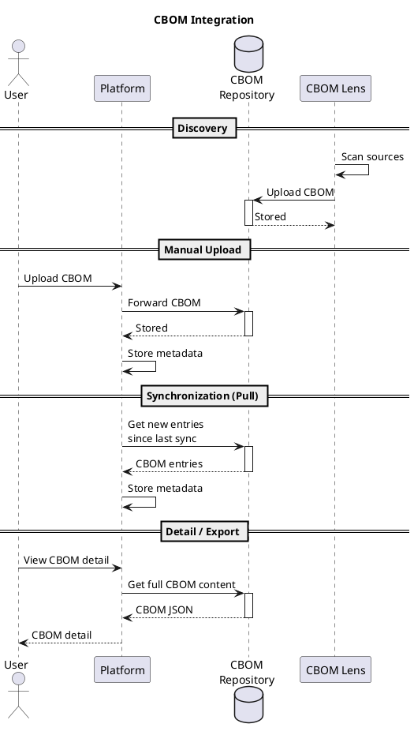

# CBOM

`CBOM` (Cryptographic Bill of Materials) is a standardized inventory of cryptographic assets based on the [CycloneDX](https://cyclonedx.org) specification. The Platform supports [CycloneDX v1.6](https://cyclonedx.org/docs/1.6/json/) and provides inventory, management, and visualization of CBOM documents containing cryptographic assets such as certificates, keys, algorithms, protocols, and secrets.

## CBOM Properties

Each `CBOM` document in the Platform is tracked with the following properties:

| Property | Description |
|----------|-------------|
| Serial Number | Unique identifier of the CBOM document (URN) |
| Version | Version number of the CBOM document |
| Spec Version | Version of the CycloneDX specification |
| Source | Origin of the CBOM (e.g., name of the tool that generated it) |
| Timestamp | Timestamp from the CBOM document metadata |
| Certificates | Number of certificate assets |
| Algorithms | Number of algorithm assets |
| Protocols | Number of protocol assets |
| Crypto Material | Number of related cryptographic material items |
| Total Assets | Total number of all cryptographic assets |

Multiple versions of the same `CBOM` (identified by serial number) are tracked, allowing historical comparison of cryptographic asset changes over time.

## CBOM Sources

CBOMs can be ingested into the Platform through the following methods:

### CBOM Repository synchronization

The Platform periodically synchronizes with a CBOM Repository to pull new or updated CBOM documents. A scheduled job queries the repository for entries created since the last synchronization and stores their metadata. Synchronization can also be triggered manually.

The CBOM Repository URL must be configured in [Platform Settings](../../settings/platform.md) to enable synchronization.

### Manual upload

CBOM documents in CycloneDX JSON format can be uploaded through the Platform UI or REST API. Uploaded documents are forwarded to the CBOM Repository for storage and versioning.

### Discovery

Cryptographic assets can be automatically discovered using connectors implementing the `Discovery Provider` `Function Group`. Discovered CBOM documents are stored in the CBOM Repository and synchronized with the Platform.

[CBOM Lens](https://github.com/CZERTAINLY/CBOM-Lens) is a scanning tool that can discover cryptographic assets in filesystems, container images, and network endpoints.

## Integration with CBOM Repository

The [CBOM Repository](https://github.com/CZERTAINLY/CBOM-Repository) is a service that provides centralized storage and versioning of CBOM documents. It serves as the single source of truth for all CBOM content.

The Platform stores `CBOM` metadata locally for listing and search. When full CBOM content is needed (e.g., for the detail view or export), it is fetched on demand from the CBOM Repository.

The following diagram illustrates the integration between the Platform, CBOM Repository, and discovery tools:

## See Also

- [CycloneDX v1.6 specification](https://cyclonedx.org/docs/1.6/json/)
- [Certificate](certificate.md)
- [Key](key.md)
