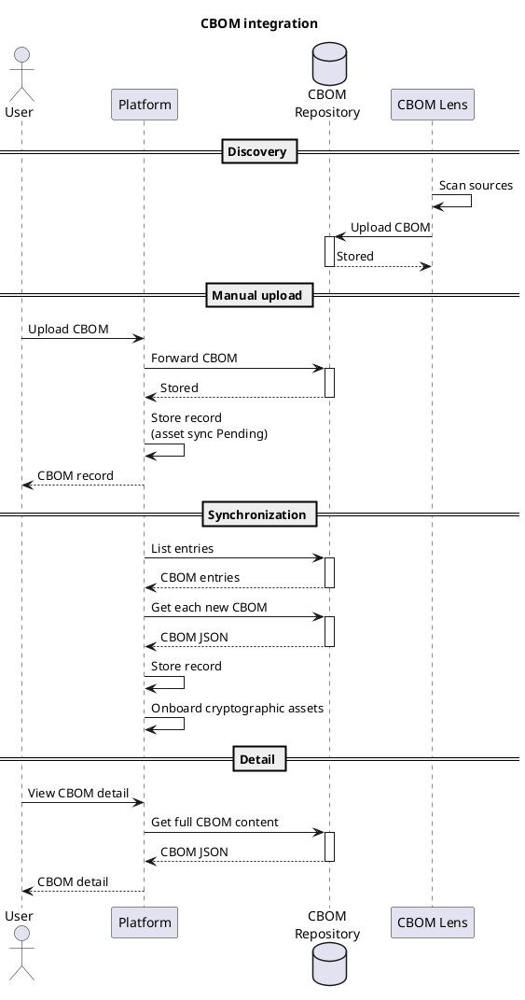
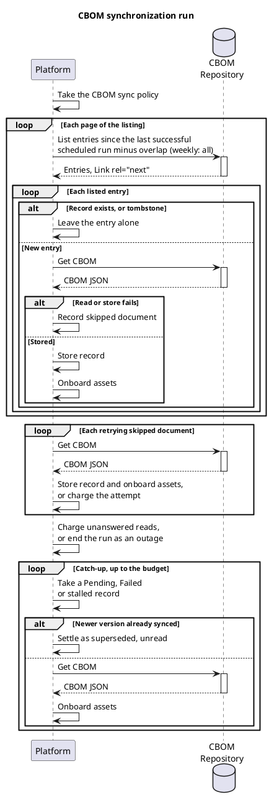
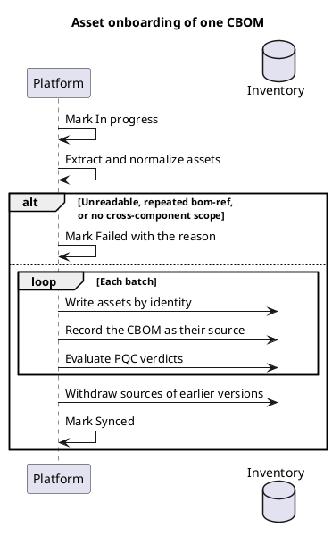

# CBOM

`CBOM` (Cryptographic Bill of Materials) is a standardized inventory of cryptographic assets based on the [CycloneDX](https://cyclonedx.org) specification. The platform supports [CycloneDX v1.6](https://cyclonedx.org/docs/1.6/json/) and [v1.7](https://cyclonedx.org/docs/1.7/json/). It keeps a record of every CBOM document it synchronizes from the CBOM Repository and onboards the cryptographic assets each document declares — algorithms, certificates, protocols and related cryptographic material — into one deduplicated [cryptographic asset inventory](../modules/cryptographic-asset-inventory.md), where each asset also carries a [post-quantum readiness](../modules/post-quantum-readiness.md) verdict.

## CBOM Properties

Each `CBOM` document in the platform is tracked with the following properties:

| Property         | Description                                                                                                                    |
|------------------|--------------------------------------------------------------------------------------------------------------------------------|
| Serial Number    | Unique identifier of the CBOM document (URN)                                                                                   |
| Version          | Version number of the CBOM document                                                                                            |
| Spec Version     | Version of the CycloneDX specification                                                                                         |
| Source           | Name of the component the document's metadata describes (`metadata.component.name`)                                            |
| Timestamp        | Timestamp from the CBOM document metadata                                                                                      |
| Certificates     | Number of certificate assets                                                                                                   |
| Algorithms       | Number of algorithm assets                                                                                                     |
| Protocols        | Number of protocol assets                                                                                                      |
| Crypto Material  | Number of related cryptographic material items                                                                                 |
| Total Assets     | Total number of all cryptographic assets                                                                                       |
| Asset Sync State | How far the onboarding of the document's cryptographic assets has come — see [Asset sync states](#asset-sync-states)          |
| Assets Synced At | Start of the sync run that onboarded the document's assets                                                                     |
| Asset Sync Error | Why the last onboarding of the document's assets failed, in words meant for an operator; empty when it did not fail          |

The asset counts are the ones the CBOM Repository reports for the document when its record is stored, or zero when it reports none. They are the repository's own figures; the cryptographic asset inventory keeps its own counts, per deduplicated asset, so the two can differ even for a single document.

Multiple versions of the same `CBOM` (identified by serial number) are tracked, allowing historical comparison of cryptographic asset changes over time. Only the newest version onboarded contributes assets to the inventory — see [Supersede of earlier versions](#supersede-of-earlier-versions).

The CBOM list does not show **Asset Sync State**, **Assets Synced At** and **Asset Sync Error** by default; they are added to it with **Add column**. The CBOM detail shows the total number of assets and the asset sync error, but only while the CBOM Repository still serves the document; otherwise read **Asset Sync Error** from the list column.

## Specification versions

Both CycloneDX v1.6 and v1.7 are accepted. The `Spec Version` property records which specification a stored document conforms to, so an inventory can contain a mixture of both.

v1.7 is additive for cryptographic assets: it introduces a registry of algorithm families and elliptic curves, typed relationships between crypto assets, and richer certificate metadata. A v1.6 document therefore remains valid and does not need to be regenerated.

The platform reads the cryptographic assets of both versions the same way, and the [CycloneDX 1.7 cryptography registry](https://github.com/CycloneDX/specification/blob/master/schema/cryptography-defs.json) is the vocabulary it reads them into. Algorithm families and elliptic curves of a v1.6 and a v1.7 document are normalized onto the families and curves the registry defines, so an algorithm described in either version is recognized as one asset. The registry is a snapshot shipped with the platform, so a change to it upstream reaches the platform with a release. The one exception is the cryptographic primitive, which takes only the values both versions define.

Producers choose the version they emit. [CBOM Lens](https://github.com/OmniTrustILM/cbom-lens) emits v1.6 by default and v1.7 when `cbom.version` is set to `"1.7"` in its configuration.

:::note
A producer that declares the specification version in the `Content-Type` media type, for example `application/vnd.cyclonedx+json; version=1.7`, must declare the same version the document itself carries in `specVersion`. The CBOM Repository rejects a mismatch with `HTTP 400`, even when the document is otherwise valid. Omitting the parameter is allowed, in which case the version is taken from the document. A document of any other CycloneDX version is rejected by the CBOM Repository with `HTTP 400`.
:::

## CBOM Sources

CBOMs reach the platform in the following ways:

### CBOM Repository synchronization

The platform periodically synchronizes with a CBOM Repository to pull new CBOM documents, store their records and onboard their cryptographic assets into the inventory. Synchronization can also be triggered manually. See [Synchronization](#synchronization) for how a run works.

The CBOM Repository URL must be configured in [Platform Settings](../../settings/platform.md) to enable synchronization.

### Manual upload

CBOM documents in CycloneDX JSON format can be uploaded through the platform UI or REST API ([Upload CBOM](/api/core-cbom#tag/cbom-management/POST/v1/cboms/upload)). Uploaded documents are forwarded to the CBOM Repository for storage and versioning, and the platform stores the document's record with the asset sync state `Pending`. Its cryptographic assets are onboarded by the catch-up of a later sync run, not during the upload. The catch-up takes pending records in no particular order, so with a backlog larger than `cbomSyncMaxIngestDocuments` an uploaded document may wait several runs.

### Discovery

[CBOM Lens](https://github.com/OmniTrustILM/cbom-lens) is a scanning tool that can discover cryptographic assets in filesystems, container images, and network endpoints. The CBOMs it produces are uploaded to the CBOM Repository, and the next sync run brings them into the platform.

## Synchronization

A sync run lists the entries of the CBOM Repository, stores a record for each document the platform does not have yet, and onboards the cryptographic assets of the documents that still owe an onboarding. Nothing is synchronized while the CBOM Repository URL is not configured.

### Sync runs

| Run                   | When                                                                                                                                      | What it lists                                                                                                                                      |
|-----------------------|-------------------------------------------------------------------------------------------------------------------------------------------|----------------------------------------------------------------------------------------------------------------------------------------------------|
| Scheduled sync        | Every hour on the hour, as the scheduled job `CbomSyncTask` (cron `0 0 * ? * *`)                                                         | The entries created since the start of the last successful scheduled sync, minus the [overlap](../../settings/platform.md#cbom-sync-policy)        |
| Manual sync           | **Sync CBOMs** on the CBOM list, or [Sync CBOMs](/api/core-cbom#tag/cbom-management/POST/v1/cboms/sync) through the API                                           | The same entries as the scheduled sync. A manual run is not recorded in the job history, so it does not move the point the next scheduled run lists from |
| Weekly reconciliation | Sundays at 02:30, as the scheduled job `CbomReconcileTask` (cron `0 30 2 ? * SUN`)                                                        | The whole repository listing                                                                                                                       |

A run reads the listing page by page, following the repository's `Link rel="next"` header, with the page size set by `cbomSyncPageSize`. Every run takes the [CBOM sync policy](../../settings/platform.md#cbom-sync-policy) as it stands when the run starts.

The weekly reconciliation exists for what an hourly window can miss — for example an entry whose upload took longer than the overlap, an entry the repository back-dated, or an entry that was written off as permanently skipped after its listing window had closed. It stores those entries, tries again the [skipped documents](#skipped-documents) the repository still lists, and otherwise does what a scheduled sync does. It only adds: nothing the repository no longer lists is withdrawn from the platform.

Both scheduled jobs are system jobs of the [Scheduler](../architecture/scheduler.md): they can be disabled and enabled again, but their schedule cannot be edited. Runs may overlap — a manual sync during a scheduled one, or the reconciliation during an hourly sync — and each document is still onboarded by one run at a time.

A failed read of an entry is normally *charged*: it counts against the entry's retry budget — see [Skipped documents](#skipped-documents). A run that looks like a repository outage charges none of its unanswered reads. That is a run in which:

- no document read succeeded, and
- at least two reads of newly listed entries got no answer or `HTTP 503`, and
- for the weekly reconciliation only, none of the entries it listed was already stored, or 1000 or more reads went unanswered.

Such a run ends before its catch-up, and the next scheduled sync lists from the same point. Reads the repository answered with any other error are charged even then. A run whose listing of the repository fails ends there: it neither retries skipped documents nor runs the catch-up.

### Storing a repository entry

For each entry of the listing, a run:

1. leaves alone an entry the platform already has a record for, and an entry that was [deleted](#deletion-and-tombstones) in the platform;
2. reads the document from the CBOM Repository;
3. stores the document's record, which requires a non-empty `specVersion`;
4. onboards the document's cryptographic assets right away, unless asset ingest is turned off.

An entry that cannot be read or stored becomes a [skipped document](#skipped-documents). Its record does not exist, so it is not in the CBOM list.

### Asset onboarding

The platform onboards the cryptographic assets of one CBOM as one unit of work. It extracts the assets the document declares, recognizes each one against the inventory — an asset another document already declared is the same asset, not a second one — records the document as a source of each asset, and evaluates each asset's [post-quantum readiness](../modules/post-quantum-readiness.md). See [Cryptographic Asset Inventory](../modules/cryptographic-asset-inventory.md) for how an asset is recognized across CBOMs. Setting names, reasons and the Core log call this onboarding *ingest*.

The assets are written in batches of `cbomSyncAssetBatchSize`, each committed on its own. If an onboarding fails, the CBOM is marked `Failed` with the reason in **Asset Sync Error**; if it is interrupted, the record stays `In progress`. Either way, a later run onboards the whole document again rather than resuming it; because an asset is recognized by its identity, doing so converges on the same inventory rows.

A document is onboarded by one of two routes:

- **Inline** — right after a run stores its record.
- **Catch-up** — every run then onboards up to `cbomSyncMaxIngestDocuments` further CBOMs: first those still `Pending` (uploaded through the platform, stored while asset ingest was turned off, or stored before the upgrade to a release with the inventory), then those `Failed` or stalled `In progress` once their retry window, `cbomSyncIngestRetryAfterSeconds`, has passed.

Setting `cbomSyncAssetIngestEnabled` to `false` stops both routes and leaves every CBOM as it was found, so turning it back on resumes the onboarding rather than repairing anything. The settings are described in [CBOM sync policy](../../settings/platform.md#cbom-sync-policy).

### Asset sync states

Each CBOM record carries the state of the onboarding of its assets. Once the state is `Synced`, the document's assets are complete in the inventory, unless the version has since been superseded; while the onboarding is in progress, or after it failed, part of them may already be there.

| State         | Meaning                                                                                                                                                                                 |
|---------------|-----------------------------------------------------------------------------------------------------------------------------------------------------------------------------------------|
| `Pending`     | The onboarding has not started. A record stored by an upload, or while asset ingest is turned off, waits here for the catch-up.                                                        |
| `In progress` | A run is onboarding the document. A record left in this state by a run that stopped is offered again once the retry window has passed.                                                |
| `Synced`      | The document's assets are in the inventory, and **Assets Synced At** holds the start of the run that onboarded them. A superseded version stays `Synced` but no longer contributes assets; it keeps its **Assets Synced At** if it was onboarded before it was superseded, and has none if it was settled as superseded without being onboarded. |
| `Failed`      | The last onboarding failed; **Asset Sync Error** says why. The catch-up offers the document again once the retry window has passed, except after repeated [refusals](#refused-documents). |

**Asset Sync Error** is cleared when the next onboarding of the document starts, and stays empty if that onboarding succeeds. A `Synced` record is never onboarded again.

The [cryptographic asset dashboard](../modules/dashboards.md#cryptographic-asset-dashboard) shows how many CBOM documents are in each state.

### Refused documents

Some documents are refused as a whole, because their content does not allow their assets to be recognized safely. The record stays, marked `Failed` with the reason in **Asset Sync Error**, and none of the document's assets reach the inventory.

| Reason in **Asset Sync Error**                                                                                                         | Cause                                                                                                                                                           |
|----------------------------------------------------------------------------------------------------------------------------------------|-----------------------------------------------------------------------------------------------------------------------------------------------------------------|
| the document defines *n* bom-ref value / values more than once, which CycloneDX requires to be unique; the ingest findings name them | A `bom-ref` repeats within the document. CycloneDX requires every `bom-ref` to be unique, and a repeated one cannot be resolved without guessing.               |
| the document's cross-component scope could not be built, so its assets cannot be keyed safely                                        | The references between the document's components could not be resolved, and recognizing certificates without them would merge assets that are not the same.   |
| the document could not be read for cryptographic assets (see the Core log)                                                            | The document could not be read for assets at all; the Core log holds the detail.                                                                                |

A repeated `bom-ref` is a verdict on the document's content, which does not change between attempts; a scope that could not be built most likely is one too, but may have been transient. A document refused for either reason is therefore attempted at most three times in all; after the third refusal the record stays `Failed` and the catch-up does not offer it again. The fix is a corrected document, published as a new version: it arrives as a record of its own and is onboarded on its own. The refused version stays `Failed`, and keeps the dashboard's inventory coverage short of complete; delete it if it should not remain. A document that could not be read for cryptographic assets at all is not counted this way, and the catch-up offers it again each time the retry window has passed.

Any other failure — the document could not be read from the CBOM Repository, or storing its assets failed — is not a verdict on the content: the reason is in **Asset Sync Error**, and the catch-up offers the document again each time the retry window has passed.

:::note
The per-component findings of an onboarding — which the first reason refers to — are recorded by the platform but are not yet served through the API or shown in the UI. Until they are, find the repeated values in the document itself, for example with `jq -r '[.. | objects | .["bom-ref"]? | strings] | group_by(.) | map(select(length > 1) | .[0]) | .[]' cbom.json`.
:::

### Supersede of earlier versions

The newest version of a serial number whose assets have been onboarded speaks for that serial number in the inventory. When a version's onboarding completes, the platform withdraws the sources of every earlier version of the same serial number, so each asset traces back to the newest onboarded version only. A newer version that is merely stored, or whose onboarding failed, does not supersede anything: the earlier version's assets stay in the inventory in the meantime.

A version that arrives after a newer one has already been onboarded — for example an older document uploaded late — is settled as superseded without its assets being extracted, and contributes nothing.

Every version keeps its record and its document in the CBOM Repository, so the version history stays complete.

:::warning
Deleting the newest version does not bring back the assets of an earlier version. Their sources were withdrawn when the earlier version was superseded, and a `Synced` record is never onboarded again. To bring them back, delete the earlier version as well and upload it again through the platform: with no newer version onboarded, the catch-up onboards it.
:::

### Deletion and tombstones

Deleting a CBOM in the platform — one at a time or several at once — first withdraws the document from the inventory: it is removed as a source from every asset it declared, and an asset left with no source is removed from the inventory. The record is then deleted, and a tombstone is written for its serial number and version.

The tombstone keeps the sync from storing that document again: every later run, including the weekly reconciliation, leaves the entry alone although the CBOM Repository still lists it. The document itself stays in the CBOM Repository. A tombstone has no expiry and cannot be removed through the API; the only way to bring a deleted document back is to upload it again through the platform. It covers one version, so a newer version of the same serial number is synchronized as usual.

If a deletion fails after the document was withdrawn from the inventory, the record stays, marked `Failed` with *A deletion withdrew this CBOM's cryptographic assets and then failed; they will be ingested again.*, and the catch-up onboards its assets again. Delete it again if it should go. If the deletion is refused because the document's assets were attached again in the meantime, the record stays as it was; retry the deletion.

A document removed from the CBOM Repository by other means changes nothing in the platform: synchronization only adds, so its record and its assets stay. Its detail can no longer be shown, because the content is read from the repository; delete the record to withdraw its assets.

### Skipped documents

A repository entry the sync cannot read or store — so no record exists for it — is a skipped document. It is different from a stored CBOM whose asset onboarding failed, which keeps its record and shows the reason in **Asset Sync Error**.

A skipped document is in one of two states:

| State                 | Meaning                                                                                                                                                                                           |
|-----------------------|---------------------------------------------------------------------------------------------------------------------------------------------------------------------------------------------------|
| `Retrying`            | The following sync runs try the entry again, one attempt per run, until its retry budget — the first attempt plus `cbomSyncSkippedRetryRuns` further runs — is spent.                            |
| `Permanently skipped` | The retry budget is spent, so no run picks the entry up to retry it. A run still tries the document whenever the repository listing offers it again, and an operator can give it a new budget. |

#### Finding out why a document was skipped

The **Skipped documents** view is reached from the icon of the same name on the CBOM list and lists every skipped document, most recently attempted first, with its serial number and version, its state, the number of attempts charged to its current budget, its first failure and its last attempt. The **Reason** column says why the last attempt failed, in words meant for an operator:

| Reason                                                                   | What to look at                                                                                                    |
|--------------------------------------------------------------------------|--------------------------------------------------------------------------------------------------------------------|
| document not found in the repository (HTTP 404)                          | The repository lists the entry but does not serve its document.                                                    |
| repository failed the document read (HTTP *n*)                           | The CBOM Repository answered the read with error status *n*. `HTTP 503` also covers a read that got no answer at all — the connection was refused or timed out. The variant *repository failed the document read (status unknown)* means the failure carried no status; the Core log holds the detail. |
| reading the document failed unexpectedly (see the Core log)              | The read failed in the platform; the Core log holds the detail.                                                    |
| the stored document was refused: *reason*                                | The document is not acceptable as a record — *the stored document was refused: CBOM Repository returned empty specVersion* when it has no `specVersion`. |
| storing the CBOM row failed: the database refused it (see the Core log)  | The database rejected the record; the Core log holds the detail.                                                   |
| storing the CBOM row failed unexpectedly (see the Core log)              | Storing the record failed in the platform; the Core log holds the detail.                                          |

The view can be filtered by serial number and by state. The same list is available through the API ([List skipped documents](/api/core-cbom#tag/cbom-management/POST/v1/cboms/syncSkips)). Core also logs each failed attempt with its reason, and while the entry is retrying, with the attempt number.

#### Continuing once the cause is fixed

- **`Retrying`** — nothing to do. The next sync runs try the entry again, and once an attempt succeeds the entry leaves the list and its record appears in the CBOM list.
- **`Permanently skipped`** — use **Retry** on the entry in the **Skipped documents** view ([Retry a skipped document](/api/core-cbom#tag/cbom-management/POST/v1/cboms/syncSkips/{uuid}/retry) through the API). The entry returns to `Retrying` with a full retry budget, and the next run of any kind tries it — the next scheduled sync, a manual **Sync CBOMs**, or the weekly reconciliation. Alternatively, wait for the weekly reconciliation, which tries every entry the repository still lists; or, if the repository cannot serve the document, upload it through the platform and then use **Retry**, so that the next run finds the record and removes the entry.

A `Retrying` entry can also be tried at once with a manual **Sync CBOMs**. Retrying an entry whose cause is not fixed only spends a new budget: it fails again and is written off again. A skipped entry cannot be dismissed: it leaves the list when its document is stored, or through retention once the repository no longer lists it.

If the producer fixes the problem by publishing a new version, the new version is a new entry and is synchronized normally. The skipped entry of the old version stays: while the repository still lists it, every weekly reconciliation tries it again, and it keeps its place on the list.

#### Retention

The scheduled job `CbomSyncSkipRetentionTask` runs daily at 03:15 and removes from the list every permanently skipped entry whose last attempt is older than `cbomSyncSkipRetentionDays`, at most 10 000 entries a day. An entry still `Retrying` is never removed. An entry the repository keeps listing is tried again by every weekly reconciliation, so it does not age out as long as the retention exceeds a week; with a shorter retention it can be removed between two reconciliations, and then returns as a new `Retrying` entry.

Listing the skipped documents requires the `list` action, retrying one the `update` action, and a manual **Sync CBOMs** or an upload the `create` action on the `CBOM` resource — see [CBOM and cryptographic asset permissions](../architecture/access-control/roles-permissions.md#cbom-and-cryptographic-asset-permissions).

## Integration with CBOM Repository

The [CBOM Repository](https://github.com/OmniTrustILM/cbom-repository) is a service that provides centralized storage and versioning of CBOM documents. It serves as the single source of truth for all CBOM content.

The platform stores the `CBOM` records and the cryptographic asset inventory built from them locally, for listing, search and the dashboard. When full CBOM content is needed (e.g., for the detail view), it is fetched on demand from the CBOM Repository.

The following diagram illustrates the integration between the platform, CBOM Repository, and discovery tools:

```plantuml
@startuml CBOM Integration

title CBOM integration

skinparam topurl /api/

actor "User" as user
participant "Platform" as core
database "CBOM\nRepository" as repo
participant "CBOM Lens" as lens

== Discovery ==

lens -> lens: Scan sources
lens -> repo: Upload CBOM
activate repo
repo --> lens: Stored
deactivate repo

== Manual upload ==

user -> core [[core-cbom#tag/cbom-management/POST/v1/cboms/upload]]: Upload CBOM
core -> repo: Forward CBOM
activate repo
repo --> core: Stored
deactivate repo
core -> core: Store record\n(asset sync Pending)
core --> user: CBOM record

== Synchronization ==

core -> repo: List entries
activate repo
repo --> core: CBOM entries
deactivate repo
core -> repo: Get each new CBOM
activate repo
repo --> core: CBOM JSON
deactivate repo
core -> core: Store record
core -> core: Onboard cryptographic assets

== Detail ==

user -> core [[core-cbom#tag/cbom-management/GET/v1/cboms/{uuid}]]: View CBOM detail
core -> repo: Get full CBOM content
activate repo
repo --> core: CBOM JSON
deactivate repo
core --> user: CBOM detail

@enduml
```

The following diagram shows one sync run, including the onboarding of the assets:

```plantuml
@startuml CBOM Synchronization Run

title CBOM synchronization run

participant "Platform" as core
database "CBOM\nRepository" as repo

core -> core: Take the CBOM sync policy

loop Each page of the listing
  core -> repo: List entries since the last successful\nscheduled run minus overlap (weekly: all)
  activate repo
  repo --> core: Entries, Link rel="next"
  deactivate repo
  loop Each listed entry
    alt Record exists, or tombstone
      core -> core: Leave the entry alone
    else New entry
      core -> repo: Get CBOM
      activate repo
      repo --> core: CBOM JSON
      deactivate repo
      alt Read or store fails
        core -> core: Record skipped document
      else Stored
        core -> core: Store record
        core -> core: Onboard assets
      end
    end
  end
end

loop Each retrying skipped document
  core -> repo: Get CBOM
  activate repo
  repo --> core: CBOM JSON
  deactivate repo
  core -> core: Store record and onboard assets,\nor charge the attempt
end

core -> core: Charge unanswered reads,\nor end the run as an outage

loop Catch-up, up to the budget
  core -> core: Take a Pending, Failed\nor stalled record
  alt Newer version already synced
    core -> core: Settle as superseded, unread
  else
    core -> repo: Get CBOM
    activate repo
    repo --> core: CBOM JSON
    deactivate repo
    core -> core: Onboard assets
  end
end

@enduml
```

And the onboarding of one CBOM's assets:

```plantuml
@startuml CBOM Asset Onboarding

title Asset onboarding of one CBOM

participant "Platform" as core
database "Inventory" as inv

core -> core: Mark In progress
core -> core: Extract and normalize assets
alt Unreadable, repeated bom-ref,\nor no cross-component scope
  core -> core: Mark Failed with the reason
else
  loop Each batch
    core -> inv: Write assets by identity
    core -> inv: Record the CBOM as their source
    core -> inv: Evaluate PQC verdicts
  end
  core -> inv: Withdraw sources of earlier versions
  core -> core: Mark Synced
end

@enduml
```

## See Also

- [CycloneDX v1.6 specification](https://cyclonedx.org/docs/1.6/json/)
- [CycloneDX v1.7 specification](https://cyclonedx.org/docs/1.7/json/)
- [Cryptographic Asset Inventory](../modules/cryptographic-asset-inventory.md)
- [Post-Quantum Readiness](../modules/post-quantum-readiness.md)
- [Cryptographic asset dashboard](../modules/dashboards.md#cryptographic-asset-dashboard)
- [CBOM sync policy](../../settings/platform.md#cbom-sync-policy)
- [CBOM API](/api/core-cbom)
- [Certificate](certificate.md)
- [Key](key.md)
