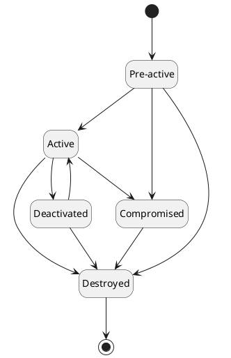

# Key

The `Key` holds the information about the cryptographic key and its lifecycle. It represents the cryptographic key in a human-readable format. `Key` holds the following information:

- `Key` management details
- Attributes of the `Key`
- Association with other related objects like `Certificate`
- [History of events](#key-history) associated with the `Key`
- Wrapped content of other related parts of the `Key`, for example public/private key, or split/component parts

In addition to the above details, the following are mapped to the `Key` for the ease of management:

- `Token Profile` it belongs to and managed by
- Owner of the `Key`
- `Group` it belongs to
- Optionally description of the `Key`

## Attributes

`Key` attributes hold information related to the platform. It can contain Custom Attributes as well as Metadata Attributes.

Metadata Attributes provides any additional information about the `Key` that can be technology specific.
They can be used for further processing of the `Key` by different components and modules of the platform.

## Key state

Every key has defined its state during its lifecycle. The state of the `Key` defines its lifecycle phase and operations that can be performed.
Once the `Key` is created, it is in the `Pre-active` state and must be activated before it can be used for any cryptographic operation.

The following states are supported:

| State         | Description                                                                                                 |
|---------------|-------------------------------------------------------------------------------------------------------------|
| `Pre-active`  | The `Key` is created and ready to be used once activated, or activate date is reached                       |
| `Active`      | The `Key` is ready to be used                                                                               |
| `Deactivated` | The `Key` is not ready to be used                                                                           |
| `Compromised` | The `Key` is compromised and cannot be used, however it still exists                                        |
| `Destroyed`   | The `Key` is destroyed and mark for removal, however it is still in the inventory for the auditing purposes |

The transition `Key` state diagram is as follows:

## Key usage

Every key has defined its key usages. The key usage can restrict the type of cryptographic operation that can be performed using the `Key`.

The following key usages are supported:

| Key Usage | Description                                              |
|-----------|----------------------------------------------------------|
| `Encrypt` | Allows to request encryption operation using the `Key`   |
| `Decrypt` | Allows to request decryption operation using the `Key`   |
| `Sign`    | Allows to request signing operation using the `Key`      |
| `Verify`  | Allows to request verification operation using the `Key` |
| `Wrap`    | Allows to request wrapping operation using the `Key`     |
| `Unwrap`  | Allows to request unwrapping operation using the `Key`   |

The supported key usages and key types combinations are:

| Key Type      | Key Usage                                                |
|---------------|----------------------------------------------------------|
| `Public Key`  | `Encrypt`, `Verify`, `Wrap`                              |
| `Private Key` | `Decrypt`, `Sign`, `Unwrap`                              |
| `Secret Key`  | `Encrypt`, `Decrypt`, `Sign`, `Verify`, `Wrap`, `Unwrap` |

## Exportable

Each private and secret key item carries an exportable flag that decides whether its key material can ever leave the cryptography provider:

- The flag is set when the `Key` is created or imported, and it is off unless it is switched on then. The platform accepts it only where the `Token Profile`'s provider exports the key's type, and for an imported key also its algorithm.
- It can be lowered to false later through the disable key export operation of the API, `PATCH /v1/keys/{uuid}/items/{keyItemUuid}/export/disable`, which is audit-logged as UPDATE and records **Disable Key Export** in the key's history. It can never be raised again.
- Discovered keys and public key items are never exportable.

The key item detail shows the flag in its **Exportable** row, as **Enabled** or **Disabled**, for private and secret key items. An exportable item is exported only while it is active and enabled.

## Import and export

Import and export move key material between a file and the cryptography provider without the platform keeping it:

- On import, `Core` reads the file with the password the user gives, and the password never leaves `Core`. `Core` protects the key again under a one-time transport passphrase and hands it to the provider, which opens it and stores it. `Core` keeps no way to decrypt the key afterwards.
- On export, the provider protects the key under the user's passphrase, and `Core` passes it on without decrypting it.
- In transit, key material stays inside a PKCS#8 envelope, carried over TLS, or through the message broker for a connector reached through the proxy. A key that a user uploads without any protection travels to `Core` in the clear, protected only by TLS.
- Deployments that need key material to stay undecryptable outside a hardware boundary keep their keys non-exportable.

A certificate's PKCS#12 download uses its key's export; see [Download Certificate](../../quick-start/certificate-management/download-certificate.mdx) for what the file holds and which tools open it.

## Key history

The key's history lists the events recorded for it, as the platform shows them:

| Event                              | Recorded when                     |
|------------------------------------|-----------------------------------|
| **Create Key**                     | the key is created                |
| **Import Key**                     | the key is imported               |
| **Export Key**                     | the key is exported               |
| **Disable Key Export**             | the key's export is disabled      |
| **Compromised Key**                | the key is marked as compromised  |
| **Destroy Key**                    | the key is destroyed              |
| **Update Key Usages**              | the key's usages change           |
| **Sign Data**, **Verify Data**     | the key signs or verifies data    |
| **Encrypt Data**, **Decrypt Data** | the key encrypts or decrypts data |
| **Enable Key**, **Disable Key**    | the key is enabled or disabled    |

Imports, exports and PKCS#12 downloads are also written to the audit log, as IMPORT and EXPORT operations, with the user and the key.
