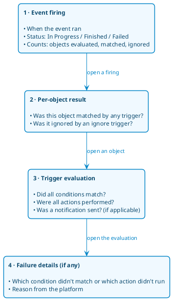

# Event Viewer

The **Event Viewer** lets administrators see what the platform did in response to each event firing — which objects the configured triggers were evaluated against, whether the conditions matched, whether the actions ran, and whether notifications were delivered. It is the place to go when you want to verify that a piece of automation worked, find out why something did or did not happen, or audit notification delivery.

The Event Viewer is separate from the [event logs](../../../logging/event-logs.md): event logs record raw platform operations, whereas the Event Viewer focuses on the workflow trigger evaluations performed for each event firing.

Access to the Event Viewer requires the `Resource Event` resource's `Detail` permission in the platform's role definitions.

## Two views of the same data

The Event Viewer is reached from two starting points, and both expose the same underlying records:

- **By event** — from the [platform events settings](../../../settings/events.md), pick an event to see every time that event has fired across the platform.
- **By object** — on the detail page of an object that participates in workflow events (for example, a certificate, cryptographic key, discovery, approval, or group), see only the firings that involved that single object.

Both views are paginated; no other filtering is currently available.

## How the data is organized

Each event firing is captured in four layers. You drill down by opening the details of the layer above:

The **by-event view** starts at layer 1 (firings for the selected event). The **by-object view** starts one level deeper at layer 3 (the trigger evaluations that involved your object). Either way, opening an evaluation reveals the same layer-4 failure details.

## What each entry tells you

**A firing** (layer 1) shows the start and finish time, the current status, the kind of object the triggers were evaluated on, and counts of how many objects were involved.

The **status** of a firing has one of three values:

- `In Progress` — the platform is currently processing the firing; triggers may still be evaluating against objects.
- `Finished` — the platform completed the firing's processing. Individual triggers may still have failed — their failures appear in the trigger evaluation records — but the firing itself ended normally.
- `Failed` — the platform encountered an unexpected error during the firing's processing. This indicates a system-level issue, not a problem with any particular trigger rule, and the firing's records may be incomplete.

The **counts** displayed for each firing have specific meanings:

- **Evaluated** — distinct objects that had at least one trigger run against them in this firing.
- **Matched** — distinct evaluated objects where at least one trigger's conditions matched (regular or ignore).
- **Ignored** — distinct evaluated objects that were excluded from further processing by an ignore trigger. Every ignored object is also counted as matched.

**A trigger evaluation** (layer 3) shows, for each [trigger](./trigger.md) that ran against the object:

- Whether all [conditions](./condition.md) matched. If not, the trigger did not proceed.
- Whether all [actions](./action.md) were performed. Failures are surfaced individually.
- The **origin** — the object that caused the event to be triggered. The origin can differ from the object the trigger evaluated against; for example, a `Discovery finished` event has the discovery as its origin while the triggers evaluate against the certificates the discovery produced. When the trigger is configured at the platform level, the origin is the platform settings itself.
- For triggers that send notifications, **whether the notification was sent** — Yes or No. This makes notification delivery auditable end-to-end.
- An optional message with extra context.

**Failure details** (layer 4) list one entry per condition that did not match and per action that did not run, with the reason from the platform. Successful conditions and actions are not listed individually — only failures are recorded, so the list is a focused diagnostic view.

## Finding what you're looking for

| If you want to know…                                      | Start at…                                                  |
| --------------------------------------------------------- | ---------------------------------------------------------- |
| Whether a specific event fired recently                   | the **by-event view** for that event                       |
| Which firings affected a particular object                | the **by-object view** on that object's detail page        |
| Whether a trigger acted on an object as you expected      | open that object's trigger evaluation in either view       |
| Why a trigger didn't perform an action on an object       | open the evaluation details and read the failure records   |
| Whether a notification was actually delivered             | open the evaluation details and check *Notification sent*  |

### Example — did yesterday's expiry check find anything?

Open the platform events settings, pick **Certificate expiring**, and look at the most recent firings. The matched-objects count tells you whether any certificates met the expiry conditions during that run. Open a firing to see exactly which certificates matched and which triggers ran for them, and open an evaluation to see whether the configured notification was actually sent.

### Example — why doesn't my certificate have the owner my trigger should set?

You configured a trigger so that newly discovered certificates whose common name contains `example.com` get their owner set to *John Doe*. A certificate that looks like it should match has no owner. To find out what happened:

1. Open the certificate's detail page and switch to its event history view.
2. Find the entry for the event that should have triggered the owner change (for example, `Certificate discovered`).
3. Open the evaluation details:
   - If **conditions matched** is *No*, the trigger's rule did not actually match this certificate — review the rule against the certificate's properties.
   - If **conditions matched** is *Yes* but **actions performed** is *No*, the failure records list the specific action that failed and the reason.

### Example — was the approval notification actually delivered?

You configured a trigger on `Approval requested` that sends a notification to the security team when an approval involves a wildcard certificate. To verify a specific approval reached the team:

1. Open the approval's detail page and switch to its event history view.
2. Find the entry for `Approval requested` and open the evaluation details for the security-team-notification trigger.
3. Read the **Notification sent** field:
   - *Yes* — the notification was delivered through the configured channel.
   - *No* — the failure record explains why; common causes include an unreachable notification channel or a misconfigured notification profile.

## What you cannot do here

The Event Viewer is read-only. You cannot edit, delete, or re-run records from this view. To change automation behaviour, edit the relevant [trigger](./trigger.md), [condition](./condition.md), or [action](./action.md) and wait for the next event firing.

The data cannot be filtered or searched; only pagination is supported.

## Retention

Trigger evaluation records are retained indefinitely — the platform does not currently apply an automatic retention period. Records also survive deletion of the trigger that produced them, so the audit trail of past firings remains complete.
