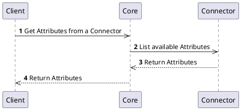
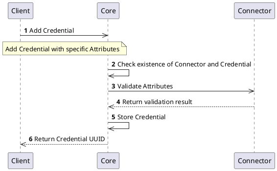
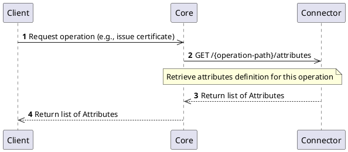
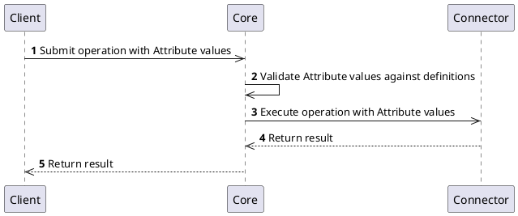

# Attributes Interface

## Overview

Each `Connector` has to implement the `Attributes` interface. This interface provides information about supported `Attributes` of the `Connector`. `Attributes` are specific to implementation and gives information about the data that can be exchanged and properly parsed by the `Connector`.

For more information, refer to [Connector Architecture](../../concept-design/architecture/connector.md).

## Legacy Connectors

### How it works

The `Attributes` interface provides information about all supported mandatory or optional `Attributes` for the `Connector`. `Attributes` are necessary to manage `Connector` specific objects. For more information about how `Attributes` can be used and implemented, including details about `Attribute` types, refer to [Contribution guide - Attributes and Callbacks](../../../contributors/attributes/overview.md).

Each `Connector` implements interface for listing available `Attributes` and their validation.

### Processes

#### Get `Attributes`

Because each `Connector` defines its own specific `Attributes`, we need to get information about that before we can start creating and managing objects.

#### Create object using `Attributes`

When you have a list of available `Attributes` supported by the `Connector`, you can create objects like `Authority`, `Credential`, `Discovery`, `Entity`, etc. For this operation you need to provide at least mandatory `Attribute` values that are validated against the definition and if success, the object is created.

:::note
The following example is creating `Credential` object. The same approach can be used for other objects that can be created based on the `Attributes` definition and specific `Connector`.
:::

### Specification and example

You can find specification and information about the legacy `Attributes` interface on the following locations:
- [Core Connector API](/api/core-connector/)
- Connector API specifications, see for example [Authority Provider](/api/connector-authority-provider-v2/)

---

## Connector NG

### How it works

In Connector NG, the `Attributes` interface is **consolidated and per-operation**. Instead of a single attributes endpoint for the whole connector, each operation endpoint that requires user input exposes a dedicated `/attributes` sub-endpoint directly beneath it.

There is no separate `/validate` endpoint — attribute validation is the responsibility of the `Core` based on the attribute definitions returned by the connector. Validation should be also part of operation at connector side but Core cannot enforce that behavior.

### Endpoint pattern

Each connector endpoint that supports attributes exposes `/attributes` as a sub-resource:

| Operation endpoint                                    | Attributes endpoint                                            |
|-------------------------------------------------------|----------------------------------------------------------------|
| `POST /v1/authority`                                  | `GET /v1/authority/attributes`                                 |
| `POST /v1/authority/raProfile/{operation}`            | `GET /v1/authority/raProfile/{operation}/attributes`           |
| `POST /v1/cryptographyProvider/tokens/{uuid}/keys/{keyUuid}/sign` | `GET /v1/cryptographyProvider/tokens/{uuid}/keys/{keyUuid}/sign/attributes` |

#### Request — list attributes

`GET /{operation-path}/attributes`

Returns the list of `Attributes` required or accepted by the operation. Returns an empty list if no attributes are needed.

#### Response codes

| Response code | Description                                    |
|---------------|------------------------------------------------|
| 200           | Attributes returned (empty array if none)      |
| 400           | Bad request — see [Error Handling](error-handling.md) |
| 404           | Not found — see [Error Handling](error-handling.md)   |
| 422           | Validation failed — see [Error Handling](error-handling.md) |

### Developer-friendly design

Each `/attributes` endpoint references a specific schema in the OpenAPI specification so that developers can see the exact required fields for that operation when using code generation tools.

This approach:
- Keeps attribute definitions close to the operation they belong to
- Enables operation-specific attribute schemas
- Allows the `Core` to retrieve and resolve `Attributes` before executing any operation on the `Connector`
- Supports flexible, operation-level attribute definitions that can differ per object or operation type

### Processes

#### Get `Attributes` for an operation (NG)

#### Execute operation with `Attributes` (NG)

For more information about how `Attributes` can be used and implemented, refer to [Contribution guide - Attributes and Callbacks](../../../contributors/attributes/overview.md).
