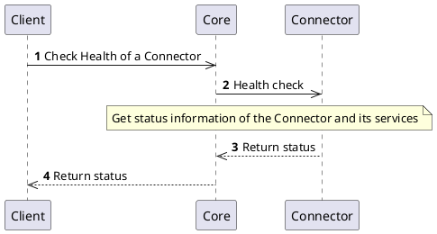

# Health Interface

## Overview

Each `Connector` has to implement the `Health` interface. This interface provides information about the status of services on which the `Connector` depends like database, HSM and so on. Although it is mandatory to implement `Health` interface, it is fully up to the `Connector` implementation what information will be provided.

## Connector NG

### How it works

In Connector NG, the Health interface is available at `GET /v2/health`. It provides structured health information conforming to a Spring Boot Actuator-compatible format and supports **Kubernetes probes** for liveness and readiness checks.

### Endpoints

| Endpoint                  | Purpose                                                              |
|---------------------------|----------------------------------------------------------------------|
| `GET /v2/health`          | Full health report including all components                         |
| `GET /v2/health/liveness` | Kubernetes liveness probe — is the process alive?                   |
| `GET /v2/health/readiness`| Kubernetes readiness probe — is the connector ready to serve traffic?|

#### Response codes

| Response code | Description                    |
|---------------|--------------------------------|
| 200           | Connector is healthy           |
| 503           | Connector is unhealthy or down |
| 500           | Internal Server Error          |

### Health status values

| Status          | Description                                                                     |
|-----------------|---------------------------------------------------------------------------------|
| `UP`            | The service (or component) is fully operational and healthy                     |
| `DOWN`          | The service (or component) is not functioning correctly and is unavailable      |
| `OUT_OF_SERVICE`| The service is intentionally out of service (e.g., disabled, under maintenance) |
| `UNKNOWN`       | The health state cannot be determined                                           |
| `DEGRADED`      | The service is working but with reduced functionality or performance (optional) |

### Response structure

The response body always contains:
- `status` — the overall health status of the connector
- `components` — a map of named components, each with its own `status` and optional `details`

The `liveness` and `readiness` components are **mandatory** in every health response.

#### Example — healthy connector (`200`)

```json
{
  "status": "UP",
  "components": {
    "liveness": {
      "status": "UP"
    },
    "readiness": {
      "status": "UP"
    },
    "database": {
      "status": "UP"
    },
    "keystore": {
      "status": "UP"
    },
    "remoteAuthority": {
      "status": "UP",
      "details": {
        "latencyMs": 45,
        "endpoint": "https://ca.example.com"
      }
    }
  }
}
```

#### Example — unhealthy connector (`503`)

```json
{
  "status": "DOWN",
  "components": {
    "liveness": {
      "status": "UP"
    },
    "readiness": {
      "status": "UP"
    },
    "database": {
      "status": "UP"
    },
    "keystore": {
      "status": "DOWN",
      "details": {
        "error": "Timeout connecting to HSM",
        "lastSuccessfulCheck": "2025-09-08T09:05:10Z"
      }
    },
    "remoteAuthority": {
      "status": "UP"
    }
  }
}
```

#### Example — liveness probe (`200`)

`GET /v2/health/liveness`

```json
{
  "status": "UP",
  "components": {
    "liveness": {
      "status": "UP"
    }
  }
}
```

#### Example — readiness probe unavailable (`503`)

`GET /v2/health/readiness`

```json
{
  "status": "OUT_OF_SERVICE",
  "components": {
    "readiness": {
      "status": "OUT_OF_SERVICE"
    }
  }
}
```

### Status codes by probe type

| Status Code              | Applies to                          | Description                                               |
|--------------------------|-------------------------------------|-----------------------------------------------------------|
| `200 OK`                 | Liveness, Readiness, Health         | Healthy / process alive / ready to serve traffic          |
| `503 Service Unavailable`| Liveness, Readiness, Health         | Unhealthy / not ready / dependencies failing              |
| `500 Internal Server Error` | Any                              | Unexpected error while checking health                    |

### Overall status calculation

The connector implementation is responsible for deciding which components to include in health and how to derive the overall status. The following approach is recommended:

**Severity order (lowest to highest):**
`UP` < `DEGRADED` < `UNKNOWN` < `OUT_OF_SERVICE` < `DOWN`

**Rules:**
1. If `liveness.status != UP` → overall `status = DOWN`
2. Else if `readiness.status != UP` → overall `status = DOWN`
3. Else compute the worst status among all remaining components:
   - Any `DOWN` or `OUT_OF_SERVICE` → overall `DEGRADED` (keeps traffic flowing but signals trouble)
   - Any `UNKNOWN` → overall `UNKNOWN`
   - Any `DEGRADED` → overall `DEGRADED`
   - Otherwise → overall `UP`

:::note
A non-critical component being `DOWN` does not necessarily mean the overall connector status should be `DOWN`. The connector implementation decides which components are critical for overall health.
:::

### Kubernetes probes

The liveness and readiness probes are designed to integrate with Kubernetes:

- **Liveness** — tells Kubernetes whether the process is alive. If liveness fails, Kubernetes restarts the pod. Use this to signal an unrecoverable internal state.
- **Readiness** — tells Kubernetes whether the connector is ready to accept traffic. If readiness fails, Kubernetes removes the pod from the load balancer. Use this to signal temporary unavailability (e.g., high load, startup).

### Specification and example

You can find specification and information about the Connector NG `Health` interface on the following locations:
- [Core Connector API v2](/api/core-connector/#tag/Connector-Management-v2) — `checkHealthV2`
- [Secret Provider API](/api/connector-secret-provider/) — connector-side `GET /v2/health` schema

---

## Legacy Connectors

### How it works

The `Health` interface provides current information about the status of the services provided by the `Connector` whenever it is requested.
Typically, when you would like to access details of the `Connector`, you can request information about its status.

### Health-check information

The status information contains the following structure:
- overall status of the `Connector`
- partial information about the service (which can contain any information and status)

The status can be one of the following:
- <span class="badge badge--success">ok</span> - service is running as expected
- <span class="badge badge--danger">nok</span> - there is a problem with the service, you should check the `Connector`
- <span class="badge badge--secondary">unknown</span> - status information not available

### Processes

#### Health-check

The `Client` with proper permissions can request health-check of the `Connectors` and invoke API that works with the `Health` interface of the `Connector`.
The following diagrams represents the requests and communication flow.



### Specification and example

You can find specification and information about the legacy `Health` interface on the following locations:
- [Core Connector API](/api/core-connector/)
- Connector API specifications, see for example [Authority Provider](/api/connector-authority-provider-v2/)
