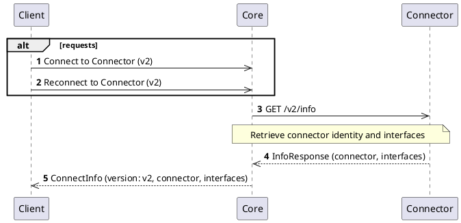
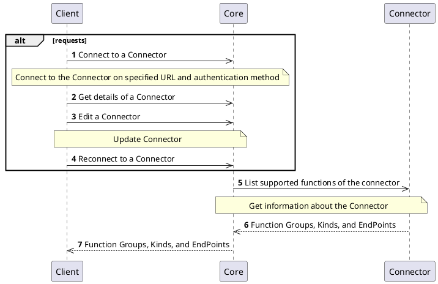
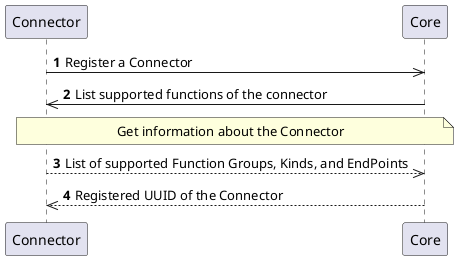

# Info Interface

## Overview

Each `Connector` has to implement the `Info` interface. This interface provides information about the list of supported functions and endpoints of the `Connector`.
The data is validated by the `Core` to check if the `Connector` is compliant with the definition of interfaces based on its function group.

## Connector NG

### How it works

In Connector NG, the `Info` interface is available at `GET /v2/info`. It provides structured information about the connector's identity, version, and the complete list of implemented interfaces — each with its own version and optional feature flags.

The `Core` uses this information during connect and reconnect operations to determine how to communicate with the connector and which provider interfaces are available.

### Endpoint

`GET /v2/info`

#### Response codes

| Response code | Description          |
|---------------|----------------------|
| 200           | See response         |
| 404           | Not found            |
| 500           | Internal Server Error |

### Response structure

The connector's `/v2/info` endpoint returns an `InfoResponse` with two top-level properties: `connector` and `interfaces`.

```json
{
  "connector": {
    "id": "ilm.example.connector",
    "name": "Example Connector",
    "version": "3.4.1",
    "description": "An example connector for demonstration purposes.",
    "metadata": {
      "author": "Example Author",
      "license": "MIT"
    }
  },
  "interfaces": [
    { "code": "info", "version": "2", "features": [] },
    { "code": "health", "version": "2", "features": [] },
    { "code": "metrics", "version": "1", "features": ["openMetrics"] },
    { "code": "authority", "version": "2", "features": [] }
  ]
}
```

#### `connector` object

| Field         | Type   | Required | Description                                                                        |
|---------------|--------|----------|------------------------------------------------------------------------------------|
| `id`          | string | yes      | Stable, unique identifier defined by the connector (e.g., `ilm.ejbca.ng`)  |
| `name`        | string | yes      | Human-readable name of the connector                                               |
| `version`     | string | yes      | Connector release version (e.g., `3.4.1`)                                         |
| `description` | string | no       | Human-readable description of the connector                                        |
| `metadata`    | object | no       | Free-form key-value pairs with additional information (author, license, etc.)      |

#### `interfaces` array

Each entry describes one implemented interface. The structure is `ConnectorInterfaceInfo`:

| Field      | Type            | Required | Description                                                                          |
|------------|-----------------|----------|--------------------------------------------------------------------------------------|
| `code`     | string          | yes      | Interface identifier — see [Interface codes](#interface-codes) below                 |
| `version`  | string          | yes      | Version of the interface implemented by this connector (e.g., `"2"`)                |
| `features` | array of string | no       | Optional feature flags — see [Feature flags](#feature-flags) below                  |

### Interface codes

The `code` field must be one of the following values defined by the `ConnectorInterface` enum:

| Code            | Label           | Description                                              |
|-----------------|-----------------|----------------------------------------------------------|
| `info`          | Info            | Connector identity and interface listing                 |
| `health`        | Health          | Health status with Kubernetes liveness/readiness probes  |
| `metrics`       | Metrics         | Prometheus/OpenMetrics metrics endpoint                  |
| `authority`     | Authority       | Certification authority operations                       |
| `discovery`     | Discovery       | Certificate discovery                                    |
| `entity`        | Entity          | End-entity and location management                       |
| `compliance`    | Compliance      | Compliance rules                                         |
| `cryptography`  | Cryptography    | Cryptographic key management and operations              |
| `notification`  | Notification    | Notification delivery                                    |
| `secret`        | Secret          | Secret/credential management                             |

### Feature flags

Feature flags are optional capability indicators that signal connector behaviour beyond what the API reference defines. The `features` field contains values from the `FeatureFlag` enum:

| Code               | Applicable interfaces | Description                                                                  |
|--------------------|-----------------------|------------------------------------------------------------------------------|
| `stateless`        | any                   | The connector does not require a persistence layer (e.g., no database)       |
| `openMetrics`      | `metrics`             | Metrics are exposed in OpenMetrics format (in addition to Prometheus text)   |
| `secretVersioning` | `secret`              | Supports versioning of secrets, keeping a history of previous values         |
| `secretRotation`   | `secret`              | Supports triggering rotation of secrets                                      |

### Processes

#### Connect and reconnect (NG)

The `Core` uses the `/v2/connectors/connect` and `/v2/connectors/{uuid}/reconnect` endpoints to register or refresh a Connector NG. These v2 endpoints work for both legacy and NG connectors.



**For legacy connectors (`version: "v1"`):**
The response contains `functionGroups` and `kinds` instead of `connector` and `interfaces`.

### Specification and example

You can find specification and information about the Connector NG `Info` interface on the following locations:
- [Core Connector API v2](/api/core-connector/#tag/Connector-Management-v2) — `getInfoV2`, `connectV2`, `reconnectV2`
- [Secret Provider API](/api/connector-secret-provider/) — connector-side `GET /v2/info` schema

---

## Legacy Connectors

### How it works

The `Info` interface is used during the `Connector` registration and reconnecting to update the information if necessary.

### Processes

#### Client operations

The `Client` with proper permissions can manage the `Connectors` and invoke API that works with the `Info` interface of the `Connector`.
The following diagrams represents the requests and communication flow.



#### Connector self-registration

The `Connector` is allowed to self-register in the platform. In this case the information about the `Connector` is stored and waiting for approval by the user or administrator.
The registration of the `Connector` may be executed by any external entity.



### Specification and example

You can find specification and information about the legacy `Info` interface on the following locations:
- [Core Connector API](/api/core-connector/)
- Connector API specifications, see for example [Authority Provider](/api/connector-authority-provider-v2/)
