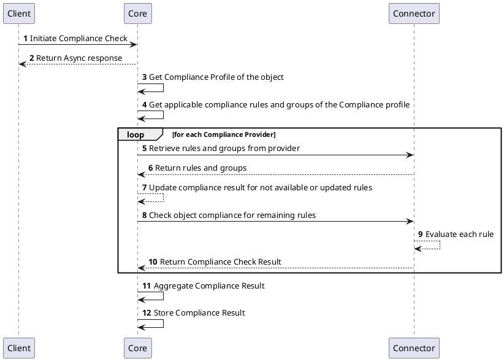

# Compliance Provider

## Overview

Various cryptographic assets, like certificate and cryptographic key, can contain various attributes and can be based on different algorithms.
There are also various standards and regulations that require specific behavior of the certificate, for example to be able to react on algorithm deprecation or vulnerabilities.
The compliance checking helps to monitor the compliance status of each certificate (and other supported compliance subjects) that is included in the inventory of the platform.

Compliance Provider implements the functionality of compliance settings and checking for different objects available in the platform.
It applies specific compliance rules and group of compliance rules to objects and informs about the compliance status. Based on the compliance check, the object will either be determined as compliant or not compliant.

Currently supported resources that can be checked for compliance are:
- Certificates
- Certificate Requests
- Cryptographic Keys and its items

## How it works

Compliance Provider have a set of applicable compliance rules and groups that can be configured as part of the `Compliance Profile`.
Each rule needs to specify resource for which is applicable (e.g. Certificate) and optionally type of resource object (e.g. Certificate type `X.509`). This defines the set of compliance requirements.

To check for the compliance status, `Compliance Profile` should be associated with corresponding profile (e.g. `RA Profile` for resource Certificate).
After that every `Certificate` managed by such `RA Profile` will be checked against compliance rules for Certificates configured in the `Compliance Profile`.
Compliance checking can be executed on `RA Profile` level (for all `Certificates`), for every specific `Certificate` in the inventory, or for each `Compliance Profile`. 

## Provider objects

[`Compliance Profiles`](../concept-design/core-components/compliance-profile.md) objects are managed in the platform through the Compliance Provider implementation.
Each `Compliance Profile` contains a list of available compliance rules and groups that can be applied for a compliance checking.
Many different `Compliance Profiles` with different compliance requirements can be managed and applied on individual resource objects.

## Processes

The following processes are associated with the Compliance Provider and management of the `Compliance Profile` objects and checking compliance status of object.

### Check Compliance of object

:::info
When a request is made to check the compliance of the `Certificate`, the `Core` gathers list of rules configured in the associated `Compliance Profile` with resource Certificate and request each Compliance Profiles for the specific compliance rule result.
After all compliance rules are evaluated, the `Core` then computes the overall compliance status.
:::

## Specification and example

The Compliance Provider implements [Common Interfaces](common-interfaces/overview.md) and the following additional interfaces:
- [Compliance Rules](/api/connector-compliance-provider-v2/#tag/Compliance-Rules)
- [Compliance](/api/connector-compliance-provider-v2/#tag/Compliance)

The OpenAPI specification of the Compliance Provider can be found here: [Connector API - Compliance Provider](/api/connector-compliance-provider-v2/).
