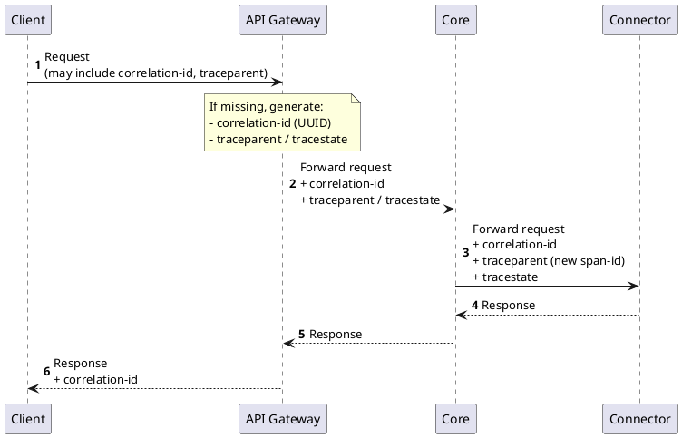

# Logging and Tracing

## Overview

Connector NG uses HTTP headers for observability. The platform adopts [W3C Trace Context](https://www.w3.org/TR/trace-context/) to track and correlate operations across services, making debugging and log correlation straightforward.

When a connector receives observability headers in a request, it is expected to use them for its own logging and tracing. Tracing headers (`traceparent`, `tracestate`) are **not** propagated back to the client — only the `correlation-id` header is returned.

## How it works

The API gateway is responsible for trace and request identification:

1. If there is no `correlation-id` header, the gateway generates a new UUID.
2. If there are no `traceparent` and `tracestate` headers, the gateway creates new ones.
3. The gateway forwards all headers to upstream services (typically the `Core`, but the same applies to any upstream).
4. When the `Core` communicates with a `Connector`, it forwards these headers with a unique `span-id` for tracing.
5. Only the `correlation-id` header is propagated back to the client and it contains the same value as originally provided.



## Requirements for connectors

Each Connector NG implementation must accept and interpret the following headers:

| Header           | Description                                                                                                  | Propagated back |
|------------------|--------------------------------------------------------------------------------------------------------------|-----------------|
| `correlation-id` | Correlation identifier to match related operations across services                                           | yes             |
| `traceparent`    | W3C Trace Context header containing trace ID, span ID, and trace flags                                      | no              |

If a header is not present in the incoming request, the connector must generate a new value and use it for its own logging and tracing.

## Logging

To enable log correlation across services, trace and correlation identifiers must be included in every log entry. Connector NG defines a JSON log schema that all connectors are required to follow. When connectors log according to this schema, logs from all services can be consistently collected and interpreted.

### Log format

All log entries must be JSON objects conforming to the `connector.log` schema (version 1):

| Field            | Type   | Required | Description                                                                       |
|------------------|--------|----------|-----------------------------------------------------------------------------------|
| `schema`         | object | yes      | Schema identifier — `{ "name": "connector.log", "version": 1 }`                  |
| `@timestamp`     | string | yes      | ISO 8601 / RFC 3339 timestamp of the log event                                   |
| `severity`       | string | yes      | Log level: `TRACE`, `DEBUG`, `INFO`, `WARN`, `ERROR`, or `FATAL`                 |
| `message`        | string | yes      | Log message (structured or unstructured, depending on the connector)              |
| `service`        | object | yes      | Service identification — `name` (required) and `version` (optional)               |
| `trace_id`       | string | conditional | W3C/OTel 16-byte trace ID as 32 lowercase hex characters                      |
| `span_id`        | string | conditional | W3C/OTel 8-byte span ID as 16 lowercase hex characters                        |
| `trace_flags`    | string | no       | W3C trace flags — `"00"` (not sampled) or `"01"` (sampled)                        |
| `correlation_id` | string | conditional | Correlation identifier matching the `correlation-id` header (max 128 chars)   |
| `attributes`     | object | no       | Free-form key/value context for additional information                            |

:::note
Each log entry must include either `trace_id` and `span_id`, or `correlation_id`, or both. This ensures that every log entry can be correlated with a request.
:::

### Example

```json
{
  "schema": { "name": "connector.log", "version": 1 },
  "@timestamp": "2025-09-10T14:03:22.615Z",
  "severity": "INFO",
  "trace_id": "4c8f7c10d5a6d0ae4bbf6b6e8b0cd8a1",
  "span_id": "f1a2b3c4d5e6f789",
  "trace_flags": "01",
  "correlation_id": "req-3c59a3",
  "service": { "name": "connector", "version": "1.1.0" },
  "message": "Certificate issued successfully for CN=example.com",
  "attributes": { "key1": "value1", "key2": "value2" }
}
```

### JSON schema

The complete JSON schema for the `connector.log` format:

```json
{
  "$schema": "https://json-schema.org/draft/2020-12/schema",
  "$id": "https://schemas.example.com/connector.log/1",
  "title": "connector.log v1",
  "type": "object",
  "additionalProperties": false,

  "required": ["schema", "@timestamp", "severity", "message", "service"],

  "properties": {
    "schema": {
      "type": "object",
      "additionalProperties": false,
      "required": ["name", "version"],
      "properties": {
        "name": { "type": "string", "const": "connector.log" },
        "version": { "type": "integer", "const": 1, "minimum": 1 }
      }
    },

    "@timestamp": { "type": "string", "format": "date-time" },

    "severity": {
      "type": "string",
      "enum": ["TRACE", "DEBUG", "INFO", "WARN", "ERROR", "FATAL"]
    },

    "trace_id": {
      "type": "string",
      "description": "W3C/OTel 16-byte ID as 32 lowercase hex chars",
      "pattern": "^[0-9a-f]{32}$"
    },

    "span_id": {
      "type": "string",
      "description": "W3C/OTel 8-byte ID as 16 lowercase hex chars",
      "pattern": "^[0-9a-f]{16}$"
    },

    "trace_flags": {
      "type": "string",
      "description": "W3C trace flags (sampled bit)",
      "enum": ["00", "01"]
    },

    "correlation_id": {
      "type": "string",
      "minLength": 1,
      "maxLength": 128
    },

    "service": {
      "type": "object",
      "additionalProperties": false,
      "required": ["name"],
      "properties": {
        "name": { "type": "string", "minLength": 1 },
        "version": { "type": "string", "minLength": 1 }
      }
    },

    "message": { "type": "string", "minLength": 1 },

    "attributes": {
      "type": "object",
      "description": "Free-form key/value context",
      "additionalProperties": {
        "oneOf": [
          { "type": "string" },
          { "type": "number" },
          { "type": "boolean" },
          { "type": "null" },
          { "type": "object" },
          {
            "type": "array",
            "items": {
              "type": ["string", "number", "boolean", "null", "object"]
            }
          }
        ]
      }
    }
  },

  "allOf": [
    {
      "anyOf": [
        { "required": ["trace_id", "span_id"] },
        { "required": ["correlation_id"] }
      ]
    }
  ]
}
```
