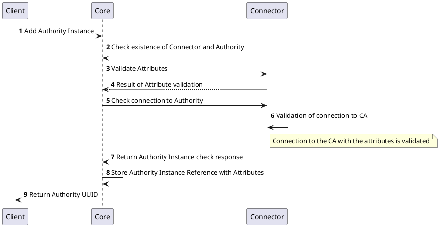
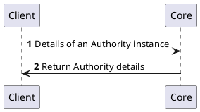
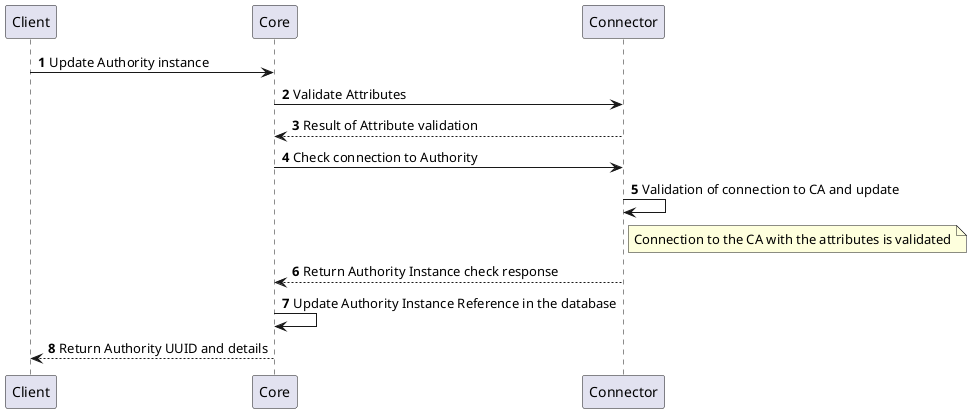
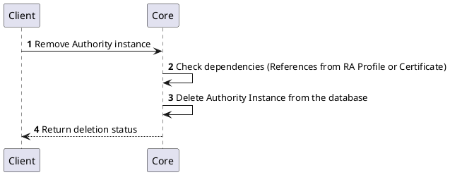
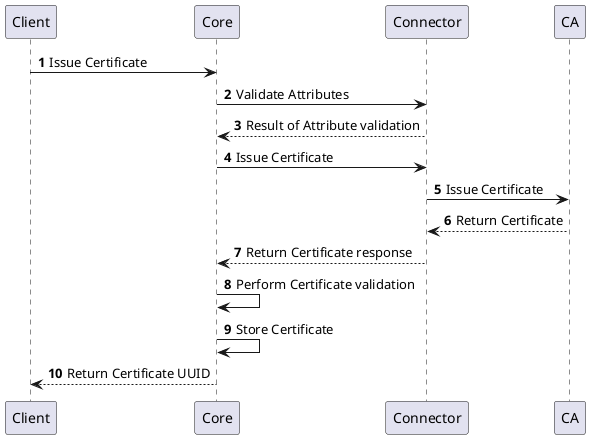
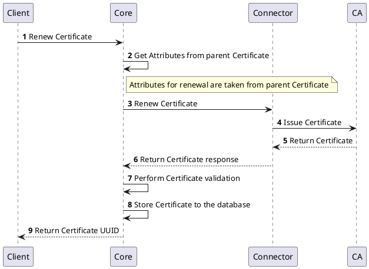
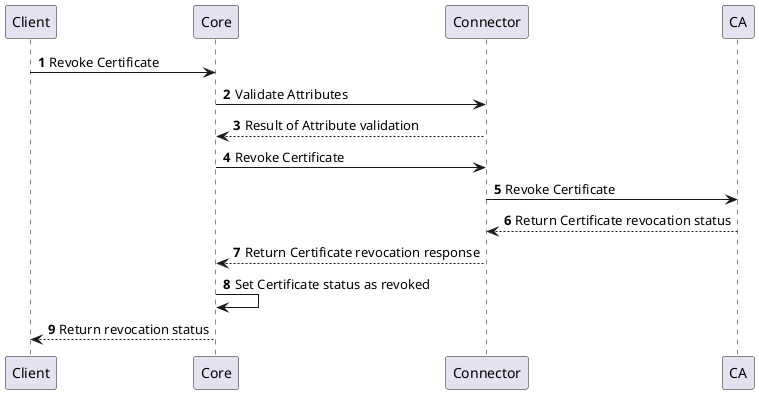

# Authority Provider NG

## Overview

Authority Provider interface is used to manage operations with certification authorities and certificates issued by them. The Authority Provider acts as an interface between the platform and the certification authority providing the following management functions:
- access to the certification authority
- certificate management operations like issue, renew (rekey), and revoke
- retrieval of the CA information, including CA certificate chain and CRL

## How it works

Authority Provider provides the ability to communicate with different types and technologies of certification authorities. The Authority Provider consumes requests from the platform and translates them into the specific API calls of the certification authority. The Authority Provider also processes the responses from the certification authority and translates them into the format understood by the platform. The Authority Provider is stateless and does not store any information about the certification authority or certificates. All the information is stored in the platform.

:::tip[Authority Provider state]
There is no requirement or expectation by the platform to store any state on the Authority Provider and it is recommended that the implementation is stateless. However, if the implementation needs to store some information, it is free to do so. The implementation is responsible for ensuring that the information is stored securely and is not accessible to unauthorized users.
:::

## Processes

The following processes are associated with the Authority Provider and management of the `Authority` objects.

## `Authority` Instance Management

### Create `Authority` Instance

To create an `Authority` instance, the client needs to provide the required attributes as defined by the specific implementation of the Authority Provider. The implementation will validate the provided attributes and attempt to establish a connection to the certification authority to ensure that the configuration is correct and the authority is reachable.

Once the connection is successfully validated, the `Authority` instance will be created and stored in the platform. The client will receive a unique identifier (UUID) for the newly created `Authority` instance.

### Get `Authority` Instance Details

To retrieve the details of an `Authority` instance, the client needs to provide the UUID of the existing instance. The implementation will fetch the details of the `Authority` instance from the platform and return them to the client.

### Update `Authority` Instance

To update an `Authority` instance, the client needs to provide the UUID of the existing instance along with the updated attributes. The implementation will validate the provided attributes and attempt to re-establish a connection to the certification authority to ensure that the updated configuration is correct and the authority is reachable.

If the connection is successfully validated, the `Authority` instance will be updated in the platform with the new configuration. The client will receive the updated details of the `Authority` instance.

### Remove `Authority` Instance

To remove an `Authority` instance, the client needs to provide the UUID of the existing instance. The implementation will check if the `Authority` instance exists and whether it is referenced by any `RA Profile` or `Certificate`. If it is not referenced, the instance will be removed from the platform.

## `Certificate` Management
Sections below represents the list of processes involved in managing the certificates.

### Issue `Certificate`

### Renew `Certificate`

### Revoke `Certificate`

## Specification and example

The Authority Provider v2 implements [Common Interfaces](common-interfaces/overview.md) and the following additional interfaces:
- [Authority Management](/api/connector-authority-provider-v2/#tag/Authority-Management)
- [Certificate Management](/api/connector-authority-provider-v2/#tag/Certificate-Management)

The OpenAPI specification of the Authority Provider v2 can be found here: [Connector API - Authority Provider v2](/api/connector-authority-provider-v2/).
