# Authority Provider v2

## Overview

Authority Provider v2 interface is used to manage operations with certificates issued by certification authority. The Authority Provider v2 acts as an interface between the `Core` and the certification authority providing the following management functions:
1. Issue
2. Renew
3. Revoke
4. Cancel a parked issue or revoke (asynchronous flows)
5. Poll the status of a parked issue or revoke (asynchronous flows)

## How it works

Authority Provider v2 provides the ability to communicate with different types and technologies of certification authorities. The platform supports both **synchronous** authorities (the connector returns the issued or revoked certificate immediately) and **asynchronous** authorities (the connector parks the operation and reports back later, or hands the operation off to an operator). The signal between Core and the connector for the asynchronous case is the HTTP response code on the existing `issueCertificate` / `renewCertificate` / `revokeCertificate` calls — see [Asynchronous certificate operations](#asynchronous-certificate-operations) below.

## Provider objects

[`Authority`](../../concept-design/core-components/authority.md) objects are managed in the platform through the Authority Provider v2 implementation.

## Processes

The following processes are associated with the Authority Provider v2 and management of the `Authority` objects.

## `Authority` Instance Management

### Create `Authority` Instance

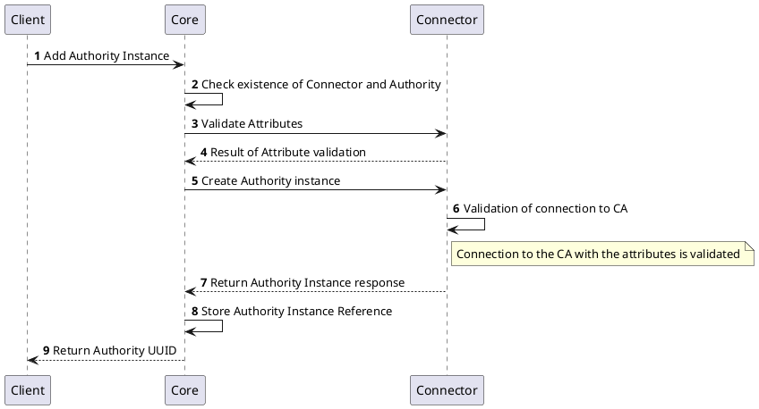

### Get `Authority` Instance Details

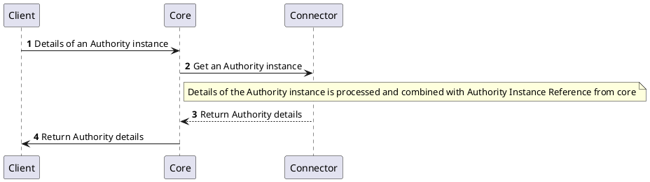

### Update `Authority` Instance

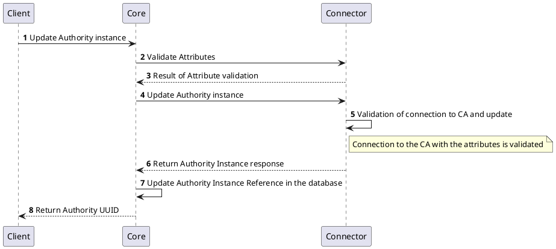

### Delete `Authority` Instance

The below diagram shows the sequence of messages that are exchanged between the client, core, and provider to delete an Authority instance.

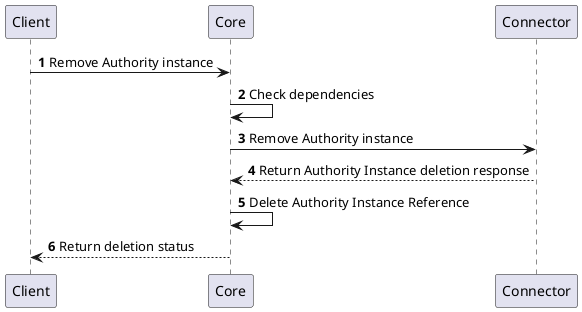

## `Certificate` Management
Sections below represents the list of processes involved in managing the certificates.

### Issue `Certificate`

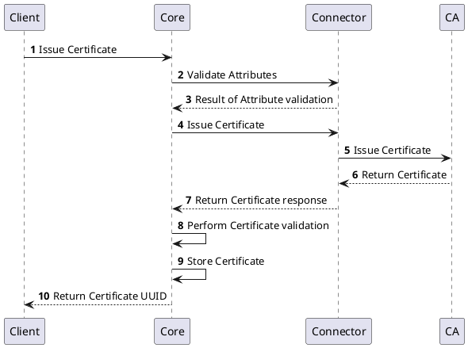

### Renew `Certificate`

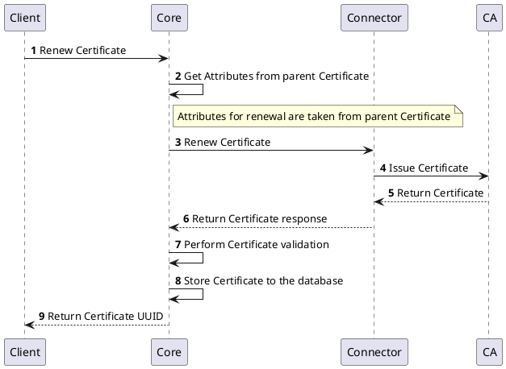

### Revoke `Certificate`

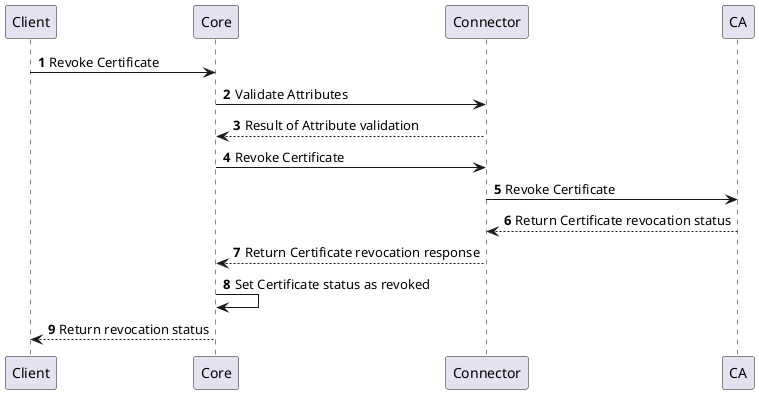

## Asynchronous certificate operations

When a certificate authority cannot complete `issue`, `renew`, or `revoke` synchronously — for example a manual or air-gapped CA, a CA that processes requests in batches, or an external authority that requires an operator-driven step — the connector **parks** the operation. The platform handles the parked state, finalisation, and cancellation through the existing v2 endpoints plus four purely-additive endpoints.

### Parking signal

The signal is the HTTP response on the existing `issueCertificate` / `renewCertificate` / `revokeCertificate` calls:

| Connector response                               | Cert state transition                                                  | Notes                                                                                                                |
|--------------------------------------------------|------------------------------------------------------------------------|----------------------------------------------------------------------------------------------------------------------|
| `200 OK` + `certificateData` (+ optional `meta`) | → `Issued` (issue/renew) or `Revoked` (revoke).                       | Today's synchronous behaviour. Unchanged.                                                                            |
| `202 Accepted` (+ optional `meta`)               | → `Pending Issue` (issue/renew) or `Pending Revoke` (revoke). Parked. | New. Existing connectors continue to return `200`; sync paths are unaffected.                                        |
| Any other status / connector exception           | → `Failed` (or back to `Issued` for revoke). Unchanged.               |                                                                                                                      |

The `meta` returned with `202` is **opaque** to Core. The connector chooses what to put in it (order ID, transaction reference, multi-field state) and Core stores it against the certificate via the same persistence path used for `200 OK + meta` today. Core does not interpret the value.

There is **no platform-level "offline" or "external" classification** of authorities, RA profiles, or connectors. Behaviour is driven by certificate state and the connector's response.

### Parked-operation lifecycle endpoints

Four purely-additive endpoints complete the parked-operation lifecycle:

| Method                       | HTTP   | Path                                                                                  | Body                                                                                  | Response                                                                                                  |
|------------------------------|--------|---------------------------------------------------------------------------------------|---------------------------------------------------------------------------------------|-----------------------------------------------------------------------------------------------------------|
| `cancelIssueCertificate`     | `POST` | `/v2/authorityProvider/authorities/{uuid}/certificates/issue/cancel`                  | `CertificateOperationCancelRequestDto { raProfileAttributes, meta }`                  | `204 No Content` (acknowledged); `404` (not tracked); `422` (refuses to abort, with reason)               |
| `cancelRevokeCertificate`    | `POST` | `/v2/authorityProvider/authorities/{uuid}/certificates/revoke/cancel`                 | `CertificateOperationCancelRequestDto { raProfileAttributes, meta }`                  | `204 No Content` (acknowledged); `404` (not tracked); `422` (refuses to abort, with reason)               |
| `getIssueCertificateStatus`  | `POST` | `/v2/authorityProvider/authorities/{uuid}/certificates/issue/status`                  | `CertificateOperationStatusRequestDto { raProfileAttributes, meta }`                  | `CertificateOperationStatusResponseDto { status: IN_PROGRESS \| COMPLETED \| FAILED, certificateData?, meta?, reason? }` |
| `getRevokeCertificateStatus` | `POST` | `/v2/authorityProvider/authorities/{uuid}/certificates/revoke/status`                 | `CertificateOperationStatusRequestDto { raProfileAttributes, meta }`                  | `CertificateOperationStatusResponseDto { status: IN_PROGRESS \| COMPLETED \| FAILED, meta?, reason? }`     |

The operation type is explicit in the path so the connector's two cancel handlers (and two status handlers) know unambiguously what they're acting on. Core dispatches based on certificate state — `Pending Issue` certificates route to the `issue/*` endpoints; `Pending Revoke` certificates route to the `revoke/*` endpoints.

**Cancel response semantics.** Core treats the connector's response as follows:
- `204 No Content` — cancel acknowledged. Core proceeds with the local state transition.
- `404 Not Found` — connector does not track the operation (already finalised externally, or implementation is stateless). **Soft failure**: Core records the result in event history and proceeds with the local transition.
- `422 Unprocessable Entity` (with reason) — connector refuses to abort (e.g., the underlying CA cannot abort the operation). **Hard failure**: Core surfaces the reason to the user and leaves the certificate in its pending state.
- `5xx` / network error — soft failure. Core records the error and proceeds with the local transition (cancel is user intent).

**Status response semantics.** When `status = COMPLETED` for an issue/renew, `certificateData` carries the Base64 cert content and Core finalises through the same internal path used by manual upload. When `status = COMPLETED` for revoke, no payload is needed — Core finalises the revoke transition. When `status = FAILED`, the connector's `reason` is surfaced and the certificate moves to `Failed`. The optional `meta` in the response lets the connector refresh the tracked state on each poll.

Sync-only connectors are never asked: Core only invokes these four endpoints against certificates in `Pending Issue` / `Pending Revoke`, which only exist after a `202` response. Existing sync connectors are unaffected and need no changes. A connector that does not track operation state may return `404 Not Found` from a status endpoint; Core treats this as "this connector does not support polling for this operation".

### Park `Certificate` Issue (Renew)

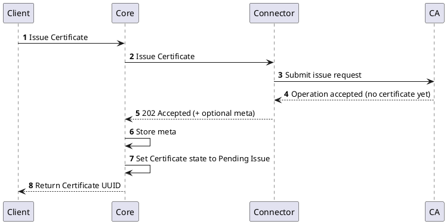

The same flow applies to `renewCertificate` — the new certificate ends in `Pending Issue` while the predecessor remains `Issued` until the new certificate is finalised.

### Park `Certificate` Revoke

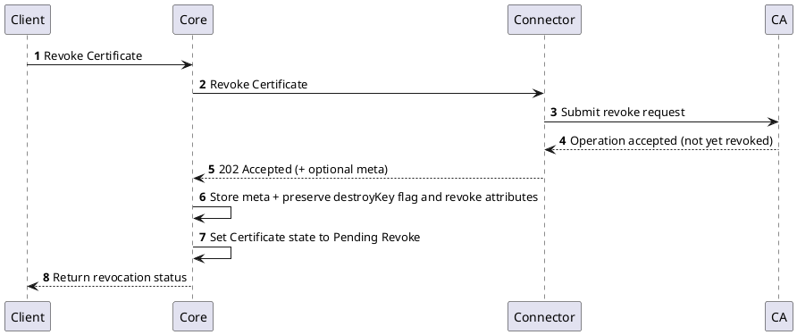

The `destroyKey` flag and revoke attributes from the original request are preserved on the certificate and applied when the parked revoke is confirmed.

### Finalise parked Issue (manual upload)

When an operator uploads the externally-issued certificate, Core verifies the upload, asks the connector to identify it, and transitions the certificate to `Issued`.

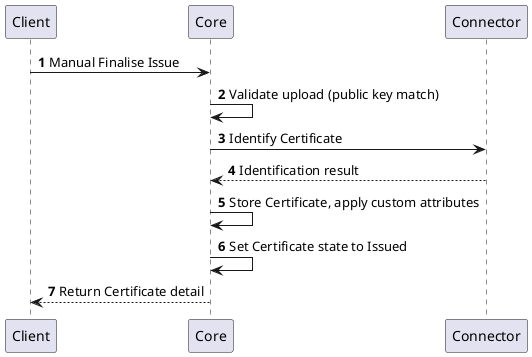

### Confirm parked Revoke

Used when the revocation has been completed externally and the operator confirms it in the platform.

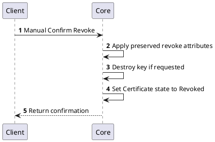

### Cancel parked operation

Used when the parked operation is no longer wanted. Core dispatches to the appropriate connector cancel endpoint based on certificate state.

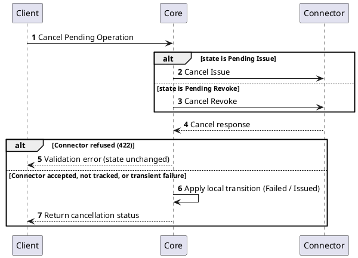

### Operations blocked while pending

While a certificate is in `Pending Issue` or `Pending Revoke`, the following client operations return `400 Bad Request`:

- `renewCertificate`
- `rekeyCertificate`
- `revokeCertificate` (for certificates in `Pending Issue`)
- Re-issue of the same `Requested` certificate
- Switch RA profile

The escape hatch from a stuck pending state is **Cancel parked operation**.

## Specification and example

The Authority Provider v2 implements [Common Interfaces](../common-interfaces/overview.md) and the following additional interfaces:
- [Authority Management](/api/connector-authority-provider-v2/#tag/Authority-Management)
- [Certificate Management](/api/connector-authority-provider-v2/#tag/Certificate-Management)

The OpenAPI specification of the Authority Provider v2 can be found here: [Connector API - Authority Provider v2](/api/connector-authority-provider-v2/).
