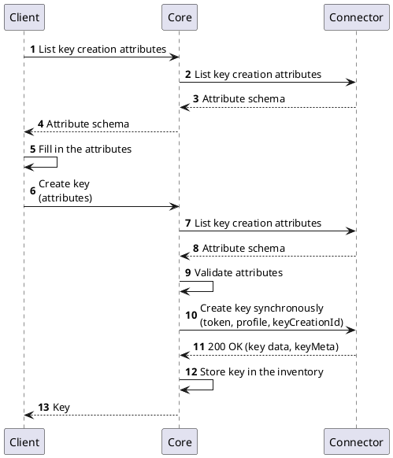
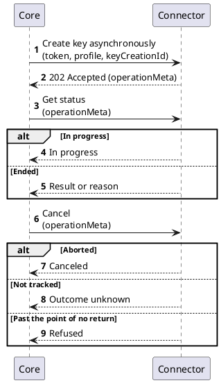
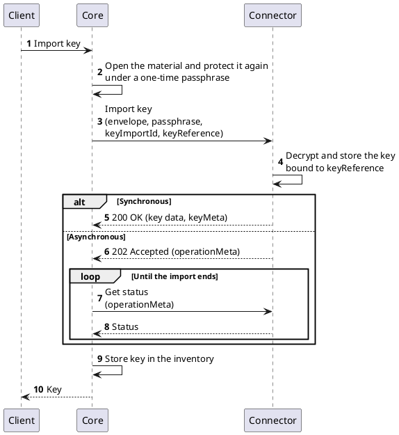

# Cryptography Provider v2

## Overview

Cryptography Provider v2 is the default interface between `Core` and a technology holding cryptographic keys, such as a hardware security module, a key management service or a software keystore. The interface covers token status, the key lifecycle, and the cryptographic operations performed with a key: signing, verification, encryption, decryption and random data generation.

Cryptography Provider v2 differs from [Cryptography Provider v1](./cryptography-provider.md) as follows:

- **Stateless.** `Core` owns every token and token profile. Each request carries the context the connector needs.
- **Capability-driven.** A connector declares asynchronous execution, key import and key export as capabilities. `Core` uses only what a connector declares.
- **Synchronous or asynchronous.** A slow operation can be accepted and tracked to completion. The caller selects the mode on each request.

## Relationship to Cryptography Provider v1

Cryptography Provider v1 is deprecated since 2.20.0. `Core` serves both contracts side by side. Deployed v1 providers therefore keep working while they migrate.

`Core` binds each token to one contract at the token's creation:

- A connector reporting the `cryptography` interface at version `v2` through its [Info interface](../common-interfaces/info-interface.md) gets v2 tokens.
- A legacy connector with the `Cryptography Provider` function group gets v1 tokens.

**A token keeps its contract for its whole life.** Its keys keep it too. Tokens created before their connector moved to v2 stay on v1. A provider therefore migrates by serving v2 alongside v1. It keeps v1 for as long as operators use the tokens bound to it.

## How it works

### Stateless model

A request about a token, a token profile or a key carries that context as attributes:

- **Token attributes** identify the token and authenticate to it.
- **Token profile attributes** carry the configuration of the profile the operation runs under.
- **Key metadata** (`keyMeta`) identifies an existing key.

`Core` assembles the attributes from its own records on every call. It resolves referenced secrets and credentials as the system identity. The connector rebuilds its session to the technology from them.

Key metadata is the connector's own description of a key. The connector returns it when it creates or imports the key. `Core` sends it back unchanged in every later request for that key. Key metadata must identify the key durably, across connector restarts and sessions.

`Core` validates request attributes against the schemas the connector publishes. The connector receives attributes that already passed that validation. New connectors use [v3 attributes](../../../contributors/attributes/overview.md).

A v2 token is usable as soon as the connector reaches it. The token status reports reachability.

### Capabilities

A connector declares optional behavior as feature flags on its `cryptography` interface, through the [Info interface](../common-interfaces/info-interface.md#feature-flags). The flags are opt-in and enforced. `Core` invokes a capability only when the connector declares it.

| Capability   | Code           | What it enables                                                                                   |
|--------------|----------------|---------------------------------------------------------------------------------------------------|
| Asynchronous | `asynchronous` | The connector accepts asynchronous execution, with status and cancel endpoints for each such operation |
| Key import   | `keyImport`    | The connector imports protected key material into a token                                          |
| Key export   | `keyExport`    | The connector exports keys created or imported as exportable, as protected key material            |

### What a connector publishes

The platform offers only what the connector publishes for each token and token profile:

- **Token attributes**, the schema an operator fills in to configure a token.
- **Token profile attributes**, for a given token.
- **Key usages** the token supports.
- **Key request types** the token profile can create: a secret key, a key pair, or both.
- **Operation attribute schemas**: for creating each key type, and for signing, verification, encryption, decryption and random data with a given key or profile.
- **Importable and exportable key types**, each with the algorithms it accepts, when the connector declares import or export.

The contract reserves these attribute names:

- **`signatureAlgorithm`** in the signing and verification schemas offers the signature algorithms the key supports. The caller selects exactly one. The platform thus knows the algorithm before the signature exists.
- **`encryptionAlgorithm`** in the encryption and decryption schemas offers the encryption algorithms the key supports. The caller selects exactly one.
- **`keyExportable`** in the key creation schema carries the intent to export a key later. Only a connector declaring `keyExport` publishes it.

## Key lifecycle

### Create a key

A create request names the key type, the execution mode and a caller-chosen `keyCreationId`. It carries the creation attributes. A synchronous request completes with the created key. An asynchronous one is accepted with a tracking handle. A client fetches the creation attribute schema before it creates a key. The diagram shows the synchronous creation `Core` performs.

**Key creation is idempotent.** A replay with the same `keyCreationId` and an equivalent request returns the original outcome. That outcome is the result of a synchronous request, or the tracking handle of an asynchronous one. Reusing the identifier with a different request is refused as a conflict. A retry after a lost response therefore leaves a single key on the token.

### Destroy a key

A destroy request identifies the key by its metadata and names the execution mode. A connector that accepted an asynchronous destruction refuses new cryptographic operations with that key.

### Asynchronous operations

Key creation, destruction, import and signing can run asynchronously on a connector declaring `asynchronous`. The connector honors the mode the caller selects.

An accepted operation answers `202 Accepted` with an `operationMeta` tracking handle. The handle is opaque to `Core`. It is sufficient on its own: status and cancel requests carry only the handle. The handle stays valid for as long as the connector tracks the operation, including after it ends.

The diagram shows an asynchronous key creation. Each asynchronous operation has its own status and cancel endpoints.

A completed status carries the result in the shape of a synchronous response. A failed or canceled status carries a reason.

## Cryptographic operations

Signing, verification, encryption and decryption run on a batch of items, each with an `identifier`. Every response item carries the identifier of exactly one request item. The response covers each request item once. `Core` matches the results to the request by identifier.

- **Sign** runs synchronously or asynchronously. An asynchronous batch is tracked and canceled as a whole. A retry after a lost response signs again.
- **Verify**, **encrypt** and **decrypt** are synchronous.
- **Random data** is synchronous. It runs under a token profile.

## Key import and export

Import and export move key material between the platform and a token. Each needs its capability flag. The importable and exportable key types tell the platform what a token accepts before a user asks for it.

**Key material crosses the interface only inside a protected PKCS#8 envelope**: an `EncryptedPrivateKeyInfo` under one pinned password-based protection profile. The OpenAPI specification states the profile.

### Import

`Core` opens what the user supplied. It protects the key again under a passphrase generated for this request alone. It sends the envelope with a `keyReference` it assigns. The connector decrypts the envelope and stores the key bound to that reference. Its response describes what it stored: the derived public key of a key pair, or the algorithm and length of a secret key.

Import is idempotent through `keyImportId`, as creation is through `keyCreationId`. `Core` protects the material again for every submission. The import result endpoint resolves an import by its `keyImportId`. A caller that lost the response thus learns what the connector holds.

### Export

Export is synchronous. The protected material therefore exists only in its response. The connector protects the key under the passphrase from the request. It returns the envelope with a description of the key. `Core` checks that description against its own record.

Only a key created or imported as exportable can be exported. The exportable intent is set once: through the `keyExportable` attribute at creation, or the `exportable` field at import. The connector maps it to the technology's own extractability control. A connector refuses the request when its token forbids extractable keys.

## Sensitive data

- **Requests carry resolved credentials.** The transport is trusted with them as with connector credentials.
- **Passphrases and key material are used once.** The connector discards them once the operation is done. Over the message broker, a request carrying them expires with the operation timeout.
- **Responses hold sanitized text only.** Schemas, results and failure reasons reach callers. `Core` refuses a response that echoes a secret it sent.

## Transport

The connector implements one HTTP interface. `Core` reaches it directly or through a proxy:

- **Directly over REST.**
- **Through a proxy over the message broker**, for a connector registered through a proxy. `Core` publishes the request. The proxy calls the connector over HTTP and returns its response.

The proxy preserves the HTTP status. `200 OK` and `202 Accepted` therefore mean the same on both paths. `Core` and the proxy correlate each response with its request. The connector correlates within the payload: batch items by `identifier`, and asynchronous operations by `operationMeta`.

## What the platform does

- **Tokens and token profiles live in the platform.** The token status shown is the one the connector reports.
- **Key creation, destruction and signing always run synchronously.**
- **Key import runs asynchronously** on a connector declaring `asynchronous`. `Core` polls the import until it ends. `Core` cancels it when the request timeout passes. An import whose requester never received the answer is settled later through the import result. The key it left on the token is destroyed.
- **A key the connector no longer knows counts as destroyed.** `Core` treats a `404 Not Found` from a destroy request that way.

## For connector developers

The base contract covers:

- the token endpoints: token attributes, token status, token profile attributes, key usages and key request types;
- synchronous key creation and destruction, with the key creation attribute schema;
- signing, verification, encryption, decryption and random data, each with its attribute schema.

Each capability adds endpoints:

- `asynchronous` adds the status and cancel endpoints of every operation the connector runs asynchronously.
- `keyImport` adds the importable key types, the import attribute schema, import, and the import result. It adds status and cancel when import runs asynchronously.
- `keyExport` adds the exportable key types, the export attribute schema and export, and the `keyExportable` attribute in the key creation schema.

## Specification

Cryptography Provider v2 implements the [Common Interfaces](../common-interfaces/overview.md) and these interfaces of its own:

- Token Management v2
- Key Management v2
- Cryptographic Operations v2
