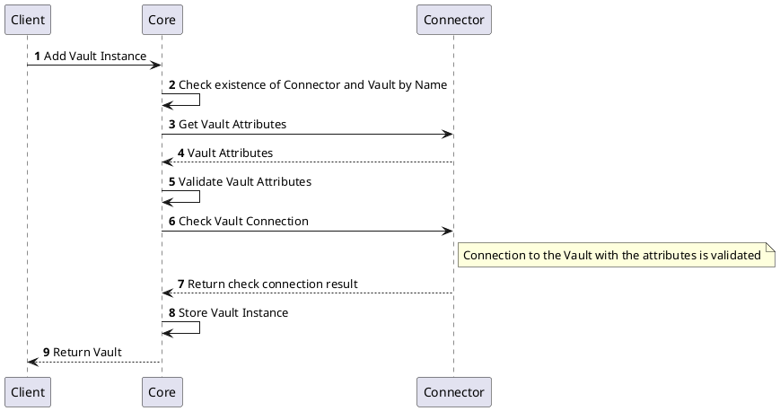
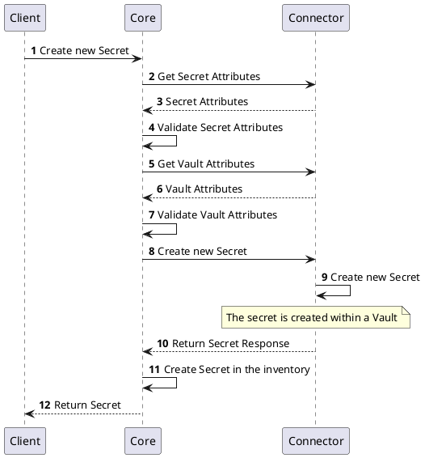
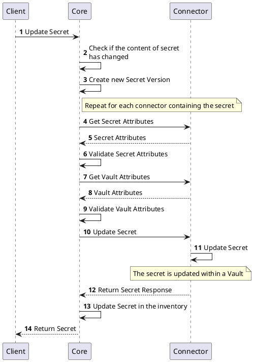
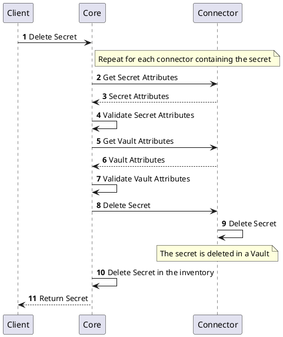
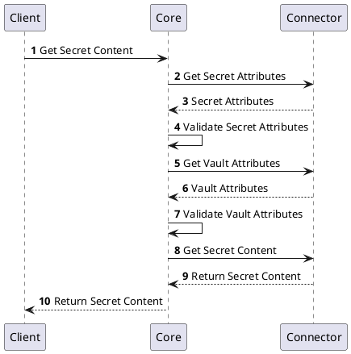

# Secret Provider

The secret provider is provider interface responsible for fetching and managing secrets from various secret management systems. It abstracts the underlying implementation details and provides a consistent API for accessing secrets.

## Vault Management
### Create `Vault` Instance

## Secret Management

### Create Secret

### Update Secret

### Delete Secret

### Get Secret Content

