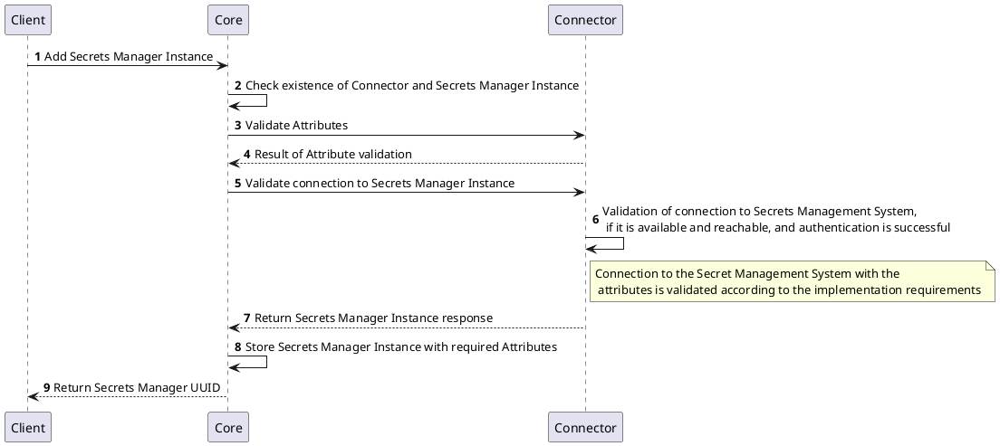
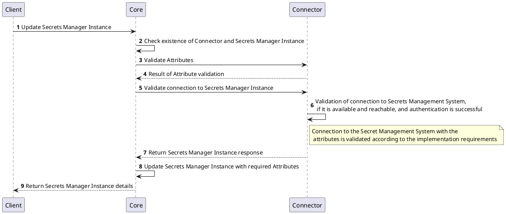
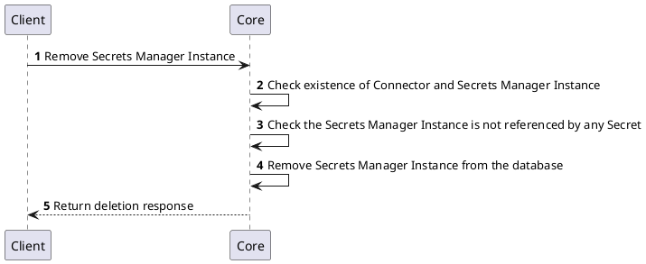
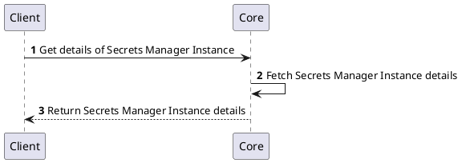

# Secrets Provider

## Overview

The purpose of the Secrets Provider is to provide an interface for easy and quick integration with external secret management systems. This allows the platform to securely store, retrieve, and manage sensitive information required for various operations.

## How it works

The Secrets Provider acts as a bridge between the platform and external secret management systems. It connects to these systems to perform operations such as storing, retrieving, and managing secrets. The Secrets Provider ensures that sensitive information is handled securely and efficiently, adhering to best practices for secret management, while providing a consistent user experience.

## Provider objects

[`Secrets Manager`](../concept-design/core-components/secret.md) objects are managed in the platform through the Secrets Provider implementation. Every instance of the `Secrets Manager` represents a connection to an external secret management system with specific configuration.

[`Secret`](../concept-design/core-components/secret.md) objects represent individual secrets stored in the external secret management system. Each `Secret` is associated with a specific `Secrets Manager` instance and contains specific type supported by the platform.

These objects are managed by the Core and the implementation does not mandate any specific requirements on the persistence of the information. The implementation is free to decide what information should be stored, in case needed, in its own storage.

## Processes related to `Secrets Manager` instances

The following processes are associated with the Secrets Provider and management of the `Secrets Manager` and `Secret` objects.

### Create `Secrets Manager` Instance

To create a `Secrets Manager` instance, client needs to provide the required attributes as defined by the specific implementation of the Secrets Provider. The implementation will validate the provided attributes and attempt to establish a connection to the external secret management system to ensure that the configuration is correct and the system is reachable.

Once the connection is successfully validated, the `Secrets Manager` instance will be created and stored in the platform. The client will receive a unique identifier (UUID) for the newly created `Secrets Manager` instance.

### Update `Secrets Manager` Instance

To update a `Secrets Manager` instance, the client needs to provide the UUID of the existing instance along with the updated attributes. The implementation will validate the provided attributes and attempt to re-establish a connection to the external secret management system to ensure that the updated configuration is correct and the system is reachable.

If the connection is successfully validated, the `Secrets Manager` instance will be updated in the platform with the new configuration. The client will receive the updated details of the `Secrets Manager` instance.

### Remove `Secrets Manager` Instance

To remove a `Secrets Manager` instance, the client needs to provide the UUID of the existing instance. The implementation will check if the `Secrets Manager` instance exists and whether it is referenced by any `Secret`. If it is not referenced, the instance will be removed from the platform.

### Get `Secrets Manager` Instance Details

To retrieve the details of a specific `Secrets Manager` instance, the client needs to provide the UUID of the instance. The implementation will fetch the details from the platform and return them to the client.

## Processes related to `Secret` objects

The following processes are associated with the Secrets Provider and management of the `Secret` objects.

### Create `Secret`