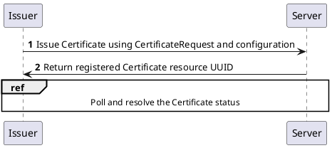
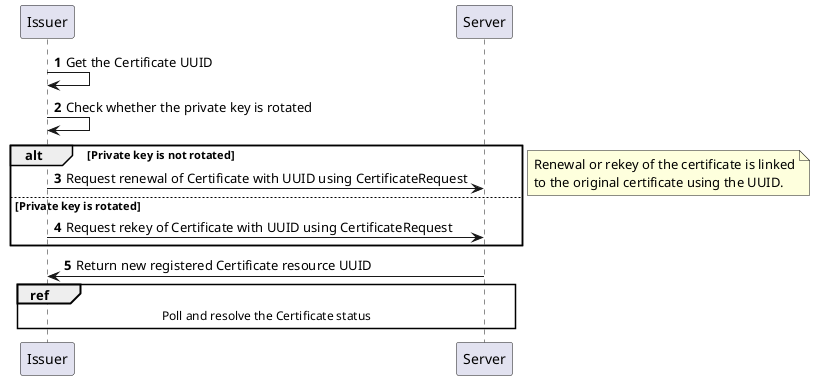
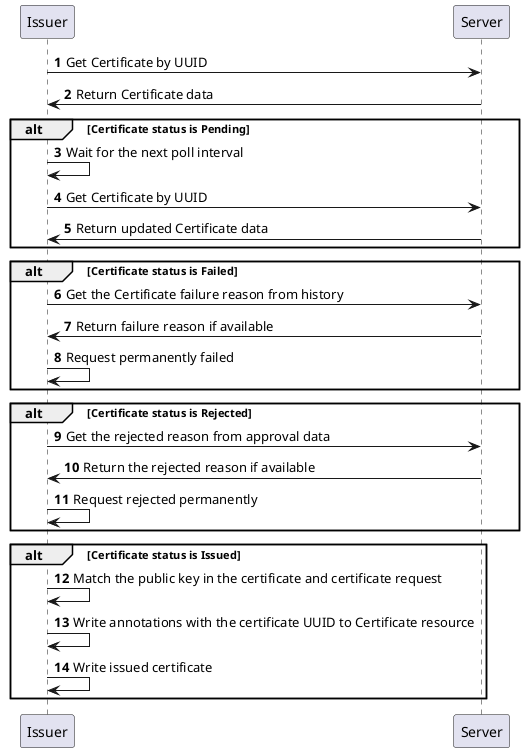

# Certificate Lifecycle

The CZERTAINLY Issuer will automatically manage the lifecycle of the certificate, including renewal and revocation, according to the configuration specified in the `Certificate` resource. The lifecycle management is controlled by the cert-manager, which will periodically check the status of the certificate and trigger operations as needed.

### Certificate issuance

The initial issuance of the certificate is triggered by the cert-manager controller, and the CZERTAINLY Issuer starts to communicate with the CZERTAINLY platform to issue the certificate, storing the identifier of the issued certificate in the `Certificate` annotations `czertainly-issuer.czertainly.com/certificate-uuid`.

This identifier is used later to manage the certificate lifecycle, including renewal and rekey operations.

The following represents the certificate issuance process:

### Certificate renewal

When the certificate should be renewed (e.g., when it is close to expiration), the cert-manager will automatically trigger the renewal process. cert-manager will create a new `CertificateRequest` resource, which contains the annotations `czertainly-issuer.czertainly.com/certificate-uuid` taken from the original `Certificate` resource. The CZERTAINLY Issuer will then use this UUID to identify the certificate to be linked with the process.

Based on the private key rotation policy defined in the `Certificate` resource, the CZERTAINLY Issuer will either renew the certificate with the same public key or rekey it with a new public key. The renewal process is similar to the initial issuance, and the CZERTAINLY Issuer will communicate with the CZERTAINLY platform to renew the certificate.

The following represents the certificate renewal process:

## Certificate polling process

The CZERTAINLY Issuer will periodically poll the CZERTAINLY platform for the status of the certificate. This is done to ensure that the certificate lifecycle is managed correctly, and any changes in the certificate status are reflected in the `Certificate` resource.

The following represents the certificate polling process:

