# PKCS#11 connector overview

The **PKCS#11 Cryptography Provider** connects the platform to PKCS#11 hardware security modules (HSMs) that you operate.

One connector can connect to multiple HSMs. The HSMs can come from different vendors.

If you are new to cryptographic keys in the platform, read [Cryptography Provider](../../connectors/provider-interfaces/cryptography-provider.md) first. Then return here to learn what the PKCS#11 connector adds.

---

## What makes the PKCS#11 connector different

HSMs are accessed through vendor-specific PKCS#11 libraries. Commercial libraries are licensed separately, so they are not built into the PKCS#11 connector. Instead, each library runs with a proxy in its own sidecar container. One sidecar contains one vendor library.

This separation keeps the connector vendor-neutral and allows one connector to work with HSMs from several vendors. The Software Cryptography Provider is different: its cryptographic implementation is included directly in the connector image. You finalize each commercial PKCS#11 sidecar with the corresponding vendor library.

## Components

```plantuml
@startuml
skinparam ArrowColor #1573B5
skinparam ComponentBorderColor #1573B5
skinparam RectangleBorderColor #1573B5
skinparam PackageBorderColor #1573B5
skinparam NoteBackgroundColor #F7F7F7
skinparam defaultFontName sans-serif
skinparam componentStyle rectangle
skinparam shadowing false
skinparam nodesep 70

component "Core" as Core #E1F5E0

package "PKCS#11 connector deployment (one Kubernetes pod)" as Pod {
  component "PKCS#11\nconnector" as Connector #E1F5E0

  rectangle "Utimaco sidecar" as UtimacoSidecar #F7F7F7 {
    component "PKCS#11 proxy" as UtimacoProxy #E1F5E0
    component "Utimaco PKCS#11\nlibrary" as UtimacoLibrary #F7F7F7
  }

  rectangle "Securosys sidecar" as SecurosysSidecar #F7F7F7 {
    component "PKCS#11 proxy" as SecurosysProxy #E1F5E0
    component "Securosys PKCS#11\nlibrary" as SecurosysLibrary #F7F7F7
  }

  rectangle "Entrust sidecar" as EntrustSidecar #F7F7F7 {
    component "PKCS#11 proxy" as EntrustProxy #E1F5E0
    component "Entrust PKCS#11\nlibrary" as EntrustLibrary #F7F7F7
  }

  Connector "<size:19> </size>\nUtimaco Config Profile&#160;&#160;&#160;&#160;&#160;&#160;&#160;&#160;&#160;&#160;&#160;&#160;&#160;&#160;&#160;&#160;" -[#1573B5]-> UtimacoProxy
  Connector -[#1573B5]-> SecurosysProxy : Securosys Config Profile
  Connector -[#1573B5]-> EntrustProxy : Entrust Config Profile

  UtimacoProxy -[#1573B5]-> UtimacoLibrary
  SecurosysProxy -[#1573B5]-> SecurosysLibrary
  EntrustProxy -[#1573B5]-> EntrustLibrary
}

component "Utimaco\nHSM" as UtimacoHSM #F7F7F7
component "Securosys\nHSM" as SecurosysHSM #F7F7F7
component "Entrust\nHSM" as EntrustHSM #F7F7F7

Core -[#1573B5]-> Connector : cryptographic requests
UtimacoLibrary -[#1573B5]-> UtimacoHSM : vendor connection
SecurosysLibrary -[#1573B5]-> SecurosysHSM : vendor connection
EntrustLibrary -[#1573B5]-> EntrustHSM : vendor connection
@enduml
```

**Core** — Sends key-management and cryptographic requests to the connector.

**PKCS#11 connector** — The `Cryptography Provider` implementation that Core calls. It selects a `Config Profile` and coordinates the operation.

**Connector deployment** — One Kubernetes pod that contains the connector and its sidecars.

**Config Profile** — Names one proxy sidecar and its local address.

**PKCS#11 proxy sidecar** — Runs beside the connector in the same pod. It loads one vendor library and manages sessions with the selected HSM.

**Vendor PKCS#11 library** — Provides the vendor-specific connection to the HSM.

**HSM** — Stores or protects the key material and performs cryptographic operations.

## Validated integrations

| Integration | Use |
|---|---|
| **SoftHSM** | Local evaluation and automated testing. The image is complete and needs no finalization. |
| **Utimaco CryptoServer** | Physical or simulated CryptoServer deployments. Standard and QuantumProtect firmware profiles are supported. |
| **Securosys Primus** | Primus HSM and CloudHSM deployments. Enrollment captures the permanent client secret. The setup password remains reusable until it expires. |
| **Entrust nShield** | Network-attached nShield deployments using a Security World and persistent client-side key blobs. |

The connector discovers the mechanisms that each token actually supports. A mechanism is available only when the selected HSM and its firmware provide it.

## Deployment shape

Run the connector and its proxy sidecars in one Kubernetes pod. Give each `Config Profile` its own sidecar and local port.

Keep the proxy ports off Services, Ingresses, and host ports. The connector uses the pod's loopback network to reach each sidecar. A `NetworkPolicy` must also restrict access through the pod IP.

The connector sends the HSM PIN to the selected sidecar for operations that require a logged-in session.

For the complete deployment sequence, see [Deploy the PKCS#11 connector](./deployment.md).

## Where to start

1. [Finalize a sidecar image](./sidecar-image-finalization.md) for each commercial HSM vendor you use.
2. Follow the page for [Utimaco](./utimaco.md), [Securosys](./securosys.md), [Entrust nShield](./nshield.md), or [SoftHSM](./softhsm.md).
3. [Size sessions and timeouts](./session-sizing-and-timeouts.md) for your environment.
4. [Deploy the connector](./deployment.md) and verify each `Config Profile`.
5. Review the [limitations](./limitations.md) before production use.
