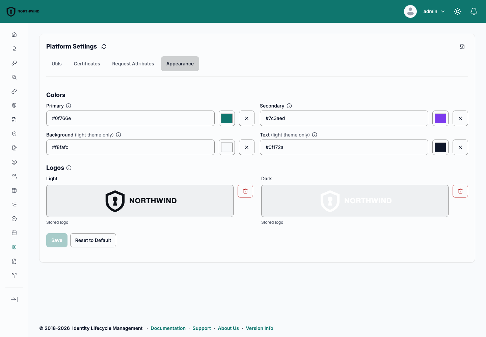
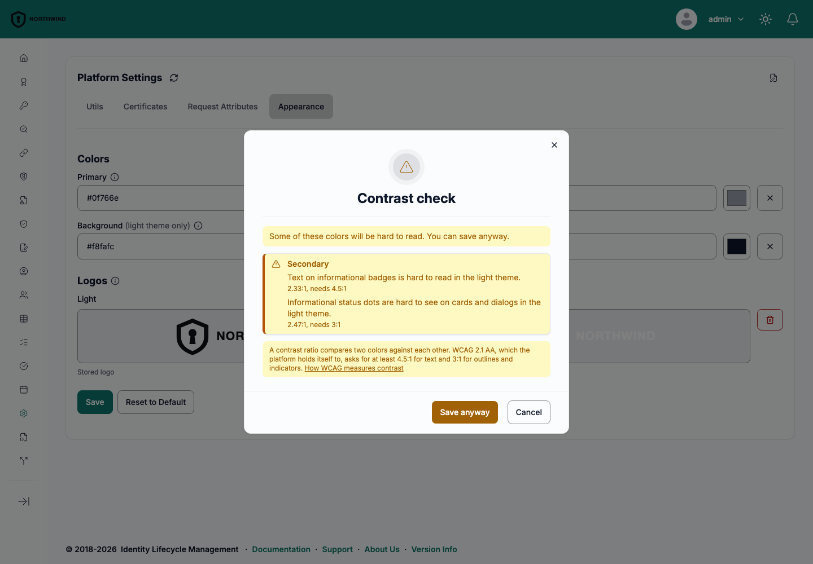
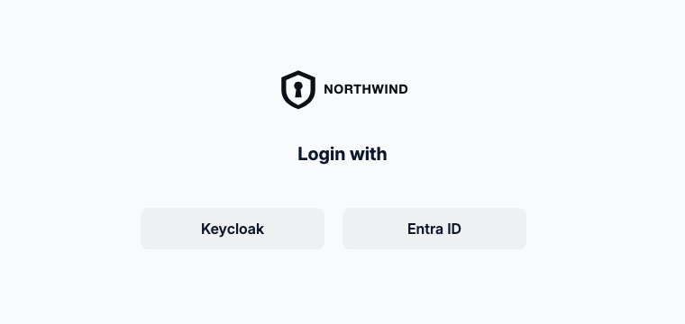
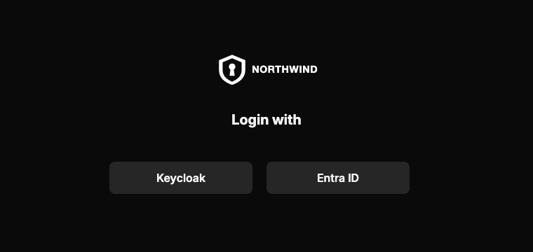

# Appearance

Appearance settings give the platform the organization's own identity: two logos and four brand colors, applied across the whole web interface in both the light and the dark theme, and on the login page before anyone signs in.

Branding is global. It is held in the platform settings, so one instance carries one brand, and every user sees a change without a redeployment.

To manage it, navigate to **Settings** → **Platform** → **Appearance** tab. The tab is offered only to users who hold the [branding permission](#access-control).

## Colors

Each color is entered as a six-digit hexadecimal value prefixed with `#`, for example `#0073CF`, either typed or chosen with the color picker. A value in any other format is refused with an inline error, and **Save** stays disabled until it is corrected.

| Color | What it changes | Themes | Platform default |
|---|---|---|---|
| **Primary** | Buttons, links, active states and the page header | Light and dark | `#0073CF` |
| **Secondary** | Accents, chips and informational badges | Light and dark | `#0369A1` |
| **Background** | The page background and raised surfaces such as cards and dialogs | Light only | `#F8FAFC` |
| **Text** | Body text and headings | Light only | `#1F2937` |

Every color stands on its own. An empty field is unset rather than blank, so it keeps the platform default, which is shown as the field's placeholder. Set one color and leave the others, and only that one changes. The clear button next to a field returns it to unset.

**Background** and **Text** apply to the light theme only, and their labels say so. The dark theme keeps its own surfaces and text colors, because a light brand background carried into the dark theme would undo it.

The platform derives the shades it needs from each color rather than using the value alone. Hover and pressed states are mixed towards black or white, and in the dark theme links and active states are lightened for contrast, while the page header and solid buttons keep the exact **Primary** color in both themes. Success, danger and warning colors, dividers, and the charts are never branded, so their meaning does not change with the brand.

## Logos

The **Logos** section has one slot per theme, **Light** and **Dark**. Drop a file on a slot or click it to choose one. The delete button next to a slot removes its logo.

| Rule | Requirement |
|---|---|
| **Format** | PNG or SVG, ideally with a transparent background |
| **Size** | At most 1 MB of image data per logo |
| **Aspect ratio** | Recommended between 1:1 and 6:1 |

The format is recognized from the file content, not from its extension, so a file of another format is refused even when renamed to `.png` or `.svg`. A PNG must be structurally well formed, and an SVG must declare the SVG namespace and carry no document type declaration.

The aspect ratio is guidance, not a rule. A logo outside the recommended range is accepted, with a note that it renders as a thin band in the header, or shrinks below its height on a narrow screen.

Each theme uses its own logo. A slot left empty shows the platform logo in that theme, never the other slot's logo, because a logo drawn for a light background is rarely legible on a dark one.

The logo is shown in the page header and on the login page.

:::info[SVG logos are sanitized]
The platform removes anything active from an uploaded SVG before storing it: scripts, embedded foreign content, animation, event handler attributes, and references to external resources. The stored logo is therefore not byte-for-byte the uploaded file, and after saving the tab shows the logo as stored.
:::

## Saving and resetting

**Save** stores the colors and logos shown on the tab. It is enabled once something has changed and every color is valid.

**Reset to Default** asks for confirmation, then removes the configured colors, logos and [default theme](#default-theme), and the instance returns to the platform's own look.

If the stored branding cannot be read, the tab is read-only and asks to reload the page, so that a save cannot overwrite branding the tab never saw.

## Contrast check

When **Save** is pressed, the Appearance tab checks the resulting colors against the WCAG 2.1 AA contrast requirements before anything is stored: 4.5:1 for text, and 3:1 for input borders and status indicators.

It measures the shades the platform actually renders, in both the light and the dark theme, so a combination that passes in one theme and fails in the other is still reported. The pairings checked include body, supporting and hint text on the page background and on cards; links and active controls on cards; white text on the page header and primary buttons; and text on informational badges.

If any pairing falls short, a **Contrast check** dialog lists the findings grouped by the color that causes them, each with its measured ratio and the theme it affects. Where a nearby shade would pass without introducing a new finding, the dialog offers it, and choosing it updates the field.

:::warning[Contrast findings are warnings, not errors]
**Save anyway** stores the colors as they are. The platform does not block a combination that falls below WCAG AA, because the brand remains the operator's decision. Colors saved this way can make parts of the interface hard to read for every user of the instance.
:::

## Theme selection

The header icon switches between three modes, cycling **System** → **Light** → **Dark** → **System**:

- **System** follows the operating system preference and changes with it.
- **Light** and **Dark** fix the theme regardless of the operating system.

Branding adds no modes. It changes the palette that **Light** and **Dark** render: on an unbranded instance the control switches between the platform's own themes, on a branded one between the operator's.

A user's choice is stored in their browser, so it applies per browser rather than per account, and it survives signing out.

### Default theme

The operator can set a default theme, `light` or `dark`, that applies to users who have not chosen a mode of their own. It is part of the branding settings and is set through the [API](#api); the Appearance tab does not edit it, and a **Save** there keeps the stored value.

The theme is resolved in this order:

1. The mode the user chose in this browser, if any.
2. The operator's default theme, if set.
3. **System**.

A user's own choice always wins, and this includes an explicit choice of **System**: a user who cycles back to **System** follows their operating system again, even on an instance with a default theme. Only a browser whose user has never chosen a mode receives the operator's default.

## Login page

Branding reaches the login page, before anyone signs in, so users recognize the instance at the first screen.

The browser remembers the last theme and colors it received and applies them before the page first renders, so a returning visitor does not see the platform's own look flash before the brand. If the branding cannot be loaded, no error is shown: a returning visitor keeps the colors and default theme from their last visit and sees the platform logo, and a first-time visitor sees the platform's own look.

:::note[Branding is public]
To render the login page, the platform serves the logos, the brand colors and the default theme to anyone who asks, without authentication. This is an accepted trade-off: branding is meant to be seen, and nothing else is exposed. Do not use a logo that must not be public.
:::

## Access control

Changing branding requires the `updateBranding` action on the `settings` resource. It is separate from the `update` action that governs the rest of the platform settings, in both directions:

- `updateBranding` grants branding only. A role holding it can change the colors, logos and default theme, but not the other platform settings.
- `update` does not grant branding. A role that manages the platform settings cannot change the appearance without `updateBranding` as well.

A role that manages the appearance also needs the `list` action on `settings`, which opens the platform settings and reads the current branding. Without it the Appearance tab cannot read what is stored and stays read-only. `list` and `updateBranding` together let the platform's appearance be delegated, for example to a communications team, without handing over the rest of its configuration.

The **Appearance** tab is shown only to users holding `updateBranding`; for everyone else it is absent rather than read-only. Reading the branding settings through the authenticated API requires the `list` action on `settings`, as for other platform settings.

`updateBranding` changes platform state, so it is not part of the [`auditor`](../concept-design/architecture/access-control/roles-permissions.md#auditor-role) role. See [Roles and Permissions](../concept-design/architecture/access-control/roles-permissions.md) for how actions are granted.

## Operational notes

- **One brand per instance.** Branding is stored in the platform settings and applies to every user of the instance. There is no per-user, per-group or per-tenant branding.
- **Propagation across replicas.** The replica that saves a change applies it immediately. The other replicas pick it up at their next settings cache refresh, which runs every 30 seconds by default and is set in seconds by the `Core` environment variable `SETTINGS_CACHE_REFRESH_INTERVAL`.
- **Browser caching.** Browsers may cache the public branding for up to 60 seconds, so a user can see the previous branding for up to that long after the change has reached their replica. The administrator who made the change sees it straight away.

## API

Branding is the `branding` category of the platform settings section. It has its own endpoints, because it is governed by its own permission. They are described in the [Other API](/api/core-other) reference:

| Operation | Endpoint | Authorization |
|---|---|---|
| Get platform branding | `GET /v1/settings/platform/branding` | `settings` / `list` |
| Update platform branding | `PUT /v1/settings/platform/branding` | `settings` / `updateBranding` |
| Get branding available to unauthenticated clients | `GET /v1/branding` | None |

The branding is also returned, read-only, in the `branding` field of [Get platform settings](/api/core-other#tag/settings/GET/v1/settings/platform). It is not part of the body of [Update platform settings](/api/core-other#tag/settings/PUT/v1/settings/platform), so that holding `update` alone cannot change it.

The branding carries these fields, all optional:

| Field | Value |
|---|---|
| `primaryColor`, `secondaryColor`, `backgroundColor`, `textColor` | Six-digit hexadecimal color prefixed with `#`, for example `#0073CF` |
| `lightLogo`, `darkLogo` | Base64 data URI with media type `image/png` or `image/svg+xml`, at most 1 MB decoded |
| `defaultTheme` | `light` or `dark` |

The API checks only the color format. The [contrast check](#contrast-check) runs in the Appearance tab, so colors written through the API are not checked.

The update carries the full desired state: a field left out clears that part of the branding, so an empty object `{}` resets everything. To change one field, read the branding first and send it back with the change.

The platform checks each logo on the way in: the declared media type must match the content, a PNG must be well formed, and an SVG must have an `svg` root, in the SVG namespace or in none, and no document type declaration. It then sanitizes an SVG before storing it. A request that fails validation is refused with a message naming the field and the rule it broke. The Appearance tab is stricter than the API: it also requires an SVG to declare the SVG namespace and a PNG to be decodable by the browser, because a logo that fails either renders blank. Check a logo written through the API against both.

The unauthenticated endpoint returns every color and logo field, with `null` for one that is not set, and omits `defaultTheme` when it is not set. Its `configured` flag is `true` when any field is set.
