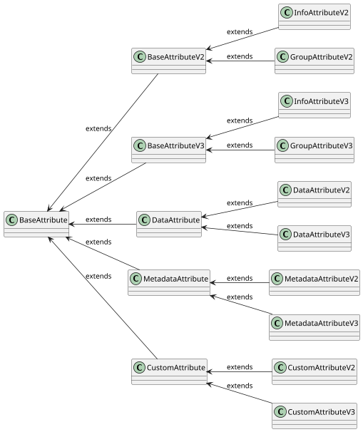

import Tabs from '@theme/Tabs';
import TabItem from '@theme/TabItem';

# Attributes

Attribute, specifically its type, is used to control different behaviour of the content and values in the platform. Some attributes define the data that are exchanged between technologies, some of them may represent read-only information, and some of them may contain additional attributes that are grouped together or work as a wizard.

## Attribute properties

The following is a list of properties that can be used to define the behaviour of the `Attribute` and extends properties of the [`BaseAttribute`](overview.md#baseattribute):

| Property            | Type                                                         | Required                                      |
|---------------------|--------------------------------------------------------------|-----------------------------------------------|
| `contentType`       | [`AttributeContentType`](content.md#supported-content-types) | <span class="badge badge--success">Yes</span> |
| `constraints`       | list of [`BaseAttributeConstraint`](constraints.mdx)         | <span class="badge badge--danger">No</span>   |
| `properties`        | [`AttributeProperties`](properties.md)                       | <span class="badge badge--success">Yes</span> |
| `attributeCallback` | [`AttributeCallback`](callbacks.mdx)                         | <span class="badge badge--danger">No</span>   |

## Attribute Types

Based on the usage and specific behaviour you want to provide, `Attribute` can be one of the following defined types in [`AttributeType`](https://github.com/OmniTrustILM/interfaces/blob/main/src/main/java/com/otilm/api/model/common/attribute/common/AttributeType.java):

| `AttributeType` | Class v2                                                                                                                                                                     | Class v3                                                                                                                                                                     | Short description                                                                                                                                                                     |
|-----------------|------------------------------------------------------------------------------------------------------------------------------------------------------------------------------|------------------------------------------------------------------------------------------------------------------------------------------------------------------------------|---------------------------------------------------------------------------------------------------------------------------------------------------------------------------------------|
| `DATA`          | [`DataAttributeV2`](https://github.com/OmniTrustILM/interfaces/blob/main/src/main/java/com/otilm/api/model/common/attribute/v2/DataAttributeV2.java)         | [`DataAttributeV3`](https://github.com/OmniTrustILM/interfaces/blob/main/src/main/java/com/otilm/api/model/common/attribute/v3/DataAttributeV3.java)         | Full fledged data carriers used in the platform for information exchange                                                                                                           |
| `INFO`          | [`InfoAttributeV2`](https://github.com/OmniTrustILM/interfaces/blob/main/src/main/java/com/otilm/api/model/common/attribute/v2/InfoAttributeV2.java)         | [`InfoAttributeV3`](https://github.com/OmniTrustILM/interfaces/blob/main/src/main/java/com/otilm/api/model/common/attribute/v3/InfoAttributeV3.java)         | Information carriers whose primary responsibility is to provide additional helper information. The content of this attribute is not sent back to the platform, it is just informative |
| `GROUP`         | [`GroupAttributeV2`](https://github.com/OmniTrustILM/interfaces/blob/main/src/main/java/com/otilm/api/model/common/attribute/v2/GroupAttributeV2.java)       | [`GroupAttributeV3`](https://github.com/OmniTrustILM/interfaces/blob/main/src/main/java/com/otilm/api/model/common/attribute/v3/GroupAttributeV3.java)       | Advanced type of attribute that can group multiple attributes. Main use is when the attributes are dependent on the content selected from other attributes                            |
| `META`          | [`MetadataAttributeV2`](https://github.com/OmniTrustILM/interfaces/blob/main/src/main/java/com/otilm/api/model/common/attribute/v2/MetadataAttributeV2.java) | [`MetadataAttributeV3`](https://github.com/OmniTrustILM/interfaces/blob/main/src/main/java/com/otilm/api/model/common/attribute/v3/MetadataAttributeV3.java) | Metadata representation that can be exchanged between the platform and connectors                                                                                                     |
| `CUSTOM`        | [`CustomAttributeV2`](https://github.com/OmniTrustILM/interfaces/blob/main/src/main/java/com/otilm/api/model/common/attribute/v2/CustomAttributeV2.java)     | [`CustomAttributeV3`](https://github.com/OmniTrustILM/interfaces/blob/main/src/main/java/com/otilm/api/model/common/attribute/v3/CustomAttributeV3.java)     | User defined attributes for storing additional information about the objects supported in the platform                                                                                |

## Attribute properties and types

The following matrix shows which `Attribute` properties are supported for each `Attribute` type (here, the version is omitted for simplicity, but the same applies for both `v2` and `v3`):

| Property name / Attribute type | `DataAttribute`                            | `InfoAttribute`                              | `GroupAttribute`                             | `MetadataAttribute`                          | `CustomAttribute`                            |
|--------------------------------|--------------------------------------------|----------------------------------------------|----------------------------------------------|----------------------------------------------|----------------------------------------------|
| `contentType`                  | <span class="badge badge--success"></span> | <span class="badge badge--success"></span>   | <span class="badge badge--secondary"></span> | <span class="badge badge--success"></span>   | <span class="badge badge--success"></span>   |
| `constraints`                  | <span class="badge badge--danger"></span>  | <span class="badge badge--secondary"></span> | <span class="badge badge--secondary"></span> | <span class="badge badge--secondary"></span> | <span class="badge badge--secondary"></span> |
| `properties`                   | <span class="badge badge--success"></span> | <span class="badge badge--success"></span>   | <span class="badge badge--secondary"></span> | <span class="badge badge--success"></span>   | <span class="badge badge--success"></span>   |
| `attributeCallback`            | <span class="badge badge--danger"></span>  | <span class="badge badge--secondary"></span> | <span class="badge badge--success"></span>   | <span class="badge badge--secondary"></span> | <span class="badge badge--secondary"></span> |

- <span class="badge badge--success" size="s"></span> - the property is required
- <span class="badge badge--danger"></span> - the property is optional
- <span class="badge badge--secondary"></span> - the property is not applicable

## Attribute structure samples

:::warning[Use V3 for new implementations]
V2 attributes are deprecated. New connector implementations should use V3. V2 samples are provided for reference when maintaining existing connectors.
:::

The following samples show how the `Attribute` can be defined in the platform for different types:

```mdx-code-block
<Tabs>
<TabItem value="data-v2" label="DATA v2">
```

```json
{
  "uuid": "c7a8f8f0-f8f8-4f8f-8f8f-f8f8f8f8f8f8",
  "name": "certificateTemplate",
  "type": "data",
  "version": 2,
  "contentType": "string",
  "content": [
    {
      "reference": "Template 1",
      "data": "template1"
    },
    {
      "reference": "Template 2",
      "data": "template2"
    },
    {
      "reference": "Template 3",
      "data": "template3"
    }
  ],
  "properties": {
    "label": "Certificate Template",
    "required": true,
    "readOnly": false,
    "visible": true,
    "list": true,
    "multiSelect": true,
    "group": "Certificate Configuration"
  },
  "description": "Available certificate templates that can be selected for the certificate request",
  "constraints": [
    {
      "description": "Certificate Template Regex",
      "errorMessage": "Certificate Template must be a valid string",
      "type": "regexp",
      "data": "^[a-z\\s]{0,255}"
    }
  ]
}
```

```mdx-code-block
</TabItem>

<TabItem value="data-v3" label="DATA v3">
```

```json
{
  "uuid": "c7a8f8f0-f8f8-4f8f-8f8f-f8f8f8f8f8f8",
  "name": "certificateTemplate",
  "type": "data",
  "version": 3,
  "schemaVersion": "v3",
  "contentType": "string",
  "content": [
    {
      "reference": "Template 1",
      "data": "template1",
      "contentType": "string"
    },
    {
      "reference": "Template 2",
      "data": "template2",
      "contentType": "string"
    },
    {
      "reference": "Template 3",
      "data": "template3",
      "contentType": "string"
    }
  ],
  "properties": {
    "label": "Certificate Template",
    "required": true,
    "readOnly": false,
    "visible": true,
    "list": true,
    "multiSelect": true,
    "group": "Certificate Configuration"
  },
  "description": "Available certificate templates that can be selected for the certificate request",
  "constraints": [
    {
      "description": "Certificate Template Regex",
      "errorMessage": "Certificate Template must be a valid string",
      "type": "regexp",
      "data": "^[a-z\\s]{0,255}"
    }
  ]
}
```

```mdx-code-block
</TabItem>

<TabItem value="info-v2" label="INFO v2">
```

```json
{
  "uuid": "c7a8f8f0-f8f8-4f8f-8f8f-f8f8f8f8f8f8",
  "name": "certificateTemplate",
  "type": "info",
  "version": 2,
  "contentType": "string",
  "content": [
    {
      "reference": "Template 1",
      "data": "template1"
    }
  ],
  "properties": {
    "label": "Certificate Template",
    "readOnly": false,
    "visible": true,
    "group": "Certificate Configuration"
  },
  "description": "Available certificate templates that can be selected for the certificate request"
}
```

```mdx-code-block
</TabItem>

<TabItem value="info-v3" label="INFO v3">
```

```json
{
  "uuid": "c7a8f8f0-f8f8-4f8f-8f8f-f8f8f8f8f8f8",
  "name": "certificateTemplate",
  "type": "info",
  "version": 3,
  "schemaVersion": "v3",
  "contentType": "string",
  "content": [
    {
      "reference": "Template 1",
      "data": "template1",
      "contentType": "string"
    }
  ],
  "properties": {
    "label": "Certificate Template",
    "readOnly": false,
    "visible": true,
    "group": "Certificate Configuration"
  },
  "description": "Available certificate templates that can be selected for the certificate request"
}
```

```mdx-code-block
</TabItem>

<TabItem value="group-v2" label="GROUP v2">
```

```json
{
  "uuid": "c7a8f8f0-f8f8-4f8f-8f8f-f8f8f8f8f8f8",
  "name": "group1",
  "type": "group",
  "version": 2,
  "content": [
    {
      "uuid": "c7a8f8f0-f8f8-4f8f-8f8f-f8f8f8f8f8f8",
      "name": "certificateTemplate",
      "type": "data",
      "version": 2,
      "contentType": "string",
      "content": [
        {
          "reference": "Template 1",
          "data": "template1"
        },
        {
          "reference": "Template 2",
          "data": "template2"
        },
        {
          "reference": "Template 3",
          "data": "template3"
        }
      ],
      "properties": {
        "label": "Certificate Template",
        "required": true,
        "readOnly": false,
        "visible": true,
        "list": true,
        "multiSelect": true,
        "group": "Certificate Configuration"
      },
      "description": "Available certificate templates that can be selected for the certificate request",
      "constraints": [
        {
          "description": "Certificate Template Regex",
          "errorMessage": "Certificate Template must be a valid string",
          "type": "regexp",
          "data": "^[a-z\\s]{0,255}"
        }
      ]
    }
  ],
  "description": "Available certificate templates that can be selected for the certificate request"
}
```

```mdx-code-block
</TabItem>

<TabItem value="group-v3" label="GROUP v3">
```

```json
{
  "uuid": "c7a8f8f0-f8f8-4f8f-8f8f-f8f8f8f8f8f8",
  "name": "group1",
  "type": "group",
  "version": 3,
  "schemaVersion": "v3",
  "content": [
    {
      "uuid": "c7a8f8f0-f8f8-4f8f-8f8f-f8f8f8f8f8f8",
      "name": "certificateTemplate",
      "type": "data",
      "version": 3,
      "schemaVersion": "v3",
      "contentType": "string",
      "content": [
        {
          "reference": "Template 1",
          "data": "template1",
          "contentType": "string"
        },
        {
          "reference": "Template 2",
          "data": "template2",
          "contentType": "string"
        },
        {
          "reference": "Template 3",
          "data": "template3",
          "contentType": "string"
        }
      ],
      "properties": {
        "label": "Certificate Template",
        "required": true,
        "readOnly": false,
        "visible": true,
        "list": true,
        "multiSelect": true,
        "group": "Certificate Configuration"
      },
      "description": "Available certificate templates that can be selected for the certificate request",
      "constraints": [
        {
          "description": "Certificate Template Regex",
          "errorMessage": "Certificate Template must be a valid string",
          "type": "regexp",
          "data": "^[a-z\\s]{0,255}"
        }
      ]
    }
  ],
  "description": "Available certificate templates that can be selected for the certificate request"
}
```

```mdx-code-block
</TabItem>

<TabItem value="meta-v2" label="META v2">
```

```json
{
  "uuid": "c7a8f8f0-f8f8-4f8f-8f8f-f8f8f8f8f8f8",
  "name": "discoverySource",
  "type": "meta",
  "version": 2,
  "contentType": "string",
  "content": [
    {
      "reference": "Internet",
      "data": "internet.com"
    }
  ],
  "properties": {
    "label": "Discovery Source",
    "readOnly": false,
    "visible": true,
    "global": true,
    "group": "Discovery"
  },

  "description": "Source from where the certificate is discovered"
}
```

```mdx-code-block
</TabItem>

<TabItem value="meta-v3" label="META v3">
```

```json
{
  "uuid": "c7a8f8f0-f8f8-4f8f-8f8f-f8f8f8f8f8f8",
  "name": "discoverySource",
  "type": "meta",
  "version": 3,
  "schemaVersion": "v3",
  "contentType": "string",
  "content": [
    {
      "reference": "Internet",
      "data": "internet.com",
      "contentType": "string"
    }
  ],
  "properties": {
    "label": "Discovery Source",
    "readOnly": false,
    "visible": true,
    "global": true,
    "group": "Discovery"
  },
  "description": "Source from where the certificate is discovered"
}
```

```mdx-code-block
</TabItem>

<TabItem value="custom-v2" label="CUSTOM v2">
```

```json
{
  "uuid": "c7a8f8f0-f8f8-4f8f-8f8f-f8f8f8f8f8f8",
  "name": "purpose",
  "type": "custom",
  "version": 2,
  "contentType": "string",
  "content": [
    {
      "reference": "",
      "data": "Created to test the custom attribute"
    }
  ],
  "properties": {
    "label": "Purpose",
    "required": true,
    "readOnly": false,
    "visible": true,
    "list": true,
    "multiSelect": true,
    "group": "Certificate Configuration"
  },
  "description": "Sample description for the custom attribute"
}
```

```mdx-code-block
</TabItem>

<TabItem value="custom-v3" label="CUSTOM v3">
```

```json
{
  "uuid": "c7a8f8f0-f8f8-4f8f-8f8f-f8f8f8f8f8f8",
  "name": "purpose",
  "type": "custom",
  "version": 3,
  "schemaVersion": "v3",
  "contentType": "string",
  "content": [
    {
      "reference": "",
      "data": "Created to test the custom attribute",
      "contentType": "string"
    }
  ],
  "properties": {
    "label": "Purpose",
    "required": true,
    "readOnly": false,
    "visible": true,
    "list": true,
    "multiSelect": true,
    "group": "Certificate Configuration"
  },
  "description": "Sample description for the custom attribute"
}
```

```mdx-code-block
</TabItem>

<TabItem value="resource-v3" label="RESOURCE OBJECT (v3)">
```

:::info[V3-only content type]
`RESOURCE OBJECT` is available only in V3 attributes. It replaces the V2-only `SECRET` and `CREDENTIAL` content types.
:::

```json
{
  "uuid": "c7a8f8f0-f8f8-4f8f-8f8f-f8f8f8f8f8f8",
  "name": "credentialAttribute",
  "type": "data",
  "version": 3,
  "schemaVersion": "v3",
  "contentType": "resource",
  "content": [
    {
      "reference": "My Credential",
      "data": {
        "uuid": "a1b2c3d4-5678-90ab-cdef-1234567890ab",
        "name": "My Credential",
        "resource": "credentials"
      },
      "contentType": "resource"
    }
  ],
  "properties": {
    "label": "Credential",
    "required": true,
    "readOnly": false,
    "visible": true,
    "list": true,
    "multiSelect": false,
    "group": "Authentication",
    "resource": "credentials"
  },
  "description": "Select a credential to use"
}
```

```mdx-code-block
</TabItem>
</Tabs>
```


The following diagram represents the `Attribute` model inherited from the `AbstractBaseAttribute`. Details can be found in the [Interfaces repository](https://github.com/OmniTrustILM/interfaces/tree/main/src/main/java/com/otilm/api/model/common/attribute).



