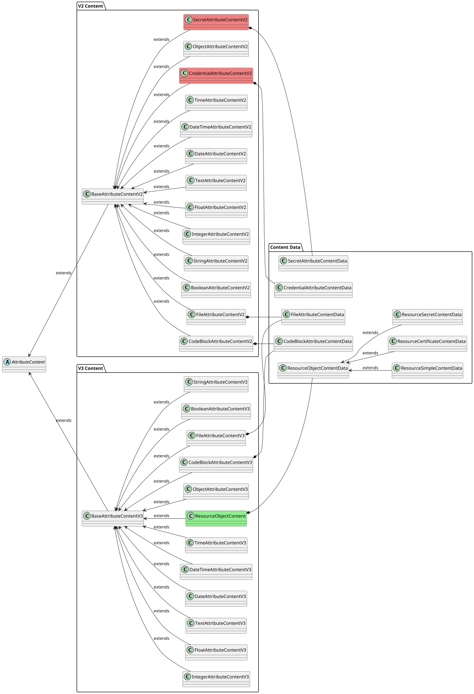

# Content

`Attribute` supports various content defined by `contentType`.

:::info[Attribute types]
For more details about `Attribute` types and `contentType`, see [Attributes](attributes.mdx).
:::

## Content properties

Each content type must extend, based on the attribute version, either [`BaseAttributeContentV2`](https://github.com/OmniTrustILM/interfaces/blob/main/src/main/java/com/czertainly/api/model/common/attribute/v2/content/BaseAttributeContentV2.java) or [`BaseAttributeContentV3`](https://github.com/OmniTrustILM/interfaces/blob/main/src/main/java/com/czertainly/api/model/common/attribute/v3/content/BaseAttributeContentV3.java) which are abstracted from [`AttributeContent`](https://github.com/OmniTrustILM/interfaces/blob/main/src/main/java/com/czertainly/api/model/common/attribute/common/AttributeContent.java).

The content has the following properties defined and inherited from `BaseAttributeContentV2`:

| Property    | Type               | Short description                                                                                                                                      | Required                                      |
|-------------|--------------------|--------------------------------------------------------------------------------------------------------------------------------------------------------|-----------------------------------------------|
| `reference` | `string`           | Reference that can be used for the content value. It is useful especially when the `data` contains an object, or any other more complex data structure | <span class="badge badge--danger">No</span>   |
| `data`      | `AttributeContent` | The value of the content, depending on the `contentType` from supported [`AttributeContentType`](#supported-content-types)                             | <span class="badge badge--success">Yes</span> |

The content has the following properties defined and inherited from `BaseAttributeContentV3`:
| Property | Type | Short description | Required |
|-------------|--------------------|---------------------------------------------------------------------------------------------------------------------------------------------------------|-----------------------------------------------|
| `reference` | `string`           | Reference that can be used for the content value. It is useful especially when the `data` contains an object, or any other more complex data structure | <span class="badge badge--danger">No</span> |
| `data`      | `AttributeContent` | The value of the content, depending on the `contentType` from supported [`AttributeContentType`](#supported-content-types)                              | <span class="badge badge--success">Yes</span> |
| `contentType`      | `AttributeContentType` | The type of the content, must match the content type of attribute definition | <span class="badge badge--success">Yes</span> |

## Supported content types

:::warning[Use V3 content classes]
V2 content classes are deprecated. New implementations should use V3 content classes (e.g., `StringAttributeContentV3` instead of `StringAttributeContentV2`). The V2-only content types `SECRET` and `CREDENTIAL` are replaced by `RESOURCE OBJECT` in V3.
:::

Supported content types are defined in [`AttributeContentType`](https://github.com/OmniTrustILM/interfaces/blob/main/src/main/java/com/czertainly/api/model/common/attribute/common/content/AttributeContentType.java).
The following content types are available and supported:

| `AttributeContentType` | Class V2                                                                                                                                                                                             | Class V3                                                                                                                                                                                           | Data                                                                                                                                                                                                              |
|------------------------|------------------------------------------------------------------------------------------------------------------------------------------------------------------------------------------------------|----------------------------------------------------------------------------------------------------------------------------------------------------------------------------------------------------|-------------------------------------------------------------------------------------------------------------------------------------------------------------------------------------------------------------------|
| `STRING`               | [`StringAttributeContentV2`](https://github.com/OmniTrustILM/interfaces/blob/main/src/main/java/com/czertainly/api/model/common/attribute/v2/content/StringAttributeContentV2.java)         | [`StringAttributeContentV3`](https://github.com/OmniTrustILM/interfaces/blob/main/src/main/java/com/czertainly/api/model/common/attribute/v3/content/StringAttributeContentV3.java)       | `string`                                                                                                                                                                                                          |
| `INTEGER`              | [`IntegerAttributeContentV2`](https://github.com/OmniTrustILM/interfaces/blob/main/src/main/java/com/czertainly/api/model/common/attribute/v2/content/IntegerAttributeContentV2.java)       | [`IntegerAttributeContentV3`](https://github.com/OmniTrustILM/interfaces/blob/main/src/main/java/com/czertainly/api/model/common/attribute/v3/content/IntegerAttributeContentV3.java)     | `integer`                                                                                                                                                                                                         |
| `SECRET`               | [`SecretAttributeContentV2`](https://github.com/OmniTrustILM/interfaces/blob/main/src/main/java/com/czertainly/api/model/common/attribute/v2/content/SecretAttributeContentV2.java)         | N/A                                                                                                                                                                                                | [`SecretAttributeContentData`](https://github.com/OmniTrustILM/interfaces/blob/main/src/main/java/com/czertainly/api/model/common/attribute/common/content/data/SecretAttributeContentData.java)         |
| `FILE`                 | [`FileAttributeContentV2`](https://github.com/OmniTrustILM/interfaces/blob/main/src/main/java/com/czertainly/api/model/common/attribute/v2/content/FileAttributeContentV2.java)             | [`FileAttributeContentV3`](https://github.com/OmniTrustILM/interfaces/blob/main/src/main/java/com/czertainly/api/model/common/attribute/v3/content/FileAttributeContentV3.java)           | [`FileAttributeContentData`](https://github.com/OmniTrustILM/interfaces/blob/main/src/main/java/com/czertainly/api/model/common/attribute/common/content/data/FileAttributeContentData.java)             |
| `BOOLEAN`              | [`BooleanAttributeContentV2`](https://github.com/OmniTrustILM/interfaces/blob/main/src/main/java/com/czertainly/api/model/common/attribute/v2/content/BooleanAttributeContentV2.java)       | [`BooleanAttributeContentV3`](https://github.com/OmniTrustILM/interfaces/blob/main/src/main/java/com/czertainly/api/model/common/attribute/v3/content/BooleanAttributeContentV3.java)     | `boolean`                                                                                                                                                                                                         |
| `TEXT`                 | [`TextAttributeContentV2`](https://github.com/OmniTrustILM/interfaces/blob/main/src/main/java/com/czertainly/api/model/common/attribute/v2/content/TextAttributeContentV2.java)             | [`TextAttributeContentV3`](https://github.com/OmniTrustILM/interfaces/blob/main/src/main/java/com/czertainly/api/model/common/attribute/v3/content/TextAttributeContentV3.java)           | `string`                                                                                                                                                                                                          |
| `CODEBLOCK`            | [`CodeBlockAttributeContentV2`](https://github.com/OmniTrustILM/interfaces/blob/main/src/main/java/com/czertainly/api/model/common/attribute/v2/content/CodeBlockAttributeContentV2.java)   | [`CodeBlockAttributeContentV3`](https://github.com/OmniTrustILM/interfaces/blob/main/src/main/java/com/czertainly/api/model/common/attribute/v3/content/CodeBlockAttributeContentV3.java) | [`CodeBlockAttributeContentData`](https://github.com/OmniTrustILM/interfaces/blob/main/src/main/java/com/czertainly/api/model/common/attribute/common/content/data/CodeBlockAttributeContentData.java)   |
| `FLOAT`                | [`FloatAttributeContentV2`](https://github.com/OmniTrustILM/interfaces/blob/main/src/main/java/com/czertainly/api/model/common/attribute/v2/content/FloatAttributeContentV2.java)           | [`FloatAttributeContentV3`](https://github.com/OmniTrustILM/interfaces/blob/main/src/main/java/com/czertainly/api/model/common/attribute/v3/content/FloatAttributeContentV3.java)         | `float`                                                                                                                                                                                                           |
| `DATE`                 | [`DateAttributeContentV2`](https://github.com/OmniTrustILM/interfaces/blob/main/src/main/java/com/czertainly/api/model/common/attribute/v2/content/DateAttributeContentV2.java)             | [`DateAttributeContentV3`](https://github.com/OmniTrustILM/interfaces/blob/main/src/main/java/com/czertainly/api/model/common/attribute/v3/content/DateAttributeContentV3.java)           | `date`                                                                                                                                                                                                            |
| `DATETIME`             | [`DateTimeAttributeContentV2`](https://github.com/OmniTrustILM/interfaces/blob/main/src/main/java/com/czertainly/api/model/common/attribute/v2/content/DatetimeAttributeContentV2.java)     | [`DateTimeAttributeContentV3`](https://github.com/OmniTrustILM/interfaces/blob/main/src/main/java/com/czertainly/api/model/common/attribute/v3/content/DateTimeAttributeContentV3.java)   | `datetime`                                                                                                                                                                                                        |
| `TIME`                 | [`TimeAttributeContentV2`](https://github.com/OmniTrustILM/interfaces/blob/main/src/main/java/com/czertainly/api/model/common/attribute/v2/content/TimeAttributeContentV2.java)             | [`TimeAttributeContentV3`](https://github.com/OmniTrustILM/interfaces/blob/main/src/main/java/com/czertainly/api/model/common/attribute/v3/content/TimeAttributeContentV3.java)           | `time`                                                                                                                                                                                                            |
| `CREDENTIAL`           | [`CredentialAttributeContentV2`](https://github.com/OmniTrustILM/interfaces/blob/main/src/main/java/com/czertainly/api/model/common/attribute/v2/content/CredentialAttributeContentV2.java) | N/A                                                                                                                                                                                                | [`CredentialAttributeContentData`](https://github.com/OmniTrustILM/interfaces/blob/main/src/main/java/com/czertainly/api/model/common/attribute/common/content/data/CredentialAttributeContentData.java) |
| `OBJECT`               | [`ObjectAttributeContentV2`](https://github.com/OmniTrustILM/interfaces/blob/main/src/main/java/com/czertainly/api/model/common/attribute/v2/content/ObjectAttributeContentV2.java)         | [`ObjectAttributeContentV3`](https://github.com/OmniTrustILM/interfaces/blob/main/src/main/java/com/czertainly/api/model/common/attribute/v3/content/ObjectAttributeContentV3.java)       | `object`                                                                                                                                                                                                          |
| `RESOURCE OBJECT`      | N/A                                                                                                                                                                                                  | [`ResourceObjectContent`](https://github.com/OmniTrustILM/interfaces/blob/main/src/main/java/com/czertainly/api/model/common/attribute/v3/content/ResourceObjectContent.java)             | [`ResourceObjectContentData`](https://github.com/OmniTrustILM/interfaces/blob/main/src/main/java/com/czertainly/api/model/common/attribute/v3/content/data/ResourceObjectContentData.java)               |

:::warning[Multiple content types in one Attribute]
One `Attribute` can define only one `contentType`. Multiple different content types for one `Attribute` is not supported.
:::

## Content type samples

The table below shows the `AttributeContentType` and the sample for each type and version.

<table>

<tr>
<th>

`AttributeContentType`

</th>
<th>

Content samples

</th>
</tr>

<tr>
<td>

`STRING`

</td>
<td>
<details>
<summary>v2</summary>
```json
{  
  "content": [
    {
      "reference": "string",
      "data": "string"
    }
  ]
}
```
</details>
<details>
<summary>v3</summary>
```json
{  
  "content": [
    {
      "reference": "string",
      "data": "string",
      "contentType": "string"
    }
  ]
}
```
</details>
</td>
</tr>

<tr>
<td>

`INTEGER`

</td>
<td>
<details>
<summary>v2</summary>
```json
{  
  "content": [
    {
      "reference": "string",
      "data": 12345
    }
  ]
}
```
</details>
<details>
<summary>v3</summary>
```json
{  
  "content": [
    {
      "reference": "string",
      "data": 12345,
      "contentType": "integer"
    }
  ]
}
```
</details>
</td>
</tr>

<tr>
<td>

`SECRET`

</td>
<td>
<details>
<summary>v2</summary>
```json
{  
  "content": [
    {
      "reference": "string",
      "data": {
        "secret": "secret"
        }
    }
  ]
}
```
</details>
:::warning[V2-only]
`SECRET` is V2-only. In V3, use `RESOURCE OBJECT` with `AttributeResource.SECRET` instead.
:::

`SECRET` is handled by the platform securely, and its value will never be presented to a client once defined.

</td>
</tr>

<tr>
<td>

`FILE`

</td>
<td>
<details>
<summary>v2</summary>
```json
{  
  "content": [
    {
      "reference": "string",
      "data": {
        "data": "base64-encoded content of the file",
        "fileName": "name of the file",
        "mimeType": "type of the file"
      }
    }
  ]
}
```

</details>

<details>
<summary>v3</summary>
```json
{  
  "content": [
    {
      "reference": "string",
      "data": {
        "data": "base64-encoded content of the file",
        "fileName": "name of the file",
        "mimeType": "type of the file"
      },
      "contentType": "file"
    }
  ]
}
```

</details>
`FILE` type can be specifically handled based on the `mimeType`.

</td>
</tr>

<tr>
<td>

`BOOLEAN`

</td>
<td>
<details>
<summary>v2</summary>
```json
{  
  "content": [
    {
      "reference": "string",
      "data": true
    }
  ]
}
```
</details>

<details>
<summary>v3</summary>

```json
{  
  "content": [
    {
      "reference": "string",
      "data": true,
      "contentType": "boolean"
    }
  ]
}
```
</details>
</td>
</tr>

<tr>
<td>

`CREDENTIAL`

</td>
<td>
<details>
<summary>v2</summary>

```json
{
  "content": [
    {
      "reference": "identification of Credential",
      "data": {
        "name": "string",
        "uuid": "UUID of the Credential",
        "kind": "kind of the Credential",
        "attributes": [
          ...list of Credential Attributes
        ]
        "enabled": true,
        "connectorUuid": "UUID of the Credential Provider Connector",
        "connectorName": "name of the Credential Provider Connector"
      }
    }
  ]
}
```

</details>

:::warning[V2-only]
`CREDENTIAL` is V2-only. In V3, use `RESOURCE OBJECT` with `AttributeResource.CREDENTIAL` instead.
:::

`CREDENTIAL` is a special purpose type that is handled by the platform for `Connectors` that needs to use the credential for authentication and authorization to technology, for example, API Key, username/password, and any other `Credential`.

</td>
</tr>

<tr>
<td>

`DATE`

</td>
<td>
<details>
<summary>v2</summary>
```json
{
  "content": [
    {
      "reference": "string",
      "data": "2022-11-30"
    }
  ]
}
```
</details>
<details>
<summary>v3</summary>

```json
{
  "content": [
    {
      "reference": "string",
      "data": "2022-11-30",
      "contentType": "date"
    }
  ]
}
```
</details>
`DATE` should be in the format `yyyy-MM-dd`.
</td>
</tr>

<tr>
<td>

`FLOAT`

</td>
<td>
<details>
<summary>v2</summary>

```json
{
  "content": [
    {
      "reference": "string",
      "data": 12.4487211
    }
  ]
}
```
</details>
<details>
<summary>v3</summary>
```json
{
  "content": [
    {
      "reference": "string",
      "data": 12.4487211,
      "contentType": "float"
    }
  ]
}
```
</details>
</td>
</tr>

<tr>
<td>

`OBJECT`

</td>
<td>
<details>
<summary>v2</summary>

```json
{
  "content": [
    {
      "reference": "identification of Object",
      "data": {
        ... any JSON object
      }
    }
  ]
}
```

</details>
<details>
<summary>v3</summary>
```json
{
  "content": [
    {
      "reference": "identification of Object",
      "data": {
        ... any JSON object
      },
      "contentType": "object"
    }
  ]
}
```
</details>
`OBJECT` type provides a flexible way how to work with the custom objects within the `Attributes` and `Callbacks`.

</td>
</tr>

<tr>
<td>

`TEXT`

</td>
<td>
<details>
<summary>v2</summary>
```json
{
  "content": [
    {
      "reference": "string",
      "data": "long text"
    }
  ]
}
```
</details>

<details>
<summary>v3</summary>
```json
{
  "content": [
    {
      "reference": "string",
      "data": "long text",
      "contentType": "text"
    }
  ]
}
```
</details>

`TEXT` supports long string/text data to be processed.

</td>
</tr>

<tr>
<td>

`CODEBLOCK`

</td>
<td>
<details>
<summary>v2</summary>

```json
{
  "content": [
    {
      "reference": "string",
      "data": {
          "language": "string",
          "code": "Block of the code in Base64. Formatting of the code is specified by variable language"
        }
    }
  ]
}
```
</details>

<details>
<summary>v3</summary>

```json
{
  "content": [
    {
      "reference": "string",
      "data": {
          "language": "string",
          "code": "Block of the code in Base64. Formatting of the code is specified by variable language"
        },
      "contentType": "codeblock"
    }
  ]
}
```
</details>

`CODEBLOCK` supports scripts from various [languages](https://github.com/OmniTrustILM/interfaces/blob/main/src/main/java/com/czertainly/api/model/common/attribute/common/content/data/ProgrammingLanguageEnum.java). For example, to store a simple addition method written in C#

```csharp
public void Add(string a, string b) {
  return a + b;
}
```

you would send the following content
<details>
<summary>v2</summary>

```json
{
  "content": [
    {
      "reference": "sample",
      "data": {
          "language": "csharp",
          "code": "cHVibGljIHZvaWQgQWRkKHN0cmluZyBhLCBzdHJpbmcgYikgewogIHJldHVybiBhICsgYjsKfQ=="
        }
    }
  ]
}
```
</details>
<details>
<summary>v3</summary>

```json
{
  "content": [
    {
      "reference": "sample",
      "data": {
          "language": "csharp",
          "code": "cHVibGljIHZvaWQgQWRkKHN0cmluZyBhLCBzdHJpbmcgYikgewogIHJldHVybiBhICsgYjsKfQ=="
        },
      "contentType": "codeblock"
    }
  ]
}
```
</details>
</td>
</tr>

<tr>
<td>

`TIME`

</td>
<td>
<details>
<summary>v2</summary>
```json
{
  "content": [
    {
      "reference": "string",
      "data": "11:45:32"
    }
  ]
}
```
</details>

<details>
<summary>v3</summary>

```json
{
  "content": [
    {
      "reference": "string",
      "data": "11:45:32",
      "contentType": "time"
    }
  ]
}
```
</details>

`TIME` should be in the format `HH:mm:ss`.

</td>
</tr>

<tr>
<td>

`DATETIME`

</td>
<td>
<details>
<summary>v2</summary>

```json
{
  "content": [
    {
      "reference": "string",
      "data": "2011-12-03T10:15:30+01:00"
    }
  ]
}
```
</details>
<details>
<summary>v3</summary>

```json
{
  "content": [
    {
      "reference": "string",
      "data": "2011-12-03T10:15:30+01:00",
      "contentType": "datetime"
    }
  ]
}
```
</details>

`DATETIME` should be in the format `yyyy-MM-dd'T'HH:mm:ss.SSSXXX`, which is ISO-8601 extended offset date-time format.

</td>
</tr>

<tr>
<td>

`RESOURCE OBJECT`

</td>
<td>
<details>
<summary>v3</summary>

```json
{
  "content": [
    {
      "reference": "My Credential",
      "data": {
        "uuid": "c18e6466-e435-4fdd-97e4-02f4f2c6ceee",
        "name": "My Credential",
        "resource": "credentials"
      },
      "contentType": "resource"
    }
  ]
}
```
</details>

`RESOURCE OBJECT` is a V3-only content type used to reference platform resource objects (e.g., `Credential`, `Certificate`, `Authority`). It replaces the V2-only `SECRET` and `CREDENTIAL` content types.
The following resources are supported:
| Resource | Data |
|---------------|---------------------------------------------------------------------------------------------------------------------------------------------------------------------------------------------------------------|
| `Certificate` | [`ResourceCertificateContentData`](https://github.com/OmniTrustILM/interfaces/blob/main/src/main/java/com/czertainly/api/model/common/attribute/v3/content/data/ResourceCertificateContentData.java)
| `Credential`  | [`ResourceSimpleContentData`](https://github.com/OmniTrustILM/interfaces/blob/main/src/main/java/com/czertainly/api/model/common/attribute/v3/content/data/ResourceSimpleContentData.java)       
| `Authority`   | [`ResourceSimpleContentData`](https://github.com/OmniTrustILM/interfaces/blob/main/src/main/java/com/czertainly/api/model/common/attribute/v3/content/data/ResourceSimpleContentData.java)
| `Entity`      | [`ResourceSimpleContentData`](https://github.com/OmniTrustILM/interfaces/blob/main/src/main/java/com/czertainly/api/model/common/attribute/v3/content/data/ResourceSimpleContentData.java)
| `Location`    | [`ResourceSimpleContentData`](https://github.com/OmniTrustILM/interfaces/blob/main/src/main/java/com/czertainly/api/model/common/attribute/v3/content/data/ResourceSimpleContentData.java)     
| `Secret`      | [`ResourceSecretContentData`](https://github.com/OmniTrustILM/interfaces/blob/main/src/main/java/com/czertainly/api/model/common/attribute/v3/content/data/ResourceSecretContentData.java)

An `Attribute` with `RESOURCE OBJECT` content type must also specify the `resource` property in its [`properties`](./properties.md) and define a corresponding [Resource Callback](./callbacks.mdx#supported-special-purpose-callbacks).
</td>
</tr>

</table>

## Content model

The following diagram represents the content model inherited from the `AttributeContent`. Details can be found in the [Interfaces repository](https://github.com/OmniTrustILM/interfaces/tree/main/src/main/java/com/czertainly/api/model/common/attribute).



:::info[Version-specific content types]
Content types highlighted in red (`SecretAttributeContentV2`, `CredentialAttributeContentV2`) are **V2-only**. The type highlighted in green (`ResourceObjectContent`) is **V3-only** and replaces the V2 `SECRET` and `CREDENTIAL` content types. All other content types exist in both V2 and V3.
:::