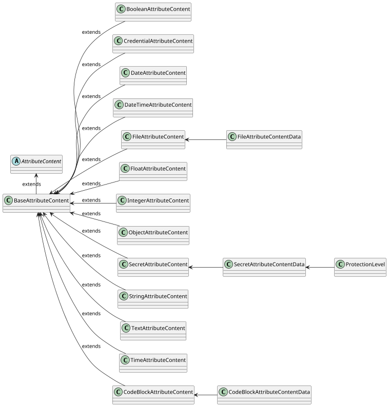

# Content

`Attribute` supports various content defined by `contentType`.

:::info[Attribute types]
For more details about `Attribute` types and `contentType`, see [Attributes](attributes.mdx).
:::

## Content properties

Each content type must extend, based on attribute version, either [`BaseAttributeContentV2`](https://github.com/CZERTAINLY/CZERTAINLY-Interfaces/blob/main/src/main/java/com/czertainly/api/model/common/attribute/v2/content/BaseAttributeContentV2.java) or [`BaseAttributeContentV3`](https://github.com/CZERTAINLY/CZERTAINLY-Interfaces/blob/main/src/main/java/com/czertainly/api/model/common/attribute/v3/content/BaseAttributeContentV3.java) which are abstracted from [`AttributeContent`](https://github.com/CZERTAINLY/CZERTAINLY-Interfaces/blob/main/src/main/java/com/czertainly/api/model/common/attribute/common/AttributeContent.java).

The content has the following properties defined and inherited from `BaseAttributeContentV2`:

| Property    | Type               | Short description                                                                                                                                       | Required                                      |
|-------------|--------------------|---------------------------------------------------------------------------------------------------------------------------------------------------------|-----------------------------------------------|
| `reference` | `string`           | Reference that can be used for the content value. It is usefull especially when the `data` contains an object, or any other more complex data structure | <span class="badge badge--danger">No</span>   |
| `data`      | `AttributeContent` | The value of the content, depending on the `contentType` from supported [`AttributeContentType`](#supported-content-types)                              | <span class="badge badge--success">Yes</span> |

The content has the following properties defined and inherited from `BaseAttributeContentV3`:
| Property    | Type               | Short description                                                                                                                                       | Required                                      |
|-------------|--------------------|---------------------------------------------------------------------------------------------------------------------------------------------------------|-----------------------------------------------|
| `reference` | `string`           | Reference that can be used for the content value. It is usefull especially when the `data` contains an object, or any other more complex data structure | <span class="badge badge--danger">No</span>   |
| `data`      | `AttributeContent` | The value of the content, depending on the `contentType` from supported [`AttributeContentType`](#supported-content-types)                              | <span class="badge badge--success">Yes</span> |
| `contentType`      | `AttributeContentType` | The type of the content, must match the content type of attribute definition                 | <span class="badge badge--success">Yes</span> |

## Supported content types

Supported content types are defined in [`AttributeContentType`](https://github.com/CZERTAINLY/CZERTAINLY-Interfaces/blob/main/src/main/java/com/czertainly/api/model/common/attribute/common/content/AttributeContentType.java).
The following content types are available and supported:

| `AttributeContentType` | Class V2                                                                                                                                                                                   | Class V3                                                                                                                                                                                   | Data                                                                                                                                                                                                          |
|-------------------------|-------------------------------------------------------------------------------------------------------------------------------------------------------------------------------------------|-------------------------------------------------------------------------------------------------------------------------------------------------------------------------------------------|---------------------------------------------------------------------------------------------------------------------------------------------------------------------------------------------------------------|
| `STRING`               | [`StringAttributeContentV2`](https://github.com/CZERTAINLY/CZERTAINLY-Interfaces/blob/master/src/main/java/com/czertainly/api/model/common/attribute/v2/content/StringAttributeContentV2.java) | [`StringAttributeContentV3`](https://github.com/CZERTAINLY/CZERTAINLY-Interfaces/blob/master/src/main/java/com/czertainly/api/model/common/attribute/v3/content/StringAttributeContentV3.java) | `string`                                                                                                                                                                                                     |
| `INTEGER`              | [`IntegerAttributeContentV2`](https://github.com/CZERTAINLY/CZERTAINLY-Interfaces/blob/master/src/main/java/com/czertainly/api/model/common/attribute/v2/content/IntegerAttributeContentV2.java) | [`IntegerAttributeContentV3`](https://github.com/CZERTAINLY/CZERTAINLY-Interfaces/blob/master/src/main/java/com/czertainly/api/model/common/attribute/v3/content/IntegerAttributeContentV3.java) | `integer`                                                                                                                                                                                                    |
| `SECRET`               | [`SecretAttributeContentV2`](https://github.com/CZERTAINLY/CZERTAINLY-Interfaces/blob/master/src/main/java/com/czertainly/api/model/common/attribute/v2/content/SecretAttributeContentV2.java) | N/A                                                                                                                                                                                       | [`SecretAttributeContentData`](https://github.com/CZERTAINLY/CZERTAINLY-Interfaces/blob/master/src/main/java/com/czertainly/api/model/common/attribute/common/content/data/SecretAttributeContentData.java)       |
| `FILE`                 | [`FileAttributeContentV2`](https://github.com/CZERTAINLY/CZERTAINLY-Interfaces/blob/master/src/main/java/com/czertainly/api/model/common/attribute/v2/content/FileAttributeContentV2.java)   | [`FileAttributeContentV3`](https://github.com/CZERTAINLY/CZERTAINLY-Interfaces/blob/master/src/main/java/com/czertainly/api/model/common/attribute/v3/content/FileAttributeContentV3.java)   | [`FileAttributeContentData`](https://github.com/CZERTAINLY/CZERTAINLY-Interfaces/blob/master/src/main/java/com/czertainly/api/model/common/attribute/common/content/data/FileAttributeContentData.java)           |
| `BOOLEAN`              | [`BooleanAttributeContentV2`](https://github.com/CZERTAINLY/CZERTAINLY-Interfaces/blob/master/src/main/java/com/czertainly/api/model/common/attribute/v2/content/BooleanAttributeContentV2.java) | [`BooleanAttributeContentV3`](https://github.com/CZERTAINLY/CZERTAINLY-Interfaces/blob/master/src/main/java/com/czertainly/api/model/common/attribute/v3/content/BooleanAttributeContentV3.java) | `boolean`                                                                                                                                                                                                    |
| `TEXT`                 | [`TextAttributeContentV2`](https://github.com/CZERTAINLY/CZERTAINLY-Interfaces/blob/master/src/main/java/com/czertainly/api/model/common/attribute/v2/content/TextAttributeContentV2.java)   | [`TextAttributeContentV3`](https://github.com/CZERTAINLY/CZERTAINLY-Interfaces/blob/master/src/main/java/com/czertainly/api/model/common/attribute/v3/content/TextAttributeContentV3.java)   | `string`                                                                                                                                                                                                     |
| `CODEBLOCK`            | [`CodeBlockAttributeContentV2`](https://github.com/CZERTAINLY/CZERTAINLY-Interfaces/blob/master/src/main/java/com/czertainly/api/model/common/attribute/v2/content/CodeBlockAttributeContentV2.java) | [`CodeBlockAttributeContentV3`](https://github.com/CZERTAINLY/CZERTAINLY-Interfaces/blob/master/src/main/java/com/czertainly/api/model/common/attribute/v3/content/CodeBlockAttributeContentV3.java) | [`CodeBlockAttributeContentData`](https://github.com/CZERTAINLY/CZERTAINLY-Interfaces/blob/master/src/main/java/com/czertainly/api/model/common/attribute/common/content/data/CodeBlockAttributeContentData.java) |
| `FLOAT`                | [`FloatAttributeContentV2`](https://github.com/CZERTAINLY/CZERTAINLY-Interfaces/blob/master/src/main/java/com/czertainly/api/model/common/attribute/v2/content/FloatAttributeContentV2.java) | [`FloatAttributeContentV3`](https://github.com/CZERTAINLY/CZERTAINLY-Interfaces/blob/master/src/main/java/com/czertainly/api/model/common/attribute/v3/content/FloatAttributeContentV3.java) | `float`                                                                                                                                                                                                      |
| `DATE`                 | [`DateAttributeContentV2`](https://github.com/CZERTAINLY/CZERTAINLY-Interfaces/blob/master/src/main/java/com/czertainly/api/model/common/attribute/v2/content/DateAttributeContentV2.java)   | [`DateAttributeContentV3`](https://github.com/CZERTAINLY/CZERTAINLY-Interfaces/blob/master/src/main/java/com/czertainly/api/model/common/attribute/v3/content/DateAttributeContentV3.java)   | `date`                                                                                                                                                                                                       |
| `DATETIME`             | [`DateTimeAttributeContentV2`](https://github.com/CZERTAINLY/CZERTAINLY-Interfaces/blob/master/src/main/java/com/czertainly/api/model/common/attribute/v2/content/DatetimeAttributeContentV2.java) | [`DateTimeAttributeContentV3`](https://github.com/CZERTAINLY/CZERTAINLY-Interfaces/blob/master/src/main/java/com/czertainly/api/model/common/attribute/v3/content/DateTimeAttributeContentV3.java) | `datetime`                                                                                                                                                                                                   |
| `TIME`                 | [`TimeAttributeContentV2`](https://github.com/CZERTAINLY/CZERTAINLY-Interfaces/blob/master/src/main/java/com/czertainly/api/model/common/attribute/v2/content/TimeAttributeContentV2.java)   | [`TimeAttributeContentV3`](https://github.com/CZERTAINLY/CZERTAINLY-Interfaces/blob/master/src/main/java/com/czertainly/api/model/common/attribute/v3/content/TimeAttributeContentV3.java)   | `time`                                                                                                                                                                                                       |
| `CREDENTIAL`           | [`CredentialAttributeContentV2`](https://github.com/CZERTAINLY/CZERTAINLY-Interfaces/blob/master/src/main/java/com/czertainly/api/model/common/attribute/v2/content/CredentialAttributeContentV2.java) | N/A                                                                                                                                                                                       | [`CredentialAttributeContentData`](https://github.com/CZERTAINLY/CZERTAINLY-Interfaces/blob/main/src/main/java/com/czertainly/api/model/common/attribute/common/content/data/CredentialAttributeContentData.java) |
| `OBJECT`               | [`ObjectAttributeContentV2`](https://github.com/CZERTAINLY/CZERTAINLY-Interfaces/blob/master/src/main/java/com/czertainly/api/model/common/attribute/v2/content/ObjectAttributeContentV2.java) | [`ObjectAttributeContentV3`](https://github.com/CZERTAINLY/CZERTAINLY-Interfaces/blob/master/src/main/java/com/czertainly/api/model/common/attribute/v3/content/ObjectAttributeContentV3.java) | `object`                                                                                                                                                                                                     |
| `RESOURCE OBJECT`      | N/A                                                                                                                                                                                       | [`ResourceObjectContent`](https://github.com/CZERTAINLY/CZERTAINLY-Interfaces/blob/main/src/main/java/com/czertainly/api/model/common/attribute/v3/content/ResourceObjectContent.java)       | [`ResourceObjectContentData`](https://github.com/CZERTAINLY/CZERTAINLY-Interfaces/blob/main/src/main/java/com/czertainly/api/model/common/attribute/v3/content/data/ResourceObjectContentData.java)            |

:::warning[Mulitple content types in one Attribute]
One `Attribute` can define only one `contentType`. Multiple different content types for one `Attribute` is not supported.
:::

## Content type samples

The table below shows the `AttributeContentType` and the sample for each type and version.

<table>

<tr>
<th> 

`AttributeContentType`

</th>
<th>

Associated `content` field v2

</th>
<th>

Associated `content` field v3

</th>
</tr>

<tr>
<td>

`STRING`

</td>
<td>

```json
{  
  "content": [
    {
      "reference": "string",
      "data": "string"
    }
  ]
}
```

</td>
<td>

```json
{  
  "content": [
    {
      "reference": "string",
      "data": "string",
      "contentType": "string"
    }
  ]
}
```

</td>
</tr>

<tr>
<td>

`INTEGER`

</td>
<td>

```json
{  
  "content": [
    {
      "reference": "string",
      "data": 12345
    }
  ]
}
```

</td>
<td>

```json
{  
  "content": [
    {
      "reference": "string",
      "data": 12345,
      "contentType": "integer"
    }
  ]
}
```

</td>
</tr>

<tr>
<td>

`SECRET`

</td>
<td>

```json
{  
  "content": [
    {
      "reference": "string",
      "data": {
        "secret": "secret"
    }
  ]
}
```

`SECRET` is handled by the platform in a secure way and its value will never be presented to client once defined.

</td>
<td>

N/A

</td>
</tr>

<tr>
<td>

`FILE`

</td>
<td>

```json
{  
  "content": [
    {
      "reference": "string",
      "data": {
        "data": "base64-encoded content of the file",
        "fileName": "name of the file",
        "mimeType": "type of the file"
      }
    }
  ]
}
```

`FILE` type can be specifically handled based on the `mimeType`.

</td>
<td>

```json
{  
  "content": [
    {
      "reference": "string",
      "data": {
        "data": "base64-encoded content of the file",
        "fileName": "name of the file",
        "mimeType": "type of the file"
      },
      "contentType": "file"
    }
  ]
}
```

`FILE` type can be specifically handled based on the `mimeType`.

</td>
</tr>

<tr>
<td>

`BOOLEAN`

</td>
<td>

```json
{  
  "content": [
    {
      "reference": "string",
      "data": true
    }
  ]
}
```

</td>
<td>

```json
{  
  "content": [
    {
      "reference": "string",
      "data": true,
      "contentType": "boolean"
    }
  ]
}
```

</td>
</tr>

<tr>
<td>

`CREDENTIAL`

</td>
<td>

```json
{
  "content": [
    {
      "reference": "identification of Credential",
      "data": {
        "name": "string",
        "uuid": "UUID of the Credential",
        "kind": "kind of the Credential",
        "attributes": [
          ...list of Credential Attributes
        ]
        "enabled": true,
        "connectorUuid": "UUID of the Credential Provider Connector",
        "connectorName": "name of the Credential Provider Connector"
      }
    }
  ]
}
```

`CREDENTIAL` is a special purpose type that is handled by the platform for `Connectors` that needs to use the credential for authentication and authorization to technology, for example API Key, username/password, and any other `Credential`.

</td>
<td>
N\A
</td>
</tr>

<tr>
<td>

`DATE`

</td>
<td>

```json
{
  "content": [
    {
      "reference": "string",
      "data": "2022-11-30"
    }
  ]
}
```

`DATE` should be in the format `yyyy-MM-dd`.

</td>
<td>

```json
{
  "content": [
    {
      "reference": "string",
      "data": "2022-11-30",
      "contentType": "date"
    }
  ]
}
```

`DATE` should be in the format `yyyy-MM-dd`.

</td>
</tr>

<tr>
<td>

`FLOAT`

</td>
<td>

```json
{
  "content": [
    {
      "reference": "string",
      "data": 12.4487211
    }
  ]
}
```

</td>
<td>

```json
{
  "content": [
    {
      "reference": "string",
      "data": 12.4487211,
      "contentType" "float"
    }
  ]
}
```

</td>
</tr>

<tr>
<td>

`OBJECT`

</td>
<td>

```json
{
  "content": [
    {
      "reference": "identification of Object",
      "data": {
        ... any JSON object
      }
    }
  ]
}
```

`OBJECT` type provides a flexible way how to work with the custom objects within the `Attributes` and `Callbacks`.

</td>
<td>

```json
{
  "content": [
    {
      "reference": "identification of Object",
      "data": {
        ... any JSON object
      },
      "contentType": "object"
    }
  ]
}
```

`OBJECT` type provides a flexible way how to work with the custom objects within the `Attributes` and `Callbacks`.

</td>
</tr>

<tr>
<td>

`TEXT`

</td>
<td>

```json
{
  "content": [
    {
      "reference": "string",
      "data": "long text"
    }
  ]
}
```

`TEXT` supports long string/text data to be processed.

</td>
<td>

```json
{
  "content": [
    {
      "reference": "string",
      "data": "long text",
      "contentType": "text"
    }
  ]
}
```

`TEXT` supports long string/text data to be processed.

</td>
</tr>

<tr>
<td>

`CODEBLOCK`

</td>
<td>

```json
{
  "content": [
    {
      "reference": "string",
      "data": {
          "language": "string",
          "code": "Block of the code in Base64. Formatting of the code is specified by variable language"
        }
    }
  ]
}
```

`CODEBLOCK` supports scripts from various [languages](https://github.com/3KeyCompany/CZERTAINLY-Interfaces/blob/master/src/main/java/com/czertainly/api/model/common/attribute/v2/content/data/ProgrammingLanguageEnum.java). For example, to store simple addition method written in C#

```csharp
public void Add(string a, string b) {
  return a + b;
}
```

you would sent following content
```json
{
  "content": [
    {
      "reference": "sample",
      "data": {
          "language": "csharp",
          "code": "cHVibGljIHZvaWQgQWRkKHN0cmluZyBhLCBzdHJpbmcgYikgewogIHJldHVybiBhICsgYjsKfQ=="
        }
    }
  ]
}
```

</td>
<td>

```json
{
  "content": [
    {
      "reference": "string",
      "data": {
          "language": "string",
          "code": "Block of the code in Base64. Formatting of the code is specified by variable language"
        },
      "contentType": "codeblock"
    }
  ]
}
```

</td>
</tr>

<tr>
<td>

`TIME`

</td>
<td>

```json
{
  "content": [
    {
      "reference": "string",
      "data": "11:45:32"
    }
  ]
}
```

`TIME` should be in the format `HH:mm:ss`.

</td>
<td>

```json
{
  "content": [
    {
      "reference": "string",
      "data": "11:45:32",
      "contentType": "time"
    }
  ]
}
```

`TIME` should be in the format `HH:mm:ss`.

</td>
</tr>

<tr>
<td>

`DATETIME`

</td>
<td>

```json
{
  "content": [
    {
      "reference": "string",
      "data": "2011-12-03T10:15:30+01:00"
    }
  ]
}
```

`DATETIME` should be in the format `yyyy-MM-dd'T'HH:mm:ss.SSSXXX`, which is ISO-8601 extended offset date-time format.

</td>
<td>

```json
{
  "content": [
    {
      "reference": "string",
      "data": "2011-12-03T10:15:30+01:00",
      "contentType": "datetime"
    }
  ]
}
```

`DATETIME` should be in the format `yyyy-MM-dd'T'HH:mm:ss.SSSXXX`, which is ISO-8601 extended offset date-time format.

</td>
</tr>

<tr>
<td>
`RESOURCE OBJECT`
</td>
<td>
N/A
</td>
<td>
```json
{
  "content": [
    {
      "reference": "string",
      "data": "2011-12-03T10:15:30+01:00",
      "contentType": "resourceObject"
    }
  ]
}
```
</td>
</tr>

</table>

## Resource Object Content Type
Attributes V3 support `Resource Object` content type, which can also use in place of `Credential` and `Secret` content types. This content type is used to retrieve data of resource objects saved in Core. Following resources are supported:
| Resource      | Data                                                                                                                                                                                                          |   |
|---------------|---------------------------------------------------------------------------------------------------------------------------------------------------------------------------------------------------------------|---|
| `Certificate` | [`ResourceCertificateContentData`](https://github.com/CZERTAINLY/CZERTAINLY-Interfaces/blob/main/src/main/java/com/czertainly/api/model/common/attribute/v3/content/data/ResourceCertificateContentData.java) |   |
| `Credential`  | [`ResourceSimpleContentData`](https://github.com/CZERTAINLY/CZERTAINLY-Interfaces/blob/main/src/main/java/com/czertainly/api/model/common/attribute/v3/content/data/ResourceSimpleContentData.java)           |   |
| `Authority`   | [ `ResourceSimpleContentData` ]( https://github.com/CZERTAINLY/CZERTAINLY-Interfaces/blob/main/src/main/java/com/czertainly/api/model/common/attribute/v3/content/data/ResourceSimpleContentData.java)        |   |
| `Entity`      | [ `ResourceSimpleContentData` ]( https://github.com/CZERTAINLY/CZERTAINLY-Interfaces/blob/main/src/main/java/com/czertainly/api/model/common/attribute/v3/content/data/ResourceSimpleContentData.java)        |   |
| `Location`    | [ `ResourceSimpleContentData` ]( https://github.com/CZERTAINLY/CZERTAINLY-Interfaces/blob/main/src/main/java/com/czertainly/api/model/common/attribute/v3/content/data/ResourceSimpleContentData.java)        |   |
| `Secret`      | [`ResourceSecretContentData`](https://github.com/CZERTAINLY/CZERTAINLY-Interfaces/blob/main/src/main/java/com/czertainly/api/model/common/attribute/v3/content/data/ResourceSecretContentData.java)           |   |


## Content model

The following diagram represents the content model inherited from the `AttributeContent`. Details can be found in the [CZERTAINLY Interfaces repository](https://github.com/CZERTAINLY/CZERTAINLY-Interfaces/tree/master/src/main/java/com/czertainly/api/model/common/attribute/v2/content). 

