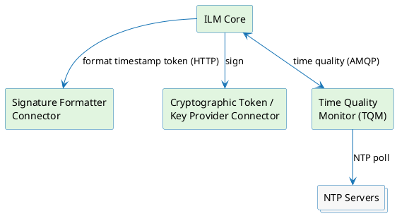

# Timestamping Overview

ILM-native timestamping is the platform's built-in RFC 3161 Time-Stamp Authority (TSA) implementation. It runs directly on ILM Core — using the same profile, connector, and credential infrastructure as the rest of the platform — without requiring an external signing server.

For teams already using the SignServer-based implementation, the SignServer path continues to be supported. See [Digital Signing — legacy](/docs/signserver/introduction) for that track.

---

## How this section is organised

The timestamping documentation covers:

- **Profiles** — the configuration objects that define a TSA: Signing Profiles, TSP Profiles, and Time Quality Configurations.
- **Request flow** — how a timestamp request is processed end to end, including authentication and authorization and the signing records it produces.
- **Supporting components** — the Time Quality Monitor, the timestamp formatter connector, and the Time Quality messaging contract between Core and the monitor.
- **Reference** — operational limitations.

---

## Signing workflows

A **Signing Profile** is parameterised by a workflow type, which defines the kind of cryptographic operation the profile governs.

**TIMESTAMPING** — The profile issues RFC 3161 timestamp tokens. The engine validates time quality, generates a serial number, constructs a `TSTInfo` structure, and signs it using the configured TSA key. This is the only workflow documented in depth in this section.

**CONTENT\_SIGNING** — The profile signs arbitrary document content. Not covered in depth here.

**RAW\_SIGNING** — The profile signs a caller-supplied raw byte sequence. Intended for low-level integrations. Not covered in depth here.

---

## Signing schemes

Every Signing Profile also specifies a **signing scheme**, which controls who holds the key and how the cryptographic operation is performed.

**MANAGED** — ILM holds and operates the key. Two variants exist based on how the key is provisioned:

- **Static Key** (`static_key`) — A pre-existing certificate and key pair are configured once on the Signing Profile and reused for every operation. The key persists on the cryptographic token for the lifetime of the profile. Required resources: a certificate (with its associated key) and the profile's signing operation attributes.
- **One-Time Key** (`one_time_key`) — A fresh certificate and key pair are issued by the configured CA for each individual signing operation. The newly issued certificate is valid only for that operation and is not reused. Required resources: an RA Profile, a Token Profile, and the profile's signing operation attributes.

**DELEGATED** — ILM delegates the signing to an external signing service via a Connector. Core passes the request to the connector and receives the signature. Required resources: a Connector UUID and its configuration attributes.

---

## RFC 3161 TSP protocol

ILM-native timestamping speaks the IETF RFC 3161 Time-Stamp Protocol (TSP). A TSA consumer sends a `TimeStampReq` (containing the hash of the datum to be timestamped and an optional policy OID) over HTTP to the ILM Core TSP endpoint. Core validates the request, checks time quality, and returns a `TimeStampResp` carrying a signed `TSTInfo` with the authoritative generation time, serial number, and TSA policy OID. Status information (granted, rejection, waiting) is carried in-band inside the response structure — there is no separate notification channel.

---

## Time quality

A timestamp is only meaningful if the TSA's clock is demonstrably accurate. ILM supports this through the **Time Quality Monitor (TQM)** — a lightweight sidecar service that polls a set of NTP servers on a configurable interval and publishes the result back to Core via the message broker (AMQP). Time-quality enforcement is **opt-in**: when a Signing Profile is associated with a Time Quality Configuration, Core consults the Time Quality Register before issuing a timestamp token, and rejects the request with `timeNotAvailable` if the registered status is anything other than `OK`. A profile with no Time Quality Configuration does not perform this check.

Detailed operator guidance is available in the operations track, and the message contract between Core and TQM is covered in the integration track.

---

## Architecture at a glance

The diagram below shows how the main components fit together for an ILM-managed TIMESTAMPING operation with the static-key variant.

The Signature Formatter Connector is responsible for assembling the data to be signed — the CMS `SignedAttributes` computed over the `TSTInfo` structure. Core calls it synchronously over HTTP, receives the encoded bytes, signs them with the TSA key via the configured cryptographic token provider, and wraps the result into the RFC 3161 response.

The Time Quality Monitor is a stateless sidecar. It has no inbound API surface; all communication is outbound over AMQP — it receives Time Quality Configuration from Core via the broker, polls the configured NTP servers, and publishes `TimeCheckResult` messages back. Core's Time Quality Register maintains the in-memory status for each active Time Quality Configuration.

---

## Workflow × scheme matrix

The table below shows the full workflow × scheme landscape of ILM Core. Model types (sealed record classes) exist for all nine cells. However, the signing engine only executes one combination today: **TIMESTAMPING × MANAGED (static key)**. Every other cell is not yet wired to an engine implementation.

| Workflow ↓ / Scheme → | MANAGED · Static Key | MANAGED · One-Time Key | DELEGATED |
| --- | --- | --- | --- |
| **TIMESTAMPING** | ✓ implemented | — | — |
| **CONTENT_SIGNING** | — | — | — |
| **RAW_SIGNING** | — | — | — |

*✓ = engine-implemented and documented in this section. — = model type exists in code but has no engine implementation yet.*

The signing model permits further workflow/scheme combinations, but only **TIMESTAMPING × MANAGED (static key)** has an engine implementation today; other cells are not yet wired.
