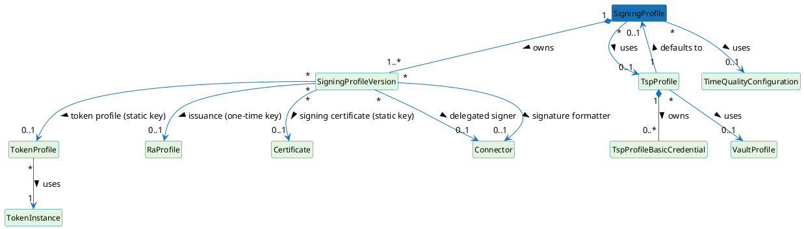

# Signing Profile

A Signing Profile is the central configuration object for a signing operation in ILM. It declares **what** is being signed (the workflow type), **how** the signing key is obtained and used (the scheme), which TSP Profile accepts inbound timestamp requests that resolve to this profile, which Time Quality Configuration governs time-source evaluation, and what signing records to retain.

---

## Entity-relationship diagram

The diagram below shows the relationships among Signing Profile, TSP Profile, Time Quality Configuration, and the bound PKI resources (RA Profile, Token Profile, Token Instance, connector, certificate, and cryptographic key). Cardinalities are taken from the entity classes and database constraints.

> This diagram is referenced from the [TSP Profile](./tsp-profile.md) and [Time Quality Configuration](./time-quality-configuration.md) pages. It is also the basis for the deletion-behaviour discussion covered in the [Limitations](../limitations.md) page.

---

## Versioning semantics

A Signing Profile maintains a history of versions, each identified by a monotonically increasing version number. The most recent version is the active one.

**When a new version is created:**

A new version is created on an update when either of the following holds:

1. Signing records already exist against the current version (records must stay linked to the version under which they were created, for audit integrity).
2. One or more recording-policy fields differ between the current version and the update request.

When neither holds, the current version is updated in place and no new version is created — so schema-neutral edits such as renaming the profile or changing its description do not advance the version number.

**What is immutable on a version:**

Once a signing record references a version, that version is never modified; subsequent updates create a new version instead.

**Active version selection:**

The active version is always the most recent one. Older versions remain accessible via the read-by-version API endpoint for audit and troubleshooting.

---

## Recording policy

The recording policy fields on each profile version control what data is persisted per signing operation. These records are the basis for the event logging and record-retention obligations that ETSI EN 319 421 places on a TSP; see [Signing Records](../signing-records.md).

- **`recordingEnabled`** — master gate. When `false`, no signing record is created regardless of the other flags.
- **`recordRequestMetadata`**, **`recordSignature`**, **`recordSignedDocument`**, **`recordDtbs`** — granular switches for which data payloads are stored alongside the record.
- **`retentionDays`** — when set, records older than this are eligible for automated purge. When null, records are retained indefinitely.
- **`persistenceMode`** — determines the write guarantee:
  - `IMMEDIATE` — the record is written synchronously before the signing response is returned; highest durability, highest latency.
  - `DEFERRED_DURABLE` — the record is written asynchronously but is guaranteed to be persisted; balanced latency and durability. This is the default.
  - `BEST_EFFORT` — the record is written on a best-effort basis with no durability guarantee; lowest latency.

Because recording-policy fields are version-scoped, changing any recording-policy field on an update always triggers a version bump, ensuring that each record can be unambiguously linked to the policy that governed its creation. The [Signing Records](../signing-records.md) page covers record structure and retrieval in detail.

---

## Relationships

- A Signing Profile references at most one **TSP Profile**. The TSP Profile exposes the profile to inbound RFC 3161 clients and carries authentication policy. See the [TSP Profile](./tsp-profile.md) page for details.
- A Signing Profile references at most one **Time Quality Configuration**. The Time Quality Configuration determines whether the system clock is considered trustworthy before a timestamp token is issued. See the [Time Quality Configuration](./time-quality-configuration.md) page for details.
- Each version of a Signing Profile may reference a **Token Profile** (for MANAGED/STATIC\_KEY), a **Certificate** (the TSA signing certificate — it must carry the `id-kp-timeStamping` EKU per RFC 5280 and follow the ETSI EN 319 412 certificate profile), an **RA Profile** (for MANAGED/ONE\_TIME\_KEY, model only), or a **Connector** (for DELEGATED scheme or Signature Formatter).

---

## Related pages

- [TSP Profile](./tsp-profile.md) — authentication methods and the default Signing Profile
- [Time Quality Configuration](./time-quality-configuration.md) — time-source evaluation parameters
- [Signing Records](../signing-records.md) — record structure, retrieval, and retention
- [Timestamping Request Flow](../timestamping-flow.md) — how a profile is resolved and used per request
- [Limitations](../limitations.md) — dependent-resource deletion behaviour
