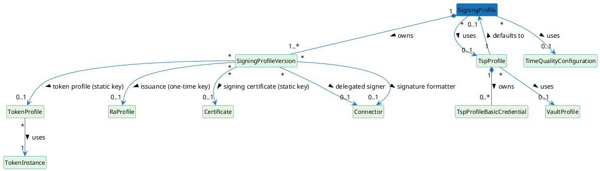

# Signing Profile

A Signing Profile is the central configuration object for a signing operation in ILM. It declares **what** is being signed (the workflow type), **how** the signing key is obtained and used (the scheme), which TSP Profile accepts inbound timestamp requests that resolve to this profile, which Time Quality Configuration governs time-source evaluation, and what signing records to retain.

---

## Entity-relationship diagram

The diagram below shows the relationships among Signing Profile, TSP Profile, Time Quality Configuration, and the bound PKI resources (RA Profile, Token Profile, Token Instance, connector, certificate, and cryptographic key). Cardinalities are taken from the entity classes and database constraints.

> This diagram is referenced from the TSP Profile and Time Quality Configuration pages. It is also the basis for the deletion-behaviour discussion covered in the limitations page.

---

## Versioning semantics

A Signing Profile maintains a history of `SigningProfileVersion` rows indexed by a monotonically increasing integer (`version`). The profile header (`SigningProfile`) tracks `latestVersion` as a denormalised counter; the active version is the row whose `version` equals `latestVersion`.

**When a new version is created:**

A version bump occurs on every update call that meets either of the following conditions:

1. Signing records already exist against the current version (records must remain linked to the version under which they were created for audit integrity).
2. One or more recording-policy fields differ between the stored version and the incoming update request.

When neither condition is met, the current version row is updated in place (no new version row is written). This is the "lenient version bump" strategy: the version counter does not change for schema-neutral edits such as renaming the profile or changing description.

**What is immutable on a version:**

Once a signing record references a version, that version row is never mutated. Subsequent updates that would touch it instead create a new version row.

**Active version selection:**

The active version is always the row whose `version` equals `latestVersion` on the parent `SigningProfile`. Older versions remain accessible via the read-by-version API endpoint for audit and troubleshooting.

---

## Recording policy

The recording policy fields on `SigningProfileVersion` control what data is persisted per signing operation.

- **`recordingEnabled`** — master gate. When `false`, no signing record is created regardless of the other flags.
- **`recordRequestMetadata`**, **`recordSignature`**, **`recordSignedDocument`**, **`recordDtbs`** — granular switches for which data payloads are stored alongside the record.
- **`retentionDays`** — when set, records older than this are eligible for automated purge. When null, records are retained indefinitely.
- **`persistenceMode`** — determines the write guarantee:
  - `IMMEDIATE` — the record is written synchronously before the signing response is returned; highest durability, highest latency.
  - `DEFERRED_DURABLE` — the record is written asynchronously but is guaranteed to be persisted; balanced latency and durability. This is the default.
  - `BEST_EFFORT` — the record is written on a best-effort basis with no durability guarantee; lowest latency.

Because recording-policy fields are version-scoped, changing any recording-policy field on an update always triggers a version bump, ensuring that each record can be unambiguously linked to the policy that governed its creation. The Signing records page covers record structure and retrieval in detail.

---

## Relationships

- A Signing Profile references at most one **TSP Profile**. The TSP Profile exposes the profile to inbound RFC 3161 clients and carries authentication policy. See the TSP Profile page for details.
- A Signing Profile references at most one **Time Quality Configuration**. The Time Quality Configuration determines whether the system clock is considered trustworthy before a timestamp token is issued. See the Time Quality Configuration page for details.
- Each version of a Signing Profile may reference a **Token Profile** (for MANAGED/STATIC\_KEY), a **Certificate** (the TSA signing certificate), an **RA Profile** (for MANAGED/ONE\_TIME\_KEY, model only), or a **Connector** (for DELEGATED scheme or Signature Formatter).
