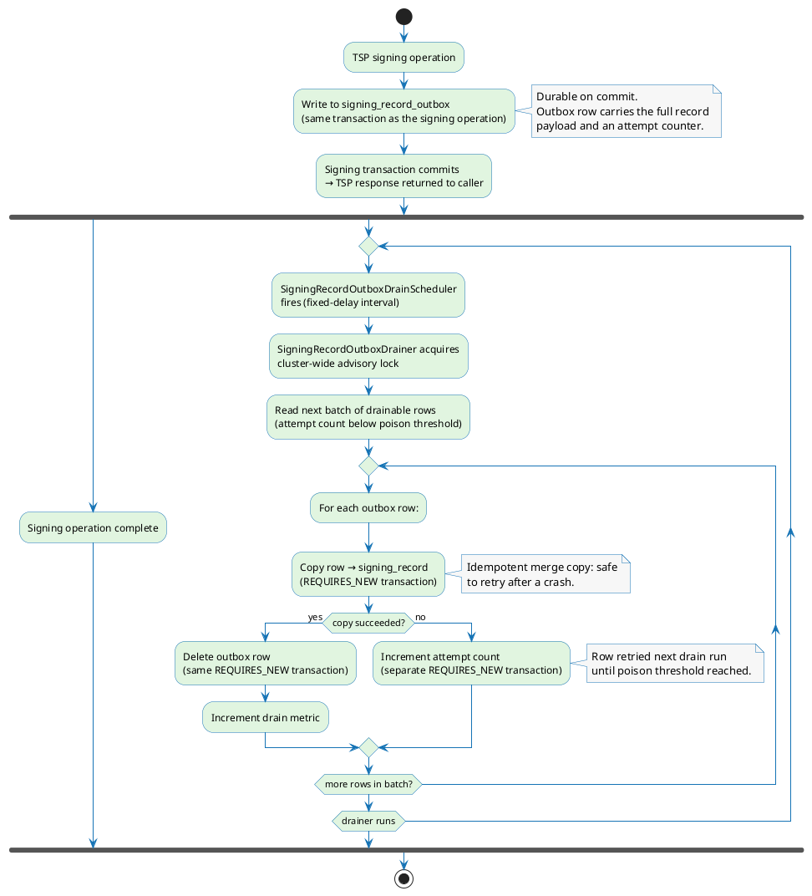

# Signing Records

Every timestamp operation can produce a **signing record** — a persisted log entry that captures who requested a timestamp, when it was issued, which signing profile and version was used, and (optionally) the cryptographic artifacts from that operation.

Recording is governed by the record policy configured on each signing profile. See [Signing Profile](./profiles/signing-profile.md) for the full set of record policy fields.

---

## What a signing record captures

A signing record always carries the following intrinsic fields:

| Field | Description |
|---|---|
| Signing profile UUID and version | Which profile (and which exact version) produced the record |
| Protocol | The signing protocol used (e.g. `TSP`) |
| Signing time | The `genTime` embedded in the issued timestamp token |
| Requested by | UUID and username of the authenticated principal |
| Display name | Human-readable label for the record |

In addition, the record policy controls four optional payload columns:

| Toggle | Column captured |
|---|---|
| `recordRequestMetadata` | JSON request metadata |
| `recordSignature` | The produced signature value |
| `recordSignedDocument` | The full signed document |
| `recordDtbs` | The data-to-be-signed |

When recording is enabled but no payload toggle is set, only the intrinsic fields are written. Records are never written when `recordingEnabled` is `false`.

---

## Persistence modes

The record policy's `persistenceMode` field selects how records are written relative to the signing operation. Three modes are available.

### IMMEDIATE

The record is mapped and written to `signing_record` **synchronously in the caller's transaction**, before the timestamp response is returned. A persistence failure propagates to the engine's `recordSigning()` call, which catches and logs it — the token is returned regardless (see [Timestamping Request Flow](./timestamping-flow.md) for the engine's exception boundary). The mode offers the strongest durability guarantee: if no exception is thrown, the record is committed.

### BEST_EFFORT

The record is mapped and admitted to an **in-memory queue** on the signing thread. The caller is never blocked on a database write; if the queue is full the admission policy (either `DROP_OLDEST` or `BLOCK`) is applied. A dedicated background thread — `SigningRecordBestEffortFlusher` — periodically drains the queue and persists batches in single transactions. Flush failures are logged and counted in metrics but not propagated; affected records are lost. This mode adds no latency to the signing path at the cost of possible record loss on queue overflow, flush error, or process restart.

### DEFERRED_DURABLE

The record is staged into a separate `signing_record_outbox` table **in the same transaction as the signing operation**. The outbox write is durable the moment the signing transaction commits. An asynchronous background task — `SigningRecordOutboxDrainer`, driven by `SigningRecordOutboxDrainScheduler` — subsequently copies records from the outbox into `signing_record` and deletes the outbox row. This mode combines low signing-path latency with full durability: the outbox entry survives a process restart.

### Mode comparison

| Mode | Durability | Signing-path impact | Record loss risk |
|---|---|---|---|
| `IMMEDIATE` | Highest — committed with the signing operation or not written | Write latency added to signing path | DB failure → record lost (exception swallowed at engine boundary) |
| `BEST_EFFORT` | None — in-memory only until flushed | No database I/O on signing path | Queue overflow, flush error, process restart |
| `DEFERRED_DURABLE` | High — durable on signing-transaction commit | Small outbox insert on signing path | Effectively none after commit |

---

## Deferred-durable outbox and drainer

When `DEFERRED_DURABLE` is active, the `signing_record_outbox` table acts as a transactional staging area.

Key properties of the drainer:

- **Cluster safety:** A cluster-wide advisory lock (the same `ClusterOperationSynchronizer` used by retention) ensures only one node drains at a time. The lock is held for the outer `REQUIRES_NEW` transaction that orchestrates the batch.
- **Per-row isolation:** Each row is copied and deleted in its own short `REQUIRES_NEW` transaction. A single failing row rolls back only its own transaction; healthy rows in the batch are committed and removed from the outbox.
- **Poison detection:** A row that fails repeatedly increments its attempt counter. Once the counter reaches the configured `poison-threshold` the drainer stops claiming it, preventing a bad row from blocking the queue indefinitely.
- **Backpressure cap:** The drainer processes at most `max-batches-per-run` batches per scheduled invocation. A large backlog drains across multiple runs rather than in one long-running transaction.
- **Crash recovery:** If the process restarts before an outbox row is drained, the row remains in `signing_record_outbox` and is drained on the next scheduled run. The copy is an idempotent merge, so a row already present in `signing_record` (copied before the crash-then-commit of the delete) is reconciled safely.

---

## Retention

Signing records are subject to a time-based retention sweep controlled by `signing-record.retention.*` properties:

| Property | Description |
|---|---|
| `sweep-interval-minutes` | How often the retention sweeper runs |
| `batch-size` | Records deleted per batch in each sweep run |
| `max-batches-per-sweep` | Maximum batches per sweep invocation (set to `0` to disable) |

The `SigningRecordRetentionSweeper`, triggered by `SigningRecordRetentionScheduler`, holds a cluster-wide advisory lock and deletes expired records in batches. Each batch commits in its own transaction; a large expired backlog is cleared across multiple scheduled sweeps rather than a single long-running transaction.

The retention period in days is set per signing profile in the record policy (`retentionDays`). A `null` value means records are kept indefinitely.

---

## Recording policy

The full set of record policy configuration fields — including enabling recording, selecting payload content, and choosing the persistence mode — is documented on the [Signing Profile](./profiles/signing-profile.md) page.
