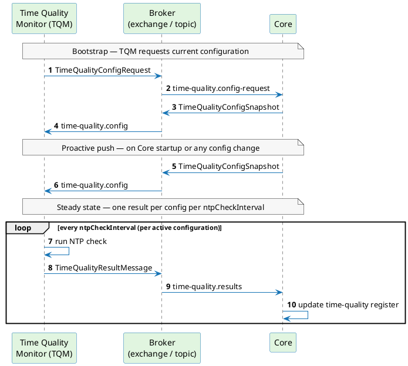
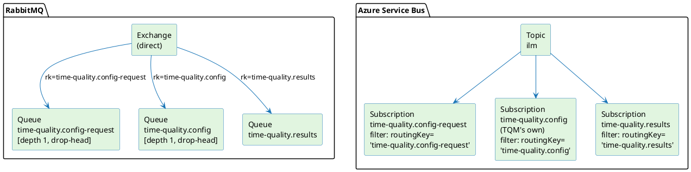

# Time Quality Messaging Contract

This page documents the AMQP message contract between the **Time Quality Monitor (TQM)** and **Core**. It is intended for operators who want to understand how the two components communicate, and for implementors who want to build a custom TQM that speaks this contract.

The contract consists of three messages. The payloads (the JSON DTOs) are identical on both supported brokers — only the addressing and connection details differ. [RabbitMQ](#broker-topology-rabbitmq) is described in full; [Azure Service Bus](#azure-service-bus-variant) maps the same flows onto a topic and subscriptions.

For the operator-facing setup of the Time Quality Monitor, see [Time Quality Monitor](./time-quality-monitor.md). For configuration of individual NTP profiles, see [Time Quality Configuration](./profiles/time-quality-configuration.md). For the high-level picture of how time quality affects signing, see the [Overview](./overview.md).

---

## Broker topology (RabbitMQ)

The default broker is RabbitMQ with a single direct exchange and three queues. Exchange name and queue names are configurable via `BROKER_EXCHANGE`, `BROKER_QUEUE_TIME_QUALITY_*`, and `BROKER_ROUTINGKEY_TIME_QUALITY_*` environment variables — the table below shows the defaults.

| Queue | Routing key | Producer | Consumer | Notes |
|---|---|---|---|---|
| `time-quality.config-request` | `time-quality.config-request` | TQM | Core | `x-max-length: 1`, `x-overflow: drop-head` — depth-1, latest wins |
| `time-quality.config` | `time-quality.config` | Core | TQM | `x-max-length: 1`, `x-overflow: drop-head` — depth-1, latest wins |
| `time-quality.results` | `time-quality.results` | TQM | Core | unbounded work queue |

The two `config*` queues keep only the latest message (depth 1, drop-head) — they carry a request and a full snapshot, not an event log. `time-quality.results` is an unbounded work queue.

All payloads are **UTF-8 JSON**. Core consumes via AMQP 1.0 (Apache Qpid JMS) and expects the JSON as an AMQP value/string body (JMS `TextMessage`). A body published as a byte, stream, or data-section will not deserialize. A custom TQM may use any AMQP 1.0 or RabbitMQ-compatible (AMQP 0-9-1) client that targets the same exchange and queues and sends a text body.

### Broker permissions

The TQM user requires:

- **write** rights on the exchange only (used for both `config-request` and `results` flows),
- **read** rights on the `time-quality.config` queue only.

The TQM must **not** declare or modify exchanges, queues, or bindings — topology is provisioned by the platform (the Helm chart). Connect, publish, and consume against the pre-declared objects.

---

## Messaging sequence

The following diagram shows the request→snapshot→result flow and the proactive snapshot push.

---

## Azure Service Bus variant

When `BROKER_TYPE=SERVICEBUS`, the three messages and their JSON payloads are identical — only the addressing, topology, and authentication differ.

The RabbitMQ *direct exchange + routing-key-bound queues* model maps onto a Service Bus *topic + subscriptions with SQL filters*:

- **Topic** = value of `BROKER_EXCHANGE` (default: `ilm`) — same name as the RabbitMQ exchange.
- The routing key is carried as the AMQP 1.0 **`Subject`** message system property (not a user/application property). On Core's JMS side this maps to `JMSType`; Azure Service Bus exposes it in SQL subscription filters under the name `routingKey`. A raw/custom AMQP 1.0 TQM must set `msg.Properties.Subject` to the routing-key value (NOT an application property named `routingKey`). Subscriptions select messages with a SQL filter on that property.
- Subscriptions are durable and shared.

| Flow | Direction | Topic | `Subject` property (= routing key) | TQM subscription |
|---|---|---|---|---|
| `TimeQualityConfigRequest` | TQM → Core | `ilm` | `time-quality.config-request` | — (consumed by Core's subscription) |
| `TimeQualityConfigSnapshot` | Core → TQM | `ilm` | `time-quality.config` | TQM's own durable subscription, filter `routingKey = 'time-quality.config'` |
| `TimeQualityResultMessage` | TQM → Core | `ilm` | `time-quality.results` | — (consumed by Core's subscription) |

The diagram below shows the two broker models side by side.

**What differs on Service Bus:**

- **Publishing** (`config-request`, `results`): send to the topic and set `msg.Properties.Subject` to the routing-key value (e.g. `time-quality.results`) — this is the AMQP 1.0 standard `Subject` system property, not a user/application property. With JMS, this is done via `message.setJMSType("time-quality.results")`.
- **Receiving** snapshots: create and own a **durable, shared subscription** on the topic with a SQL filter `routingKey = 'time-quality.config'`. Core does not create the TQM's subscription — provision it via the Service Bus namespace alongside the topic and Core's subscriptions.
- **Authentication**: either SAS policy (`BROKER_USERNAME` / `BROKER_PASSWORD`) or Microsoft Entra ID OAuth2 client-credentials (`BROKER_AZURE_TENANT_ID`, `BROKER_AZURE_CLIENT_ID`, `BROKER_AZURE_CLIENT_SECRET`). Token scope: `https://servicebus.azure.net/.default`.
- **ACLs** are managed through Azure (SAS policies or Entra ID roles on the namespace, topic, and subscriptions), not through RabbitMQ permission regexes.

**Everything else is identical**: the three messages, the JSON schemas, the request→snapshot correlation, the proactive full-snapshot push, one result per configuration per interval.

**Summary of broker differences:**

| Aspect | RabbitMQ | Azure Service Bus |
|---|---|---|
| Addressing | direct exchange + routing key → bound queue | topic + subscription SQL filter on `routingKey` |
| Routing key transport | publish routing key in AMQP target address | AMQP 1.0 `Subject` system property (`msg.Properties.Subject`); exposed as `routingKey` in Azure SQL subscription filters |
| TQM receives snapshot from | queue `time-quality.config` | TQM's durable subscription on the topic |
| Connection auth | username + password (broker user) | SAS or Microsoft Entra ID |
| Transport | AMQP 1.0 or AMQP 0-9-1 | AMQP 1.0 |
| Payload / DTOs | JSON TextMessage | identical |

---

## Proactive full-snapshot push

Core broadcasts a `TimeQualityConfigSnapshot` (with `correlationId: null`) in two situations, without waiting for a request:

1. **On startup** — Core publishes the current full snapshot to `time-quality.config` as soon as the application is ready. A TQM that starts after Core will receive the snapshot without needing to send a `TimeQualityConfigRequest`.
2. **On config change** — after any operator creates, updates, or deletes a Time Quality Configuration, Core publishes the updated full snapshot. TQM must replace its entire in-memory config set with the new snapshot contents.

A TQM should therefore handle `correlationId: null` gracefully and treat every incoming `TimeQualityConfigSnapshot` as a complete replacement, regardless of whether it was requested.

---

## Build your own custom TQM

The checklist below covers everything a custom Time Quality Monitor must implement to interoperate with Core over both supported brokers.

### RabbitMQ

- [ ] Connect to the RabbitMQ broker as the TQM user on the configured vhost; obtain credentials from operations.
- [ ] Do **not** declare or modify exchanges, queues, or bindings — topology is pre-provisioned by the platform.
- [ ] On startup, publish a `TimeQualityConfigRequest` to the exchange with routing key `time-quality.config-request`.
  - Set a fresh UUID as `correlationId`; record it to match the response.
  - Set `requestedAt` to the current UTC instant in ISO 8601 format.
  - Send the JSON as a text body (AMQP value/string section; `content-type: text/plain` or `application/json`).
- [ ] Consume from queue `time-quality.config`:
  - Treat every `TimeQualityConfigSnapshot` as a **full replacement** of the active config set.
  - Accept messages with a `null` `correlationId` (proactive push from Core).
  - Match `correlationId` to an outstanding request when present.
  - Acknowledge (accept) the message after successful processing; reject on parse failure so the broker can discard (dead-letter) the malformed message.
- [ ] Re-request configuration after a reconnect (the queue may have been empty during the disconnect window).
- [ ] For each active `TimeQualityConfig`, start a periodic NTP check loop at the configured `ntpCheckInterval`:
  - Query each server in `ntpServers`, taking `ntpSamplesPerServer` samples per server, subject to `ntpCheckTimeout` for the whole cycle.
  - Evaluate the results: check reachable server count against `ntpServersMinReachable`; compute drift and compare against `maxClockDrift`.
  - Apply `leapSecondGuard` logic when the NTP leap indicator signals an upcoming leap second.
  - Set `status` to `"degraded"` whenever NTP leap indicators conflict across servers; in that case set `leapSecondWarning` to `"none"`.
- [ ] Publish a `TimeQualityResultMessage` to the exchange with routing key `time-quality.results` after each check cycle:
  - Echo the configuration's `id` as `configurationId`.
  - Serialize enums as lowercase codes (`"ok"`, `"degraded"`, `"none"`, `"positive"`, `"negative"`).
  - Serialize timestamps as ISO 8601 UTC (`2026-06-16T10:30:45Z`) and durations as ISO 8601 (`PT1S`).
  - Include one `NtpServerMeasurementResult` entry per configured server; set numeric fields to `null` for unreachable servers.
  - Send as a text body (same format as the request message).
- [ ] When the active config set changes (new snapshot received), stop loops for removed configurations and start loops for added ones; update parameters for changed ones.
- [ ] Validate your messages against the published schemas at `%API_BASE_URL%` → Time Quality Messaging API (group `doc-openapi-messaging-time-quality`).

### Azure Service Bus (additional steps)

- [ ] Connect to the Service Bus namespace over AMQP 1.0.
- [ ] Authenticate with either SAS (`BROKER_USERNAME` + `BROKER_PASSWORD`) or Microsoft Entra ID OAuth2 client-credentials; token scope `https://servicebus.azure.net/.default`.
- [ ] Provision a **durable, shared subscription** on the topic (default: `ilm`) with the SQL filter `routingKey = 'time-quality.config'`. This is the TQM's config-snapshot subscription — provision it in the namespace alongside the topic and Core's subscriptions before the TQM starts.
- [ ] **Publishing** (`config-request`, `results`): send to the topic and set `msg.Properties.Subject` to the routing-key value (e.g. `time-quality.results`) — this is the AMQP 1.0 standard `Subject` system property (NOT an application property named `routingKey`). With a JMS client, use `message.setJMSType(routingKeyValue)`.
- [ ] **Receiving** snapshots: consume from the subscription provisioned above. All other contract rules (full replacement, null `correlationId`, acknowledgement) are identical to the RabbitMQ case.
- [ ] ACLs are managed through Azure (SAS policies or Entra ID roles) — obtain the required send and listen permissions from operations.
