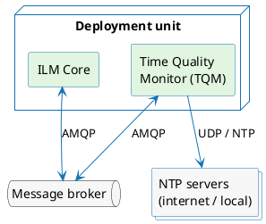
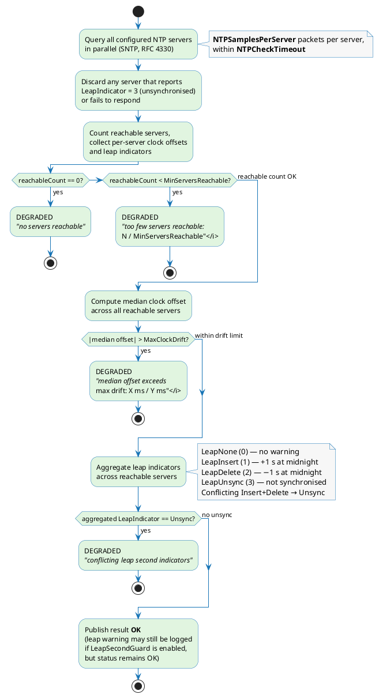

# Time Quality Monitor

The Time Quality Monitor (TQM) is a lightweight Go sidecar that runs alongside ILM Core and continuously evaluates whether the system clock is trustworthy enough to issue RFC 3161 timestamp tokens. It is how ILM satisfies the time-source accuracy requirements of ETSI EN 319 421 (and eIDAS Art. 42(1)(b) for qualified time stamps): it queries a set of NTP servers (via SNTP, RFC 4330) on behalf of each Time Quality Configuration, applies the configured thresholds, and publishes the outcome — **OK** or **DEGRADED** — back to Core over AMQP. Core gates timestamp token issuance on the most recently received status for each configuration.

For the NTP parameters (servers, intervals, thresholds) that drive the evaluation, see [Time Quality Configuration](./profiles/time-quality-configuration.md). For the AMQP message contract that TQM implements, see [Time Quality Messaging](./time-quality-messaging.md).

---

## Sidecar deployment model

TQM runs as a separate container (or process) alongside ILM Core. It has no inbound network exposure other than a health endpoint; all operational traffic is outbound — AMQP connections to the message broker and UDP to NTP servers.

TQM and Core do not communicate directly; the message broker is the integration point. Core subscribes to the `time-quality.results` routing key; TQM publishes to it. TQM subscribes to `time-quality.config` and publishes config-request messages to `time-quality.config-request` to bootstrap configuration delivery.

The health endpoint (`GET /health`) on `LISTEN_PORT` (default `8080`) is intended for container liveness and readiness probes only; it reflects broker connectivity in AMQP mode.

---

## AMQP operation

### Broker selection

TQM supports two broker types, selected by `BROKER_TYPE`:

| `BROKER_TYPE` | Broker | AMQP library |
|---|---|---|
| `RABBITMQ` (default) | RabbitMQ | AMQP 1.0 via `go-amqp` |
| `SERVICEBUS` | Azure Service Bus | AMQP 1.0 via `go-amqp` |

### Message flows

TQM participates in three AMQP flows:

| Flow | Direction | Routing key / Subject | Address (RabbitMQ) | Address (Service Bus) |
|---|---|---|---|---|
| Config request | TQM → Core | `time-quality.config-request` | `/exchanges/ilm/time-quality.config-request` | Topic (subject on message) |
| Config snapshot | Core → TQM | `time-quality.config` | `/queues/time-quality.config` | `ilm/Subscriptions/time-quality.config` |
| Results | TQM → Core | `time-quality.results` | `/exchanges/ilm/time-quality.results` | Topic (subject on message) |

On startup TQM opens a receiver on the config-snapshot address and then immediately publishes a config-request. Core responds with a snapshot containing all active Time Quality Configurations. TQM re-publishes the config-request at `BROKER_REQUEST_TIMEOUT` intervals until the snapshot arrives. Once a snapshot is received TQM starts one monitoring goroutine per configuration and begins publishing results.

### RabbitMQ connection

TQM dials `BROKER_URL` when set; otherwise it builds `amqp[s]://BROKER_HOST:BROKER_PORT` with the scheme from `BROKER_TLS_ENABLED`. Authentication uses SASL PLAIN with `BROKER_USERNAME` and `BROKER_PASSWORD`. The virtual host is transmitted in the AMQP Open frame hostname as `vhost:<BROKER_VIRTUAL_HOST>`.

TLS is opt-in via `BROKER_TLS_ENABLED`. When enabled, the keystore and optional truststore are loaded from PKCS12 files at the paths set by `BROKER_TLS_KEYSTORE` and `BROKER_TLS_TRUSTSTORE`.

### Azure Service Bus connection

TQM dials the URL at `BROKER_URL` (format `amqps://<namespace>.servicebus.windows.net`). TLS is implied by the `amqps://` scheme. Two mutually exclusive authentication modes are supported:

- **SAS** — set `BROKER_USERNAME` to the SAS policy name and `BROKER_PASSWORD` to the SAS token. TQM uses SASL PLAIN.
- **Entra ID (AAD)** — set all three of `BROKER_AZURE_TENANT_ID`, `BROKER_AZURE_CLIENT_ID`, and `BROKER_AZURE_CLIENT_SECRET`. TQM uses SASL ANONYMOUS and performs a CBS put-token round-trip with an OAuth2 token obtained from Entra ID immediately after the connection is established.

The Service Bus subscription that receives config snapshots must be provisioned externally with the name set in `BROKER_QUEUE_TIME_QUALITY_CONFIG` (default `time-quality.config`). TQM attaches to the subscription but does not create or delete it. The subscription must have a Correlation Filter matching on `time-quality.config` in `Properties.Subject` so that Core's config snapshots are routed to it.

### Reconnection

TQM manages the AMQP connection lifecycle internally. On any connection or link error it closes the existing connection, waits through the configured backoff sequence, and redials. The receiver and sender are rebuilt on each reconnect. The backoff schedule is set by `BACKOFF` (comma-separated ISO 8601 durations; default `PT100MS`; the reference `config.yml` ships the seven-step sequence `PT100MS, PT200MS, PT500MS, PT1S, PT2S, PT5S, PT10S` as a recommended starting point). After all retries are exhausted TQM logs an error and continues waiting; it does not exit.

---

## NTP evaluation

The following diagram shows how TQM evaluates a single NTP check cycle and determines **OK** or **DEGRADED**. The inputs come from the Time Quality Configuration associated with the profile (see [Time Quality Configuration](./profiles/time-quality-configuration.md)).

### Evaluation logic summary

1. **Reachability** — TQM queries all NTP servers in the profile simultaneously, sending `NTPSamplesPerServer` packets to each within `NTPCheckTimeout`. A server that does not respond, or that returns `LeapIndicator = 3` (unsynchronised), is excluded from all further calculations.

2. **Minimum server count** — If the number of reachable servers is zero, the result is immediately DEGRADED. If the count is non-zero but below `MinServersReachable`, the result is also DEGRADED.

3. **Drift check** — TQM computes the median clock offset across all reachable servers. If the absolute value of this median exceeds `MaxClockDrift`, the result is DEGRADED.

4. **Leap indicator** — TQM aggregates the leap indicators from all reachable servers. If any server reports `LeapInsert` (value 1) and any other reports `LeapDelete` (value 2), the aggregate becomes `LeapUnsync` and the result is DEGRADED. A consistent `LeapInsert` or `LeapDelete` across all servers does not itself degrade the result, but triggers a warning log when `LeapSecondGuard` is enabled on the profile.

The checks are applied in order; the first failure determines the reason string published with the result. All four conditions must pass for the result to be OK.
