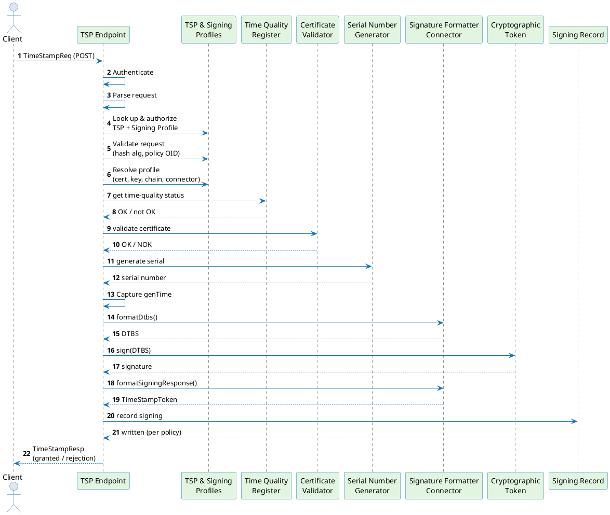

# Timestamping Request Flow

This page documents the end-to-end path of a managed static-key RFC 3161 timestamp request through ILM Core. Only the **TIMESTAMPING × MANAGED (static key)** combination is available today (see [Timestamping Overview](./overview.md)).

---

## Sequence diagram

The diagram below shows every stage a request passes through, from the moment it arrives at the TSP endpoint to the moment the RFC 3161 response is returned to the caller. Authentication is folded into the sequence because it happens before any business logic runs.

---

## Stage-by-stage walkthrough

### 1. Authentication

Every `/v1/protocols/tsp/**` request is authenticated before any business logic runs:

- The TSP Profile is resolved from the URL path. If no profile matches, the request is rejected with HTTP 401 before any credential is examined.
- Authentication methods are tried in fixed priority order — client certificate (mTLS), then Bearer token, then Basic password. The first method that matches the request claims it; if that method is not listed in the TSP Profile's `allowedAuthenticationMethods`, the request is rejected with HTTP 401. Selection does not fall through to a second method.
- On rejection, a `WWW-Authenticate` response header lists the HTTP-level methods the profile accepts.

Repeat Basic-password requests are served from the credential verification cache, so the fingerprint comparison is not redone on every call. The three credential types, the credential cache, and the secret-mapping model are covered in [Authentication and Authorization](./authentication-authorization.md).

### 2. Request parsing and profile lookup

The raw request body is decoded from its ASN.1 `TimeStampReq` form into its fields: hash algorithm, hashed message, optional nonce, optional policy OID, the include-signer-certificate flag, and any request extensions. Core then:

1. Looks up the TSP Profile by name.
2. Authorizes the request — an OPA policy check verifies the authenticated principal holds the `timestamp` action on the TSP Profile. A denial is rendered as the same generic `badRequest` rejection as a non-existent profile, so callers cannot distinguish missing from forbidden (enumeration defence).
3. Fetches the linked Signing Profile and verifies it is enabled and has the TSP protocol active.

### 3. Request validation

The request is validated against the rules declared on the signing profile's workflow:

- **Hash algorithm** — if `allowedDigestAlgorithms` is set, the request's hash algorithm must be in the list; otherwise the request is rejected with `badAlg`. Restricting the permitted digest algorithms is how a deployment enforces an approved cryptographic suite (ETSI TS 119 312).
- **Policy OID** — if `allowedPolicyIds` is set and the request specifies a policy OID, it must match one of the allowed OIDs; otherwise the request is rejected with `unacceptedPolicy`.

### 4. Profile resolution

The profile's stored references are dereferenced at request time (the resolved form is never cached):

- **Signing certificate and chain**
- **Key items**
- **Time Quality Configuration** — if none is configured, a local-clock configuration is used, which always reports `OK`.
- **Signature Formatter Connector**

### 5. Time quality check

The timestamping engine's first step is to read the current time-quality status for the profile's Time Quality Configuration:

- With no explicit configuration (local clock), the status is always `OK`.
- With an explicit configuration, the status is `OK` only when a result is present for the configuration, that result is not stale (age ≤ `accuracy`), the monitor-reported status is `OK`, and the leap-second and drift guards are not triggered.

If the status is anything other than `OK`, the engine returns a `timeNotAvailable` rejection and no token is assembled. The monitor that populates this status is documented on the [Time Quality Monitor](./time-quality-monitor.md) page.

### 6. Signing certificate validation

The signing certificate is checked against the timestamping eligibility rules for the configured qualification level (qualified or non-qualified):

- **Extended key usage** — the certificate must assert the `id-kp-timeStamping` extended key usage (OID `1.3.6.1.5.5.7.3.8`, RFC 5280 §4.2.1.12), which is the EKU that marks a certificate as valid for signing time-stamp tokens.
- **Key usage and validity** — checked alongside the EKU; the certificate (and chain) profile follows ETSI EN 319 412.

A failure returns a `systemFailure` rejection.

### 7. Serial number generation

A unique serial number is generated for the token. Serial-number uniqueness is a requirement of both RFC 3161 (§2.4.2) and ETSI EN 319 421 for TSPs issuing time-stamps. The generator is coordination-free and has a throughput ceiling of 25,600 tokens per second per instance; it protects against sequence overflow and backward clock jumps, rejecting with `timeNotAvailable` if the clock regresses by more than 100 ms. Serial numbers stay within the 160-bit field limit mandated by RFC 5280 and referenced by RFC 3161. The scheme's operational limits are covered on the [Limitations](./limitations.md) page.

The generation time (`genTime`) is captured immediately after the serial number is issued, so both reflect the same clock sample.

### 8. Formatter phase 1 — build the data to be signed

Token assembly is a two-phase exchange with the Signature Formatter Connector. In phase 1, Core sends the request fields (hash, nonce, policy OID, extensions, serial number, `genTime`, accuracy, certificate chain, signature algorithm, formatter attributes) to the connector. The connector encodes the CMS (RFC 5652) `SignedAttributes` computed over the `TSTInfo` (RFC 3161) — including the `SigningCertificateV2` attribute (carrying `ESSCertIDv2`, RFC 5816) that binds the TSA certificate to the token — and returns the DER bytes, the exact data to be signed. The connector and its two-phase calling convention are described on the [Timestamp Formatter Connector](./timestamp-formatter-connector.md) page.

### 9. Signing

Core signs the returned bytes with the profile's managed key through the configured cryptographic token. The managed key never leaves the token; Core receives only the raw signature bytes. The signature algorithm is determined before phase 1 so the same algorithm is supplied to both formatter calls.

### 10. Formatter phase 2 — assemble the token

In phase 2, Core sends the data-to-be-signed and the raw signature back to the connector, which injects the signature into the CMS `SignedData` structure (RFC 5652) and returns the fully assembled RFC 3161 `TimeStampToken`. If `validateTokenSignature` is set on the profile, Core verifies the token signature against the signing certificate before proceeding; a verification failure returns a `systemFailure` rejection.

### 11. Signing record

Depending on the profile's record policy, a signing record is written. The record write never affects the response — a failure is logged and the token is still returned. The persistence mode selects how the record is written:

- **IMMEDIATE** — synchronous write before the response is returned.
- **DEFERRED_DURABLE** — staged to a durable outbox and drained asynchronously.
- **BEST_EFFORT** — enqueued in an in-memory queue; dropped under backpressure.

The [Signing Records](./signing-records.md) page covers the record schema, retrieval API, and retention policy.

### 12. Response

Core encodes the result into an RFC 3161 `TimeStampResp` and returns it as `HTTP 200 application/timestamp-reply`. RFC 3161 status codes (granted, rejection, waiting) are carried inside the response body — the HTTP status code is always 200 for any conforming TSP exchange.

Authorization denials and resource-not-found errors are both mapped to a generic `badRequest` rejection so callers cannot distinguish a missing profile from a forbidden one.

---

## Error outcomes

| Stage | Failure type | RFC 3161 failure code |
|---|---|---|
| Authentication | Method not allowed, bad credentials | HTTP 401 (before RFC 3161 encoding) |
| Authorization | OPA denial | `badRequest` (enumeration defence) |
| TSP/Signing Profile not found or disabled | Profile missing or disabled | `badRequest` |
| Request validation | Bad hash algorithm | `badAlg` |
| Request validation | Disallowed policy OID | `unacceptedPolicy` |
| Profile resolution | Certificate/key/connector not found | `systemFailure` |
| Time quality | Status not OK (see note) | `timeNotAvailable` |
| Certificate validation | Eligibility check failed | `systemFailure` |
| Serial number | Clock drift > 100 ms | `timeNotAvailable` |
| Serial number | Tick overflow | `systemFailure` |
| Formatter (either phase) | Connector communication error | `systemFailure` |
| Token signature verification | Verification failure | `systemFailure` |
| Signing record | Write failure | (not propagated — token already granted) |

The time-quality check rejects for more than a `DEGRADED` status alone — a stale result, excessive clock drift, or a leap-second conflict each resolve to a not-OK status. See [Time Quality Configuration](./profiles/time-quality-configuration.md) for the full set of rejection causes.

---

## Related pages

- [Signing Profile](./profiles/signing-profile.md) — workflow and scheme configuration
- [TSP Profile](./profiles/tsp-profile.md) — authentication methods, linked signing profile
- [Time Quality Configuration](./profiles/time-quality-configuration.md) — NTP reference, accuracy, leap-second guard
- [Timestamping Overview](./overview.md) — signing workflow/scheme taxonomy and component architecture

Pages that expand on topics touched here:

- [Authentication & Authorization](./authentication-authorization.md) — credential types, cache, secret mapping
- [Signing Records](./signing-records.md) — schema, retrieval, retention
- [Time Quality Monitor](./time-quality-monitor.md) — TQM sidecar, AMQP contract
- [Timestamp Formatter Connector](./timestamp-formatter-connector.md) — connector operation and the two-phase DTBS/response calling convention
- [Limitations](./limitations.md) — serial number throughput and overflow
